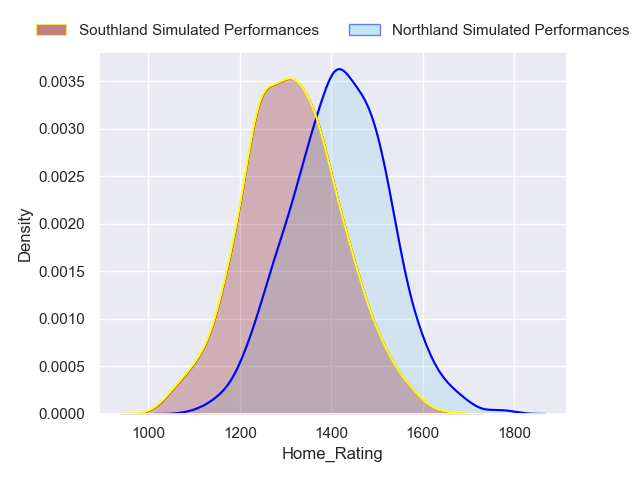
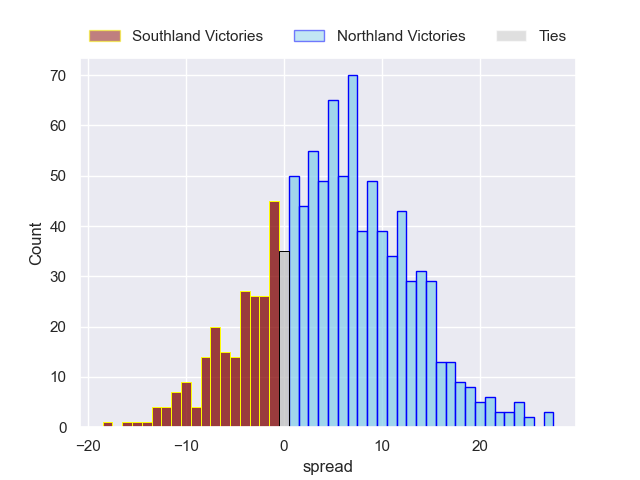
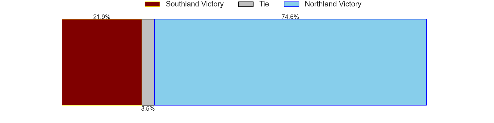
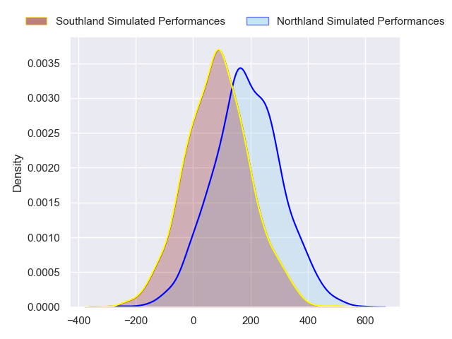
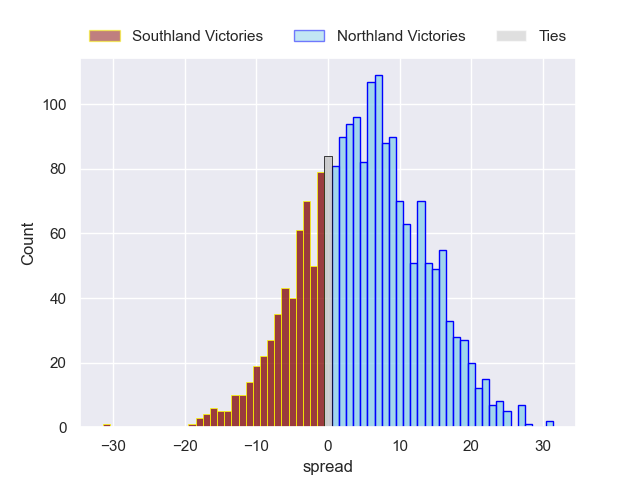
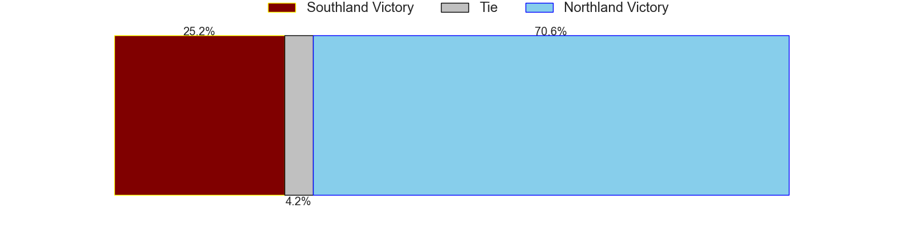

---  
layout: page  
title: Southland at Northland  
date: 2024-08-30 18:00:00 -0500  
categories: "NPC 2024" match projection  
---
# Southland at Northland

# Club Level Predictions

The first set of predictions treats a club as the smallest object, as the club develops its members, organizes a gameplan, and deploys its players as needed for each match. This club model has a prediction of 0.546, which translates to predicting Northland to win by 5.2.

Our Over/Under is 56.5 - and combined with the spread above, we have a predicted scoreline of 26 to 31

Each club has a rating and a rating deviation (similar to a Glicko rating), and expected performances can be generated. This allows for simulated matches and spreads like the ones below.
## Projected Performances - Club Model

## Projected Spreads - Club Model

## Projected Results - Club Model

# Player Level Predictions

Treating teams instead as an entity made up of the currently active players, I have ratings for each player in an altogether different system. These can be combined to form team ratings once teamsheets are announced, weighting starters a bit higher than the reserves. After the match is played, players can be weighted by their minutes on the field, allowing for an accurate measure of the team's composition. With these compiled team ratings, we can make predictions, measure inaccuracy, and update the individual player ratings.
## Prediction without Player Minutes: Northland by 5.1

Northland by 2.0 on a neutral pitch

## Projected Performances - Player Model

## Projected Spreads - Player Model

## Projected Results - Player Model

| Away Player           |   Away Percentile |   Number |   Home Percentile | Home Player            |
|:----------------------|------------------:|---------:|------------------:|:-----------------------|
| Jack Sexton           |            nan    |        1 |             55.07 | Jarred Adams           |
| Jack Taylor           |            nan    |        2 |            nan    | Matt Moulds            |
| Morgan Mitchell       |            nan    |        3 |            nan    | Chris Apoua            |
| Mitchell Dunshea      |            nan    |        4 |            nan    | Liam Hallam-Eames      |
| Shneil Singh          |              6.5  |        5 |            nan    | Sam Caird              |
| Sean Withy            |            nan    |        6 |            nan    | Simon Parker           |
| Dylan Nel             |            nan    |        7 |            nan    | Terrell Peita          |
| Semisi Tupou Ta'eiloa |            nan    |        8 |            nan    | Rob Rush               |
| Jay Renton            |             26.68 |        9 |            nan    | Sam Nock               |
| Jake Strachan         |             22.61 |       10 |            nan    | Rivez Reihana          |
| Charlie Powell        |            nan    |       11 |            nan    | Heremaia Murray        |
| Faletoi Peni          |            nan    |       12 |            nan    | Tevita Latu            |
| Isaac Te Tamaki       |            nan    |       13 |            nan    | Corey Evans            |
| Viliami Fine          |            nan    |       14 |            nan    | Brady Rush             |
| Rory van Vugt         |            nan    |       15 |            nan    | Jordan Trainor         |
| Nic Souchon           |             32.46 |       16 |            nan    | Richie Asiata          |
| Hunter Fahey          |            nan    |       17 |            nan    | Rob Cobb               |
| Hamdahn Tuipulotu     |            nan    |       18 |            nan    | Remsy Lemisio          |
| Josh Bekhuis          |            nan    |       19 |            nan    | Bodene Davis           |
| Leroy Ferguson        |            nan    |       20 |            nan    | Saimoni Uluinakauvadra |
| Lachie Albert         |            nan    |       21 |            nan    | Lisati Milo-Harris     |
| Byron Smith           |            nan    |       22 |            nan    | Daniel Hawkins         |
| Angus Simmers         |            nan    |       23 |            nan    | Quinton Nichols        |

