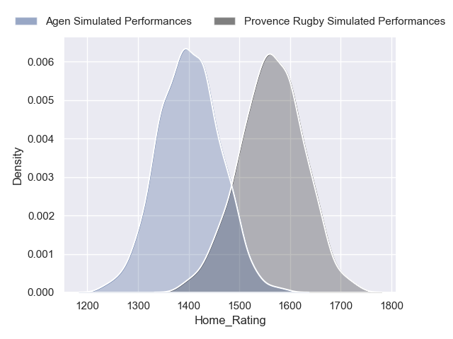
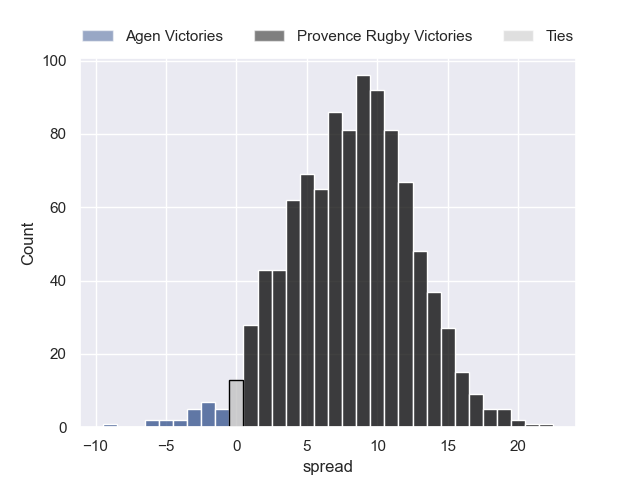
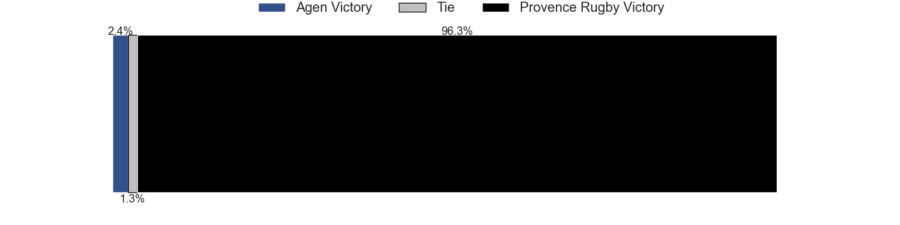
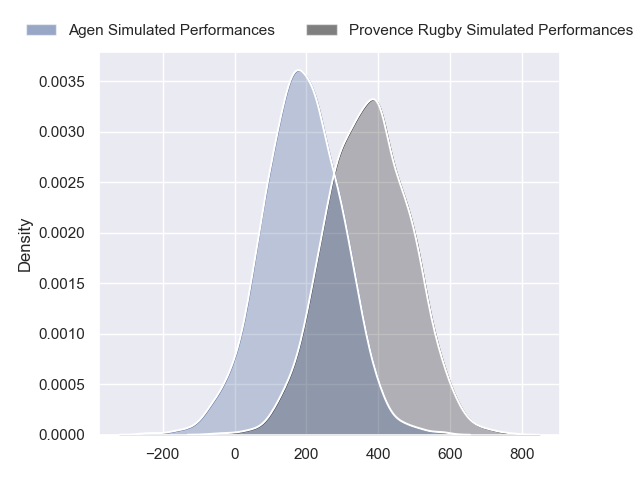
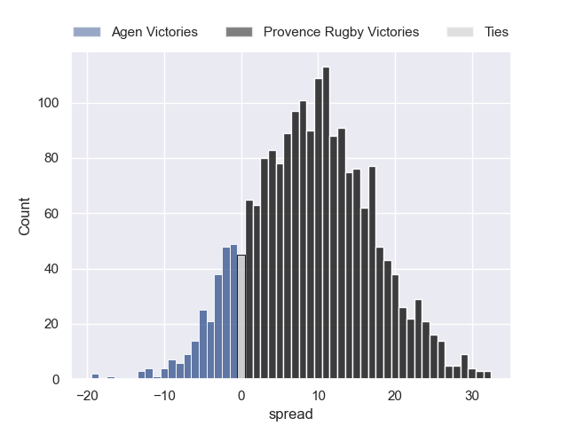
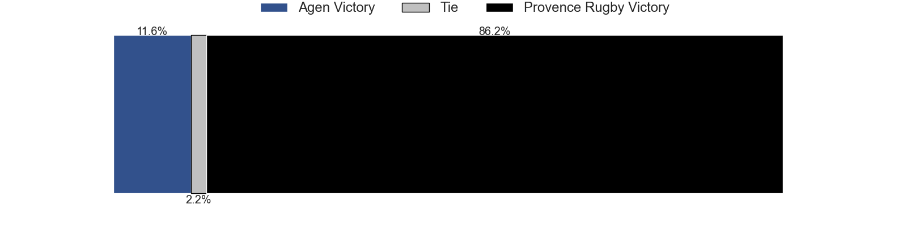

---  
layout: page  
title: Agen at Provence Rugby  
date: 2024-08-30 18:00:00 -0500  
categories: "Pro D2 2024" match projection  
---
# Agen at Provence Rugby

# Club Level Predictions

The first set of predictions treats a club as the smallest object, as the club develops its members, organizes a gameplan, and deploys its players as needed for each match. This club model has a prediction of 0.635, which translates to predicting Provence Rugby to win by 8.1.

Our Over/Under is 41.5 - and combined with the spread above, we have a predicted scoreline of 17 to 25

Each club has a rating and a rating deviation (similar to a Glicko rating), and expected performances can be generated. This allows for simulated matches and spreads like the ones below.
## Projected Performances - Club Model

## Projected Spreads - Club Model

## Projected Results - Club Model

# Player Level Predictions

Treating teams instead as an entity made up of the currently active players, I have ratings for each player in an altogether different system. These can be combined to form team ratings once teamsheets are announced, weighting starters a bit higher than the reserves. After the match is played, players can be weighted by their minutes on the field, allowing for an accurate measure of the team's composition. With these compiled team ratings, we can make predictions, measure inaccuracy, and update the individual player ratings.
## Prediction without Player Minutes: Provence Rugby by 9.2

Provence Rugby by 3.4 on a neutral pitch

## Projected Performances - Player Model

## Projected Spreads - Player Model

## Projected Results - Player Model

| Away Player           |   Away Percentile |   Number |   Home Percentile | Home Player        |
|:----------------------|------------------:|---------:|------------------:|:-------------------|
| Hans Lombard-Buret    |            nan    |        1 |            nan    | Julius Nostadt     |
| Santiago Socino       |             75.86 |        2 |            nan    | Thomas Sauveterre  |
| Alex Burin            |            nan    |        3 |             99.68 | Tomas Francis      |
| Evan Olmstead         |            nan    |        4 |             66.77 | Charly Gambini     |
| John Madigan          |            nan    |        5 |            nan    | Josh Tyrell        |
| Julien Lebian         |            nan    |        6 |            nan    | Guillaume Piazzoli |
| Arnaud Duputs         |            nan    |        7 |             48.09 | Ned Hanigan        |
| Matthieu Bonnet       |            nan    |        8 |            nan    | Teimana Harrison   |
| Jack Maunder          |             40.79 |        9 |            nan    | Arthur Coville     |
| Franck Pourteau       |            nan    |       10 |             76.76 | Jules Plisson      |
| Iban Etcheverry       |            nan    |       11 |            nan    | Léo Drouet         |
| Kolinio Ramoka        |            nan    |       12 |            nan    | Inga Finau         |
| Peyo Muscarditz       |            nan    |       13 |            nan    | Eto Bainivalu      |
| Henry Purdy           |            nan    |       14 |            nan    | Adrien Lapègue     |
| Jean-Marcellin Buttin |            nan    |       15 |            nan    | Mathias Colombet   |
| Pierre Jouvin         |            nan    |       16 |            nan    | Loick Jammes       |
| Mamuka Mstoiani       |            nan    |       17 |            nan    | Nicolás Toth       |
| William Demotte       |            nan    |       18 |            nan    | Malohi Suta        |
| Valentin Gayraud      |            nan    |       19 |            nan    | Bilel Taieb        |
| Dorian Bellot         |            nan    |       20 |             24.74 | Tornike Jalagonia  |
| Billy Searle          |            nan    |       21 |            nan    | Joris Cazenave     |
| Loris Tolot           |            nan    |       22 |            nan    | Jimmy Gopperth     |
| Lasha Macharashvili   |             50.08 |       23 |            nan    | Paul Mallez        |

