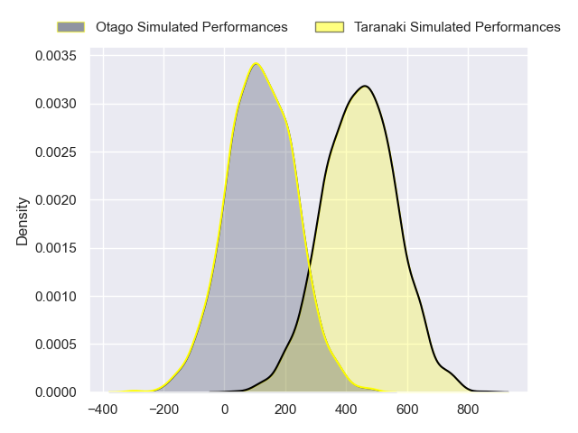
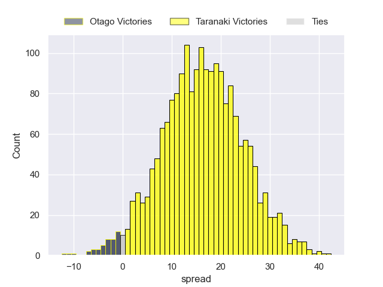
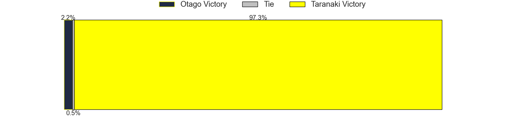

---  
layout: page  
title: Otago at Taranaki  
date: 2024-08-30 18:00:00 -0500  
categories: "NPC 2024" match projection  
---
# Otago at Taranaki

# Club Level Predictions

The first set of predictions treats a club as the smallest object, as the club develops its members, organizes a gameplan, and deploys its players as needed for each match. This club model has a prediction of 0.83, which translates to predicting Taranaki to win by 14.3.

Each club has a rating and a rating deviation (similar to a Glicko rating), and expected performances can be generated. This allows for simulated matches and spreads like the ones below.
## Projected Performances - Club Model

## Projected Spreads - Club Model

## Projected Results - Club Model

# Player Level Predictions

Treating teams instead as an entity made up of the currently active players, I have ratings for each player in an altogether different system. These can be combined to form team ratings once teamsheets are announced, weighting starters a bit higher than the reserves. After the match is played, players can be weighted by their minutes on the field, allowing for an accurate measure of the team's composition. With these compiled team ratings, we can make predictions, measure inaccuracy, and update the individual player ratings.
## Prediction without Player Minutes: Taranaki by 16.6

Taranaki by 13.5 on a neutral pitch

## Projected Performances - Player Model

## Projected Spreads - Player Model

## Projected Results - Player Model

| Away Player   |   Away Percentile |   Number |   Home Percentile | Home Player                   |
|:--------------|------------------:|---------:|------------------:|:------------------------------|
|               |              30.4 |        1 |            nan    | Mitch O'Neill                 |
|               |              30.4 |        2 |             86.79 | Bradley Slater                |
|               |              30.4 |        3 |            nan    | Michael Bent                  |
|               |              30.4 |        4 |            nan    | Fiti Sa                       |
|               |              30.4 |        5 |            nan    | Tom Franklin                  |
|               |              30.4 |        6 |            nan    | Arese Poliko                  |
|               |              30.4 |        7 |            nan    | Michael Loft                  |
|               |              30.4 |        8 |            nan    | Kaylum Boshier                |
|               |              30.4 |        9 |            nan    | Leone Nawai                   |
|               |              30.4 |       10 |            nan    | Jayson Potroz                 |
|               |              30.4 |       11 |            nan    | Josh Setu                     |
|               |              30.4 |       12 |             87.51 | Daniel Rona                   |
|               |              30.4 |       13 |            nan    | Meihana Grindlay              |
|               |              30.4 |       14 |            nan    | Jacob Ratumaitavuki-Kneepkens |
|               |              30.4 |       15 |            nan    | Josh Jacomb                   |
|               |              30.4 |       16 |            nan    | Ricky Riccitelli              |
|               |              30.4 |       17 |            nan    | Perry Lawrence                |
|               |              30.4 |       18 |            nan    | Toby Burkett                  |
|               |              30.4 |       19 |            nan    | Jackson Morgan                |
|               |              30.4 |       20 |            nan    | Scott Jury                    |
|               |              30.4 |       21 |            nan    | Adam Lennox                   |
|               |              30.4 |       22 |            nan    | Vereniki Tikoisolomone        |
|               |              30.4 |       23 |            nan    | Obey Samate                   |

