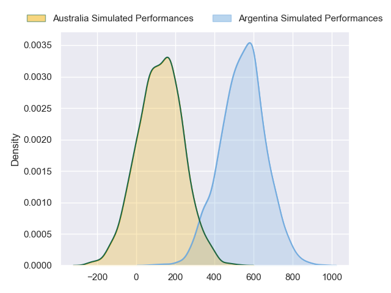
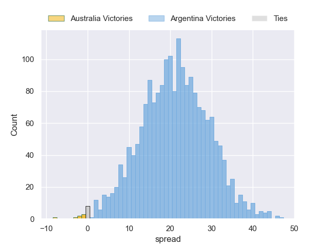
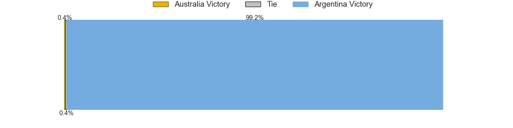

---  
layout: page  
title: Australia at Argentina  
date: 2024-08-31 18:00:00 -0500  
categories: "Rugby Championship 2024" match projection  
---
# Australia at Argentina

# Club Level Predictions

The first set of predictions treats a club as the smallest object, as the club develops its members, organizes a gameplan, and deploys its players as needed for each match. This club model has a prediction of 0.633, which translates to predicting Argentina to win by 8.1.

Our Over/Under is 51.5 - and combined with the spread above, we have a predicted scoreline of 22 to 30

Each club has a rating and a rating deviation (similar to a Glicko rating), and expected performances can be generated. This allows for simulated matches and spreads like the ones below.
## Projected Performances - Club Model

## Projected Spreads - Club Model

## Projected Results - Club Model

# Player Level Predictions

Treating teams instead as an entity made up of the currently active players, I have ratings for each player in an altogether different system. These can be combined to form team ratings once teamsheets are announced, weighting starters a bit higher than the reserves. After the match is played, players can be weighted by their minutes on the field, allowing for an accurate measure of the team's composition. With these compiled team ratings, we can make predictions, measure inaccuracy, and update the individual player ratings.
## Prediction without Player Minutes: Argentina by 21.7

Argentina by 18.2 on a neutral pitch

## Projected Performances - Player Model

## Projected Spreads - Player Model

## Projected Results - Player Model

| Away Player   |   Away Percentile |   Number |   Home Percentile | Home Player          |
|:--------------|------------------:|---------:|------------------:|:---------------------|
|               |              30.4 |        1 |             92.59 | Thomas Gallo         |
|               |              30.4 |        2 |             88.74 | Julian Montoya       |
|               |              30.4 |        3 |             92.27 | Joel Sclavi          |
|               |              30.4 |        4 |             74.6  | Franco Molina        |
|               |              30.4 |        5 |             58.04 | Pedro Rubiolo        |
|               |              30.4 |        6 |             99.41 | Pablo Matera         |
|               |              30.4 |        7 |             94.74 | Marcos Kremer        |
|               |              30.4 |        8 |             95.2  | Juan Martin Gonzalez |
|               |              30.4 |        9 |             79.35 | Gonzalo Bertranou    |
|               |              30.4 |       10 |             84.85 | Santiago Carreras    |
|               |              30.4 |       11 |             66.45 | Mateo Carreras       |
|               |              30.4 |       12 |             74.28 | Santiago Chocobares  |
|               |              30.4 |       13 |             62.65 | Lucio Cinti          |
|               |              30.4 |       14 |             96.25 | Santiago Cordero     |
|               |              30.4 |       15 |             99.58 | Juan Cruz Mallia     |
|               |              30.4 |       16 |             95.43 | Agustin Creevy       |
|               |              30.4 |       17 |              5.72 | Mayco Vivas          |
|               |              30.4 |       18 |              1.37 | Eduardo Bello        |
|               |              30.4 |       19 |             91.47 | Guido Petti          |
|               |              30.4 |       20 |             93.75 | Tomas Lavanini       |
|               |              30.4 |       21 |            nan    | Santiago Grondona    |
|               |              30.4 |       22 |             53.01 | Lautaro Bazan Velez  |
|               |              30.4 |       23 |             85.27 | Tomas Albornoz       |

