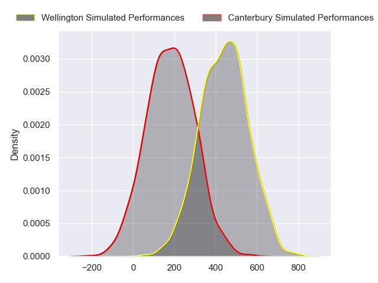
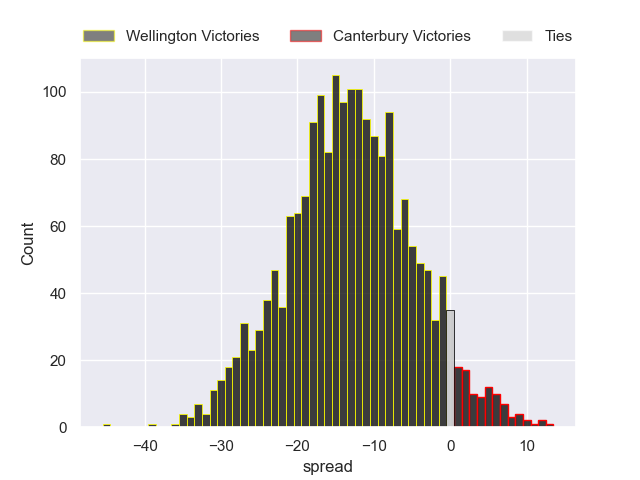
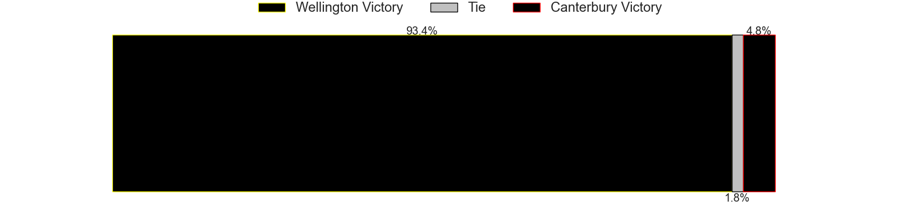

---  
layout: page  
title: Wellington at Canterbury  
date: 2024-08-31 18:00:00 -0500  
categories: "NPC 2024" match projection  
---
# Wellington at Canterbury

# Club Level Predictions

The first set of predictions treats a club as the smallest object, as the club develops its members, organizes a gameplan, and deploys its players as needed for each match. This club model has a prediction of 0.404, which translates to predicting Wellington to win by 3.4.

Each club has a rating and a rating deviation (similar to a Glicko rating), and expected performances can be generated. This allows for simulated matches and spreads like the ones below.
## Projected Performances - Club Model

## Projected Spreads - Club Model

## Projected Results - Club Model

# Player Level Predictions

Treating teams instead as an entity made up of the currently active players, I have ratings for each player in an altogether different system. These can be combined to form team ratings once teamsheets are announced, weighting starters a bit higher than the reserves. After the match is played, players can be weighted by their minutes on the field, allowing for an accurate measure of the team's composition. With these compiled team ratings, we can make predictions, measure inaccuracy, and update the individual player ratings.
## Prediction without Player Minutes: Wellington by 13.3

Wellington by 16.4 on a neutral pitch

## Projected Performances - Player Model

## Projected Spreads - Player Model

## Projected Results - Player Model

| Away Player           |   Away Percentile |   Number |   Home Percentile | Home Player   |
|:----------------------|------------------:|---------:|------------------:|:--------------|
| Xavier Numia          |            nan    |        1 |              30.4 |               |
| Leni Apisai           |            nan    |        2 |              30.4 |               |
| Siale Lauaki          |            nan    |        3 |              30.4 |               |
| Hugo Plummer          |            nan    |        4 |              30.4 |               |
| Caleb Delany          |             87.4  |        5 |              30.4 |               |
| Brad Shields          |            nan    |        6 |              30.4 |               |
| Sione Halalilo        |            nan    |        7 |              30.4 |               |
| Peter Lakai           |            nan    |        8 |              30.4 |               |
| Kyle Preston          |            nan    |        9 |              30.4 |               |
| Callum Harkin         |            nan    |       10 |              30.4 |               |
| Pepesana Patafilo     |            nan    |       11 |              30.4 |               |
| Riley Higgins         |            nan    |       12 |              30.4 |               |
| Peter Umaga-Jensen    |            nan    |       13 |              30.4 |               |
| Julian Savea          |            nan    |       14 |              30.4 |               |
| Tjay Clarke           |            nan    |       15 |              30.4 |               |
| Penieli Poasa         |            nan    |       16 |              30.4 |               |
| Yota Kamimori         |            nan    |       17 |              30.4 |               |
| PJ Sheck              |            nan    |       18 |              30.4 |               |
| Akira Ieremia         |            nan    |       19 |              30.4 |               |
| Dominic Ropeti        |            nan    |       20 |              30.4 |               |
| Nui Muriwai           |            nan    |       21 |              30.4 |               |
| Jackson Garden-Bachop |            nan    |       22 |              30.4 |               |
| Stanley Solomon       |             25.14 |       23 |              30.4 |               |

