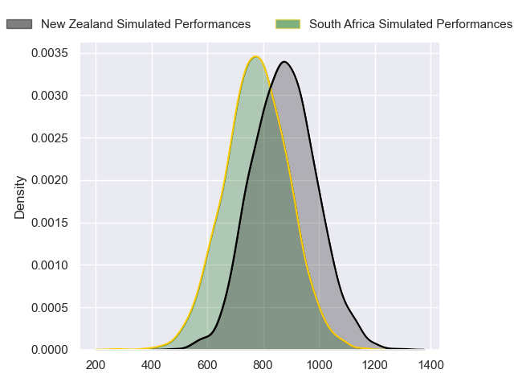
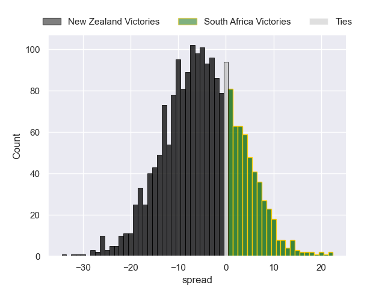

---  
layout: page  
title: New Zealand at South Africa  
date: 2024-08-31 18:00:00 -0500  
categories: "Rugby Championship 2024" match projection  
---
# New Zealand at South Africa

# Club Level Predictions

The first set of predictions treats a club as the smallest object, as the club develops its members, organizes a gameplan, and deploys its players as needed for each match. This club model has a prediction of 0.684, which translates to predicting South Africa to win by 10.3.

Our Over/Under is 50.5 - and combined with the spread above, we have a predicted scoreline of 20 to 31

Each club has a rating and a rating deviation (similar to a Glicko rating), and expected performances can be generated. This allows for simulated matches and spreads like the ones below.
## Projected Performances - Club Model

## Projected Spreads - Club Model

## Projected Results - Club Model

# Player Level Predictions

Treating teams instead as an entity made up of the currently active players, I have ratings for each player in an altogether different system. These can be combined to form team ratings once teamsheets are announced, weighting starters a bit higher than the reserves. After the match is played, players can be weighted by their minutes on the field, allowing for an accurate measure of the team's composition. With these compiled team ratings, we can make predictions, measure inaccuracy, and update the individual player ratings.
## Prediction without Player Minutes: New Zealand by 4.9

New Zealand by 8.5 on a neutral pitch

## Projected Performances - Player Model

## Projected Spreads - Player Model

## Projected Results - Player Model

| Away Player         |   Away Percentile |   Number |   Home Percentile | Home Player               |
|:--------------------|------------------:|---------:|------------------:|:--------------------------|
| Tamaiti Williams    |             87.79 |        1 |             99.76 | Ox Nche                   |
| Codie Taylor        |             98.85 |        2 |             98.04 | Bongi Mbonambi            |
| Tyrel Lomax         |             85.93 |        3 |             89.09 | Frans Malherbe            |
| Scott Barrett       |             95.42 |        4 |             94.6  | Pieter-Steph du Toit      |
| Tupou Vaa'i         |             95.02 |        5 |             89.35 | Ruan Nortje               |
| Ethan Blackadder    |             98.43 |        6 |             91.66 | Siya Kolisi               |
| Sam Cane            |             99.12 |        7 |             79.2  | Ben-Jason Dixon           |
| Ardie Savea         |             98.73 |        8 |             87.05 | Jasper Wiese              |
| TJ Perenara         |             97.05 |        9 |             95.15 | Cobus Reinach             |
| Damian McKenzie     |             98.12 |       10 |             73.7  | Sacha Feinberg-Mngomezulu |
| Caleb Clarke        |             86.84 |       11 |             98.3  | Kurt-Lee Arendse          |
| Jordie Barrett      |             94.85 |       12 |             99.36 | Damian de Allende         |
| Rieko Ioane         |             88.63 |       13 |             98.39 | Jesse Kriel               |
| Will Jordan         |             96.78 |       14 |             99.72 | Cheslin Kolbe             |
| Beauden Barrett     |            100    |       15 |             92.24 | Aphelele Fassi            |
| Asafo Aumua         |             95.74 |       16 |            100    | Malcolm Marx              |
| Ofa Tu'ungafasi     |             99.51 |       17 |             92.89 | Gerhard Steenekamp        |
| Fletcher Newell     |              1.29 |       18 |             67.74 | Vincent Koch              |
| Sam Darry           |             56.62 |       19 |             99.2  | Eben Etzebeth             |
| Samipeni Finau      |             96.86 |       20 |             90.23 | Elrigh Louw               |
| Cortez Ratima       |             86.31 |       21 |             87.9  | Kwagga Smith              |
| Anton Lienert-Brown |             95.39 |       22 |             70.36 | Grant Williams            |
| Mark Tele'a         |             73.77 |       23 |             84.76 | Handre Pollard            |

