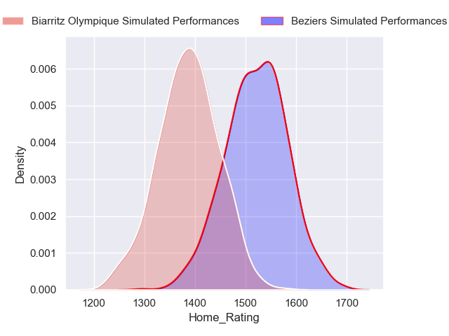
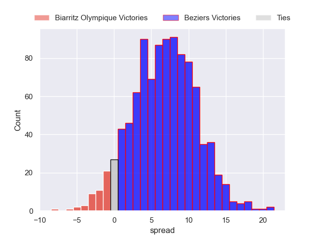
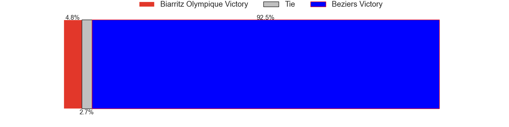
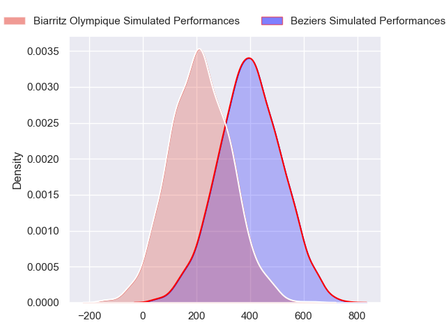
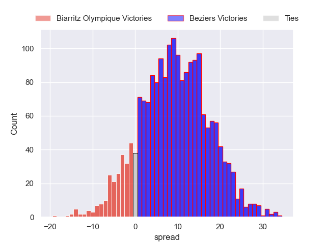
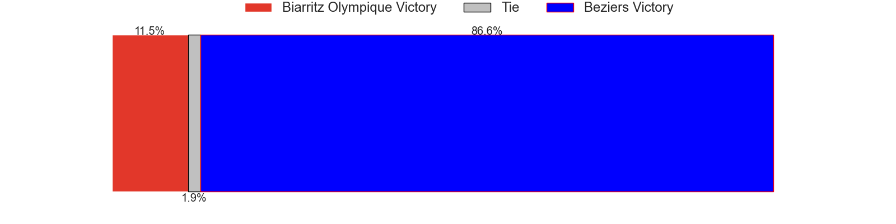

---  
layout: page  
title: Biarritz Olympique at Beziers  
date: 2024-09-05 18:00:00 -0500  
categories: "Pro D2 2024" match projection  
---
# Biarritz Olympique at Beziers

# Club Level Predictions

The first set of predictions treats a club as the smallest object, as the club develops its members, organizes a gameplan, and deploys its players as needed for each match. This club model has a prediction of 0.598, which translates to predicting Beziers to win by 6.7.

Our Over/Under is 43.5 - and combined with the spread above, we have a predicted scoreline of 18 to 25

Each club has a rating and a rating deviation (similar to a Glicko rating), and expected performances can be generated. This allows for simulated matches and spreads like the ones below.
## Projected Performances - Club Model

## Projected Spreads - Club Model

## Projected Results - Club Model

# Player Level Predictions

Treating teams instead as an entity made up of the currently active players, I have ratings for each player in an altogether different system. These can be combined to form team ratings once teamsheets are announced, weighting starters a bit higher than the reserves. After the match is played, players can be weighted by their minutes on the field, allowing for an accurate measure of the team's composition. With these compiled team ratings, we can make predictions, measure inaccuracy, and update the individual player ratings.
## Prediction without Player Minutes: Beziers by 9.5

Beziers by 1.0 on a neutral pitch

## Projected Performances - Player Model

## Projected Spreads - Player Model

## Projected Results - Player Model

| Away Player         |   Away Percentile |   Number |   Home Percentile | Home Player        |
|:--------------------|------------------:|---------:|------------------:|:-------------------|
| Alexandre Plantier  |            nan    |        1 |            nan    | Youssef Amrouni    |
| Yohan Beheregaray   |             58.62 |        2 |            nan    | Jose Luis Gonzalez |
| Giorgi Nutsubidze   |            nan    |        3 |             69.74 | Christian Judge    |
| Adrian Motoc        |              2.19 |        4 |            nan    | Cam Dodson         |
| Piula Fa'asalele    |             78.46 |        5 |            nan    | Hans N'Kinsi       |
| Simon Augry         |            nan    |        6 |            nan    | William Van Bost   |
| Jessy Jegerlehner   |            nan    |        7 |            nan    | Clément Ancely     |
| Cornell du Preez    |             90.97 |        8 |            nan    | Otunuku Pauta      |
| Kerman Aurrekoetxea |             61.68 |        9 |             87.46 | Samuel Marques     |
| Thomas Dolhagaray   |             37    |       10 |            nan    | Charly Malié       |
| Baptiste Fariscot   |            nan    |       11 |             84.45 | Aminiasi Tuimaba   |
| Tyler Morgan        |            nan    |       12 |            nan    | Taleta Tupuola     |
| Mathieu Acebes      |             94.15 |       13 |            nan    | Paul Recor         |
| Zach Kibirige       |            nan    |       14 |            nan    | Pierre Courtaud    |
| Kylian Jaminet      |            nan    |       15 |            nan    | Gabin Lorre        |
| Clément Martinez    |            nan    |       16 |            nan    | Yanis Boulassel    |
| François Mur        |            nan    |       17 |            nan    | Yahnis El Maslouhi |
| Ellande Sanderson   |            nan    |       18 |            nan    | Pierre Gayraud     |
| Ekain Imaz Agirre   |            nan    |       19 |            nan    | Baptiste Abescat   |
| Edgar Retière       |            nan    |       20 |            nan    | Damien Añon        |
| Thomas Hébert       |            nan    |       21 |            nan    | Victor Dreuille    |
| Yann David          |            nan    |       22 |             80.74 | Taylor Gontineac   |
| Zakaria El Fakir    |            nan    |       23 |            nan    | Yannick Arroyo     |

