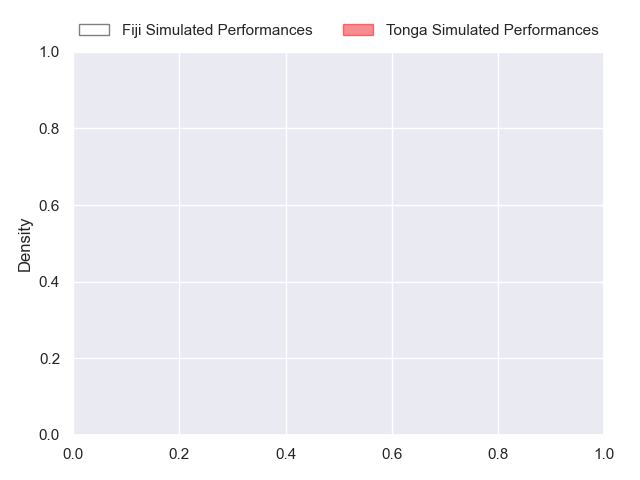
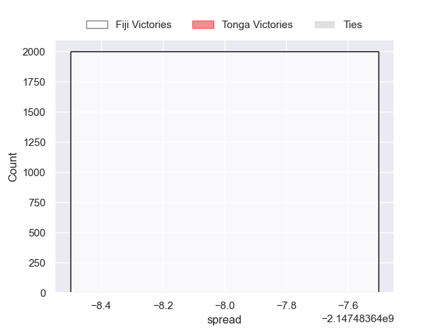
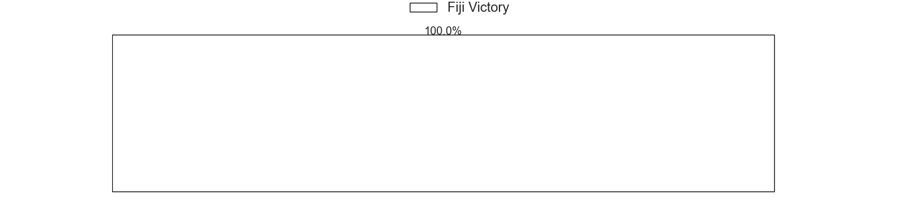

---  
layout: page  
title: Fiji at Tonga  
date: 2024-09-05 18:00:00 -0500  
categories: "Pacific Nations Cup 2024" match projection  
---
# Fiji at Tonga

# Club Level Predictions

The first set of predictions treats a club as the smallest object, as the club develops its members, organizes a gameplan, and deploys its players as needed for each match. This club model has a prediction of 0.192, which translates to predicting Fiji to win by 13.3.

Each club has a rating and a rating deviation (similar to a Glicko rating), and expected performances can be generated. This allows for simulated matches and spreads like the ones below.
## Projected Performances - Club Model

## Projected Spreads - Club Model

## Projected Results - Club Model

# Player Level Predictions

Treating teams instead as an entity made up of the currently active players, I have ratings for each player in an altogether different system. These can be combined to form team ratings once teamsheets are announced, weighting starters a bit higher than the reserves. After the match is played, players can be weighted by their minutes on the field, allowing for an accurate measure of the team's composition. With these compiled team ratings, we can make predictions, measure inaccuracy, and update the individual player ratings.
## Prediction without Player Minutes: Fiji by 3.3

Fiji by 5.7 on a neutral pitch

## Projected Performances - Player Model

## Projected Spreads - Player Model

## Projected Results - Player Model

| Away Player             |   Away Percentile |   Number |   Home Percentile | Home Player           |
|:------------------------|------------------:|---------:|------------------:|:----------------------|
| Eroni Mawi              |             84.3  |        1 |            nan    | Jethro Felemi         |
| Tevita Ikanivere        |            nan    |        2 |            nan    | Solomone Aniseko      |
| Samu Tawake             |             50.81 |        3 |            nan    | Ben Tameifuna         |
| Mesake Vocevoce         |             75.17 |        4 |            nan    | Harrison Mataele      |
| Temo Mayanavanua        |            nan    |        5 |             49.58 | Onehunga Havili       |
| Meli Derenalagi         |             52.28 |        6 |            nan    | Tevita Ahokovi        |
| Elia Canakaivata        |            nan    |        7 |             68.41 | Tupou Ma'Afu-Afungia  |
| Albert Tuisue           |             93.75 |        8 |            nan    | Lotu Inisi            |
| Frank Lomani            |            nan    |        9 |             10.14 | Aisea Halo            |
| Caleb Muntz             |            nan    |       10 |            nan    | Pat Pellegrini        |
| Epeli Momo              |            nan    |       11 |            nan    | Samuel Tuitupou       |
| Adrea Cocagi            |             93.4  |       12 |            nan    | Fetuli Paea           |
| Iosefo Masi             |            nan    |       13 |            nan    | Fine Inisi            |
| Vuate Karawalevu        |            nan    |       14 |            nan    | Esau Filimoehala      |
| Isaiah Armstrong-Ravula |             20.3  |       15 |            nan    | Nikolai Foliaki       |
| Mesu Dolokoto           |             38.26 |       16 |            nan    | Penisoni Fineanganofo |
| Haereiti Hetet          |            nan    |       17 |            nan    | Salesi Tuifua         |
| Peni Ravai Kovekalou    |             53.56 |       18 |            nan    | Brandon Televave      |
| Ratu Rotuisolia         |             51.15 |       19 |             30.13 |                       |
| Kitione Salawa          |            nan    |       20 |             27.91 | Sosefo Sakalia        |
| Peni Matawalu           |             58.93 |       21 |            nan    | Siaosi Nai            |
| Inia Tabuavou           |            nan    |       22 |            nan    | Tyler Pulini          |
| Ilaisa Droasese         |             75.37 |       23 |             30.13 |                       |

