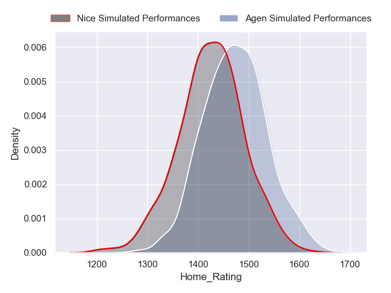
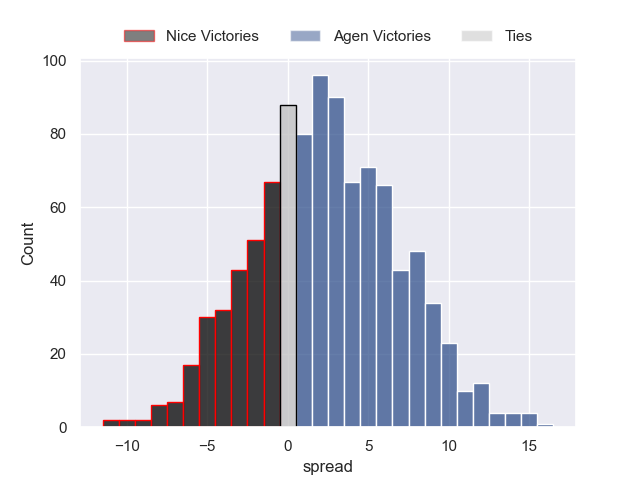
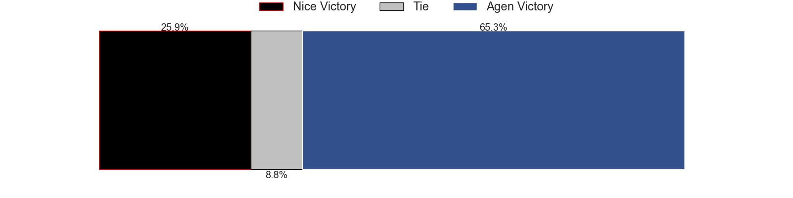
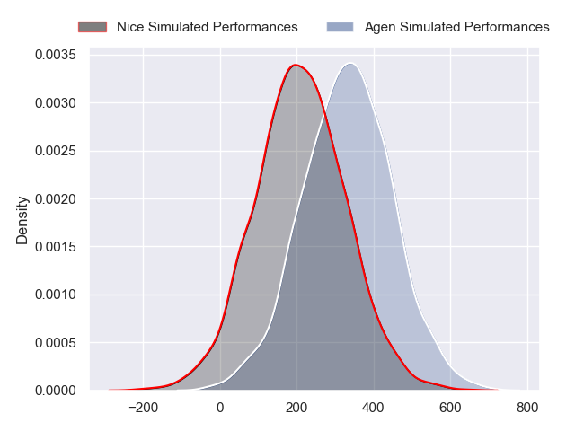
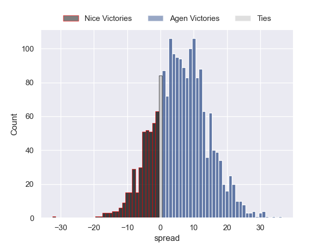
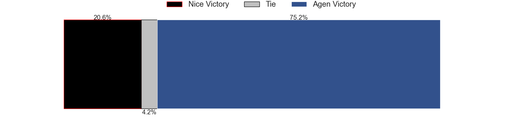

---  
layout: page  
title: Nice at Agen  
date: 2024-09-06 18:00:00 -0500  
categories: "Pro D2 2024" match projection  
---
# Nice at Agen

# Club Level Predictions

The first set of predictions treats a club as the smallest object, as the club develops its members, organizes a gameplan, and deploys its players as needed for each match. This club model has a prediction of 0.479, which translates to predicting Nice to win by -2.4.

Our Over/Under is 32.5 - and combined with the spread above, we have a predicted scoreline of 15 to 17

Each club has a rating and a rating deviation (similar to a Glicko rating), and expected performances can be generated. This allows for simulated matches and spreads like the ones below.
## Projected Performances - Club Model

## Projected Spreads - Club Model

## Projected Results - Club Model

# Player Level Predictions

Treating teams instead as an entity made up of the currently active players, I have ratings for each player in an altogether different system. These can be combined to form team ratings once teamsheets are announced, weighting starters a bit higher than the reserves. After the match is played, players can be weighted by their minutes on the field, allowing for an accurate measure of the team's composition. With these compiled team ratings, we can make predictions, measure inaccuracy, and update the individual player ratings.
## Prediction without Player Minutes: Agen by 6.2

Nice by 2.0 on a neutral pitch

## Projected Performances - Player Model

## Projected Spreads - Player Model

## Projected Results - Player Model

| Away Player             |   Away Percentile |   Number |   Home Percentile | Home Player         |
|:------------------------|------------------:|---------:|------------------:|:--------------------|
| Facundo Gigena          |             34.14 |        1 |            nan    | Hans Lombard-Buret  |
| Pierre Strippoli        |            nan    |        2 |             77.5  | Santiago Socino     |
| Luvuyo Pupuma           |            nan    |        3 |            nan    | Alex Burin          |
| Tom Murday              |            nan    |        4 |            nan    | Evan Olmstead       |
| Martin Freytes          |            nan    |        5 |            nan    | John Madigan        |
| Arthur Vignolles        |            nan    |        6 |            nan    | Matthieu Bonnet     |
| Bastien Berenguel       |            nan    |        7 |            nan    | Arnaud Duputs       |
| Jordan Taufua           |             93.93 |        8 |              2.58 | Fotu Lokotui        |
| Jules Solinas           |            nan    |        9 |             52.92 | Jack Maunder        |
| Mathis Viard            |            nan    |       10 |            nan    | Franck Pourteau     |
| David Odiete            |            nan    |       11 |            nan    | Iban Etcheverry     |
| Romain Riguet           |            nan    |       12 |            nan    | Kolinio Ramoka      |
| Luca Cutayar            |            nan    |       13 |            nan    | Peyo Muscarditz     |
| Christiaan Erasmus      |            nan    |       14 |            nan    | Henry Purdy         |
| Paul Auradou            |            nan    |       15 |            nan    | Loris Tolot         |
| Santiago Ovejero Abdala |            nan    |       16 |            nan    | Pierre Jouvin       |
| Julien Beaufils         |            nan    |       17 |            nan    | Mamuka Mstoiani     |
| Thibaud Rey             |            nan    |       18 |            nan    | William Demotte     |
| Adrien Vigne            |            nan    |       19 |            nan    | Vincent Farré       |
| Louis Suaud             |            nan    |       20 |            nan    | Dorian Bellot       |
| Thibault Dufau          |            nan    |       21 |            nan    | Billy Searle        |
| Tom Daly                |             25.96 |       22 |            nan    | Clément Garrigues   |
| Tom Ross                |             14.97 |       23 |             50.4  | Lasha Macharashvili |

