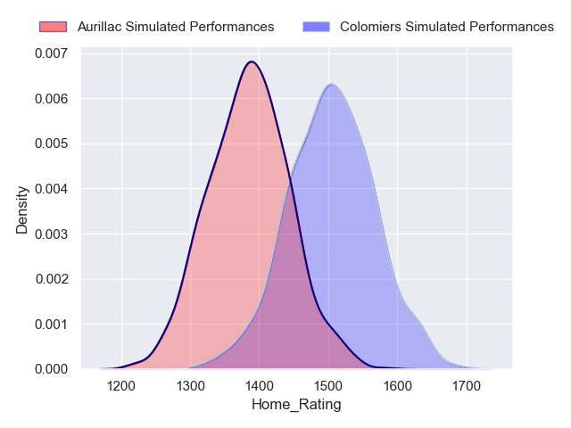
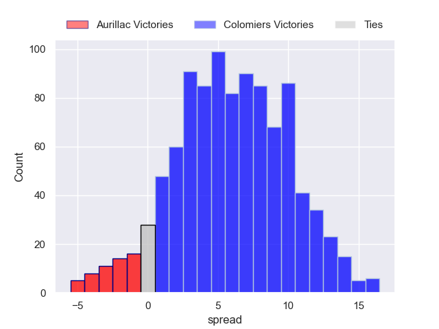
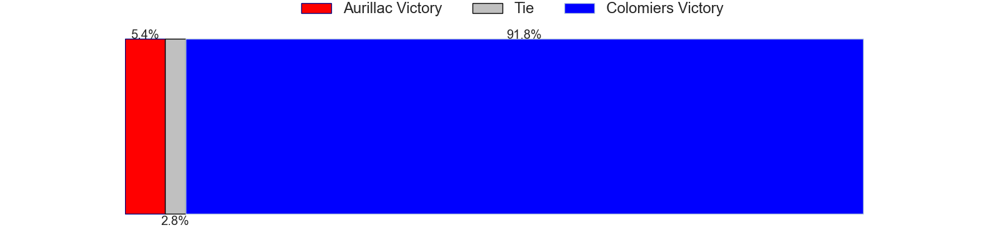
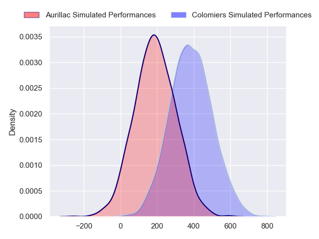
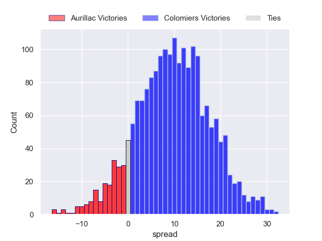
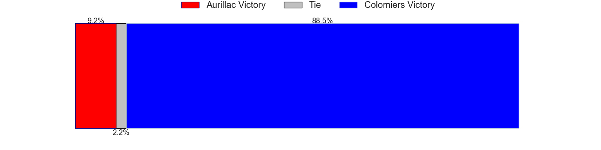

---  
layout: page  
title: Aurillac at Colomiers  
date: 2024-09-06 18:00:00 -0500  
categories: "Pro D2 2024" match projection  
---
# Aurillac at Colomiers

# Club Level Predictions

The first set of predictions treats a club as the smallest object, as the club develops its members, organizes a gameplan, and deploys its players as needed for each match. This club model has a prediction of 0.577, which translates to predicting Colomiers to win by 6.0.

Our Over/Under is 45.5 - and combined with the spread above, we have a predicted scoreline of 20 to 26

Each club has a rating and a rating deviation (similar to a Glicko rating), and expected performances can be generated. This allows for simulated matches and spreads like the ones below.
## Projected Performances - Club Model

## Projected Spreads - Club Model

## Projected Results - Club Model

# Player Level Predictions

Treating teams instead as an entity made up of the currently active players, I have ratings for each player in an altogether different system. These can be combined to form team ratings once teamsheets are announced, weighting starters a bit higher than the reserves. After the match is played, players can be weighted by their minutes on the field, allowing for an accurate measure of the team's composition. With these compiled team ratings, we can make predictions, measure inaccuracy, and update the individual player ratings.
## Prediction without Player Minutes: Colomiers by 10.2

Colomiers by 2.3 on a neutral pitch

## Projected Performances - Player Model

## Projected Spreads - Player Model

## Projected Results - Player Model

| Away Player           |   Away Percentile |   Number |   Home Percentile | Home Player        |
|:----------------------|------------------:|---------:|------------------:|:-------------------|
| Irakli Mchedlidze     |            nan    |        1 |            nan    | Guillaume Tartas   |
| Ronan Loughnane       |            nan    |        2 |            nan    | Thomas Larrieu     |
| Giorgi Kartvelishvili |            nan    |        3 |            nan    | Michaël Simutoga   |
| Eoghan Masterson      |            nan    |        4 |            nan    | Jean Thomas        |
| Mehdi Slamani         |            nan    |        5 |            nan    | Janse Roux         |
| Tim De Jong           |             32.94 |        6 |            nan    | Anthony Coletta    |
| Hugo Huurman          |            nan    |        7 |            nan    | Aldric Lescure     |
| Abongile Nonkontwana  |            nan    |        8 |            nan    | Caleb Timu         |
| Mikheil Alania        |             65.64 |        9 |            nan    | Ugo Séguéla        |
| Tedo Abzhandadze      |             50.11 |       10 |            nan    | Joaquin De La Vega |
| Simeli Yabaki         |            nan    |       11 |             91.85 | Rodrigo Marta      |
| Karsen Talalua        |            nan    |       12 |            nan    | Ray Nu'U           |
| Karl Martin           |            nan    |       13 |            nan    | Enzo Salles        |
| Lucas Oudard          |            nan    |       14 |             89.86 | Vincent Pinto      |
| Dachi Papunashvili    |            nan    |       15 |            nan    | Ugo Pacome         |
| Basa Khonelidze       |            nan    |       16 |            nan    | Théo Lachaud       |
| Gymaël Jean-Jacques   |            nan    |       17 |            nan    | Eliès El Ansari    |
| Martial Rolland       |            nan    |       18 |            nan    | Louis Descoux      |
| Théo Cambon           |            nan    |       19 |            nan    | Grégoire Bazin     |
| Didier Tison          |            nan    |       20 |            nan    | Dorian Laborde     |
| Léo Salvan            |            nan    |       21 |            nan    | Arthur Diaz        |
| Hugo Bastard          |            nan    |       22 |            nan    | Max Auriac         |
| Valentin Welsch       |            nan    |       23 |             64.16 | Hugo Pirlet        |

