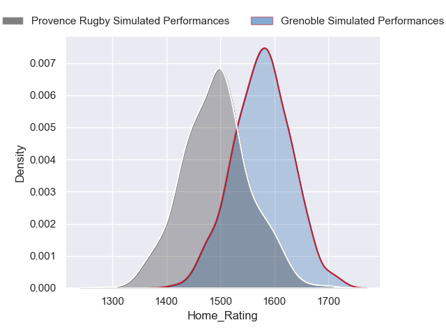
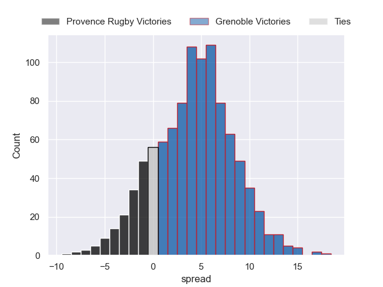
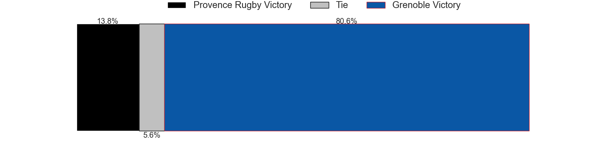
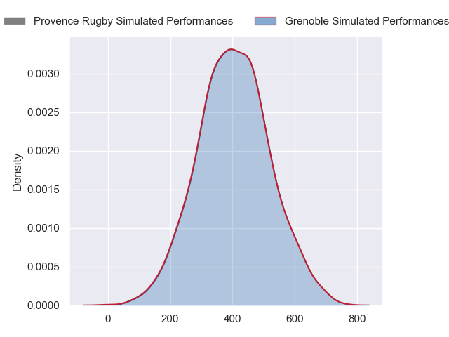
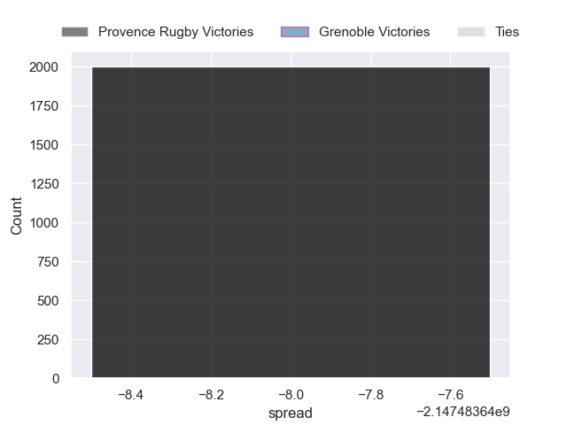
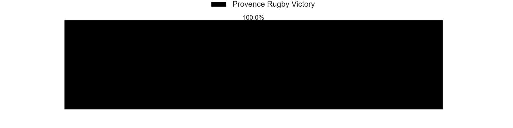

---  
layout: page  
title: Provence Rugby at Grenoble  
date: 2024-09-06 18:00:00 -0500  
categories: "Pro D2 2024" match projection  
---
# Provence Rugby at Grenoble

# Club Level Predictions

The first set of predictions treats a club as the smallest object, as the club develops its members, organizes a gameplan, and deploys its players as needed for each match. This club model has a prediction of 0.527, which translates to predicting Grenoble to win by 4.2.

Our Over/Under is 48.5 - and combined with the spread above, we have a predicted scoreline of 22 to 26

Each club has a rating and a rating deviation (similar to a Glicko rating), and expected performances can be generated. This allows for simulated matches and spreads like the ones below.
## Projected Performances - Club Model

## Projected Spreads - Club Model

## Projected Results - Club Model

# Player Level Predictions

Treating teams instead as an entity made up of the currently active players, I have ratings for each player in an altogether different system. These can be combined to form team ratings once teamsheets are announced, weighting starters a bit higher than the reserves. After the match is played, players can be weighted by their minutes on the field, allowing for an accurate measure of the team's composition. With these compiled team ratings, we can make predictions, measure inaccuracy, and update the individual player ratings.
## Prediction without Player Minutes: Grenoble by 10.5

Grenoble by 2.5 on a neutral pitch

## Projected Performances - Player Model

## Projected Spreads - Player Model

## Projected Results - Player Model

| Away Player       |   Away Percentile |   Number |   Home Percentile | Home Player        |
|:------------------|------------------:|---------:|------------------:|:-------------------|
| Thomas Vernet     |            nan    |        1 |             85.13 | Tommy Raynaud      |
| Loick Jammes      |            nan    |        2 |            nan    | Mathis Sarragallet |
| Paul Mallez       |            nan    |        3 |             66.75 | Johannes Jonker    |
| Charly Gambini    |             67.32 |        4 |            nan    | Thomas Lainault    |
| Malohi Suta       |            nan    |        5 |            nan    | Pierce Phillips    |
| Ned Hanigan       |            nan    |        6 |             93.62 | Jose Madeira       |
| Bilel Taieb       |            nan    |        7 |            nan    | Thibaut Martel     |
| Tornike Jalagonia |             21.18 |        8 |            nan    | Pio Muarua         |
| Arthur Coville    |            nan    |        9 |            nan    | Barnabé Couilloud  |
| Jules Soulan      |             68.72 |       10 |            nan    | Sam Davies         |
| Léo Drouet        |            nan    |       11 |            nan    | Geoffrey Cros      |
| Jimmy Gopperth    |            nan    |       12 |             79.96 | Julien Heriteau    |
| Atila Septar      |            nan    |       13 |            nan    | Romain Fusier      |
| Adrien Lapègue    |            nan    |       14 |             46.05 | Gerswin Mouton     |
| Thomas Salles     |            nan    |       15 |            nan    | Julien Farnoux     |
| Ian Boubila       |            nan    |       16 |            nan    | Lilian Rossi       |
| Nicolás Toth      |            nan    |       17 |            nan    | Zack Gauthier      |
| Andrés Zafra      |            nan    |       18 |             69.6  | Giorgi Javakhia    |
| Teimana Harrison  |            nan    |       19 |            nan    | Victor Guillaumond |
| Kévin Viallard    |            nan    |       20 |            nan    | Eric Escande       |
| Inga Finau        |            nan    |       21 |            nan    | Max Clément        |
| Eto Bainivalu     |            nan    |       22 |            nan    | Bautista Ezcurra   |
| Tomas Francis     |            nan    |       23 |            nan    | Cody Thomas        |

