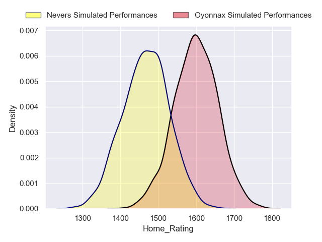
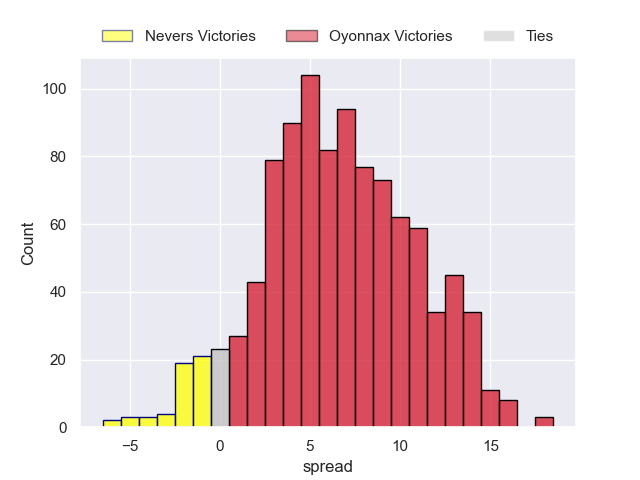
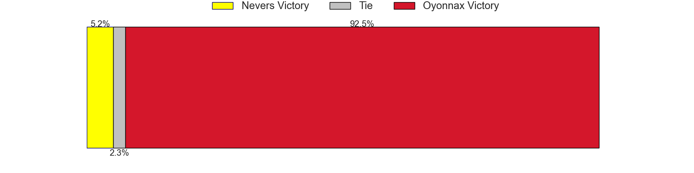
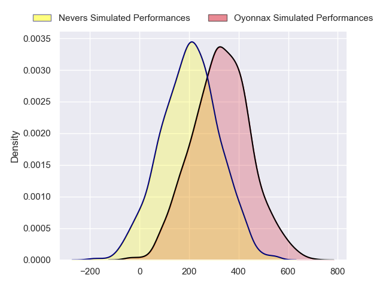
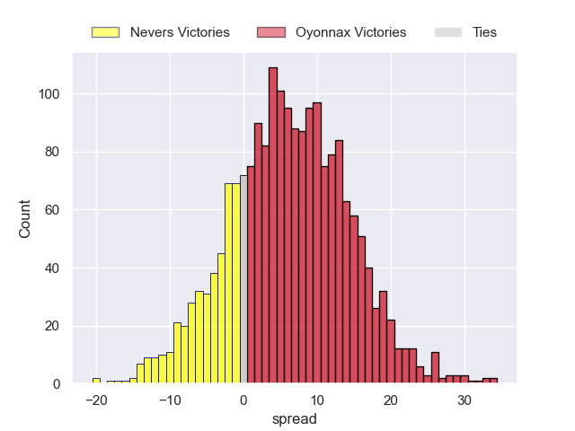
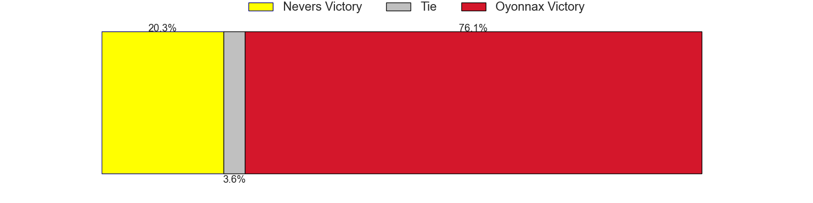

---  
layout: page  
title: Nevers at Oyonnax  
date: 2024-09-06 18:00:00 -0500  
categories: "Pro D2 2024" match projection  
---
# Nevers at Oyonnax

# Club Level Predictions

The first set of predictions treats a club as the smallest object, as the club develops its members, organizes a gameplan, and deploys its players as needed for each match. This club model has a prediction of 0.592, which translates to predicting Oyonnax to win by 6.6.

Our Over/Under is 37.5 - and combined with the spread above, we have a predicted scoreline of 16 to 22

Each club has a rating and a rating deviation (similar to a Glicko rating), and expected performances can be generated. This allows for simulated matches and spreads like the ones below.
## Projected Performances - Club Model

## Projected Spreads - Club Model

## Projected Results - Club Model

# Player Level Predictions

Treating teams instead as an entity made up of the currently active players, I have ratings for each player in an altogether different system. These can be combined to form team ratings once teamsheets are announced, weighting starters a bit higher than the reserves. After the match is played, players can be weighted by their minutes on the field, allowing for an accurate measure of the team's composition. With these compiled team ratings, we can make predictions, measure inaccuracy, and update the individual player ratings.
## Prediction without Player Minutes: Oyonnax by 6.6

Nevers by 1.2 on a neutral pitch

## Projected Performances - Player Model

## Projected Spreads - Player Model

## Projected Results - Player Model

| Away Player                |   Away Percentile |   Number |   Home Percentile | Home Player               |
|:---------------------------|------------------:|---------:|------------------:|:--------------------------|
| Aitor Kitutu               |            nan    |        1 |             96.52 | Oli Kebble                |
| Jean-Maxence Jules-Rosette |            nan    |        2 |             87.85 | Peniami Narisia           |
| Aselo Ikahehegi            |            nan    |        3 |             20.87 | Ali Oz                    |
| Lasha Jaiani               |             87.24 |        4 |             76.57 | Ewan Johnson              |
| Maka Polutélé              |            nan    |        5 |             57.03 | Hugo Fabregue             |
| Rati Zazadze (2)           |            nan    |        6 |             42.26 | Kevin Lebreton            |
| Julien Kazubek             |            nan    |        7 |             76.29 | Antoine Miquel            |
| Jason Fraser               |            nan    |        8 |              3.14 | Loic Godener              |
| Hugo Bouyssou              |            nan    |        9 |              9.62 | Vasil Lobzhanidze         |
| Yohan Le Bourhis           |            nan    |       10 |             31.08 | Chris William Smith       |
| Perry Mayo                 |            nan    |       11 |            nan    | Karim Qadiri              |
| Rudy Derrieux              |            nan    |       12 |             65.43 | Lucas Mensa               |
| Atu Manu                   |            nan    |       13 |              9.36 | Chris Farrell             |
| Lucas Blanc                |            nan    |       14 |             47.2  | Maxime Salles             |
| Tom Deleuze                |            nan    |       15 |              7.16 | Justin Bouraux            |
| Jonathan Maïau             |            nan    |       16 |             11.49 | Teddy Durand              |
| Tornike Mataradze          |            nan    |       17 |              3.4  | Adrien Bordenave          |
| Shaun Reynolds             |            nan    |       18 |             15.28 | Kevin Kornath             |
| Luka Plataret              |            nan    |       19 |            nan    | Veresa Tuqovu Ramototabua |
| Ugo Vignolles              |             45.66 |       20 |            nan    | Yvan David                |
| Simon Tarel                |            nan    |       21 |            nan    | Eddie Sawailau            |
| Paula Walisoliso           |            nan    |       22 |             57.47 | Martin Bogado             |
| Lasha Pkhakadze (2)        |            nan    |       23 |             42.31 | Paulo Tafili              |

