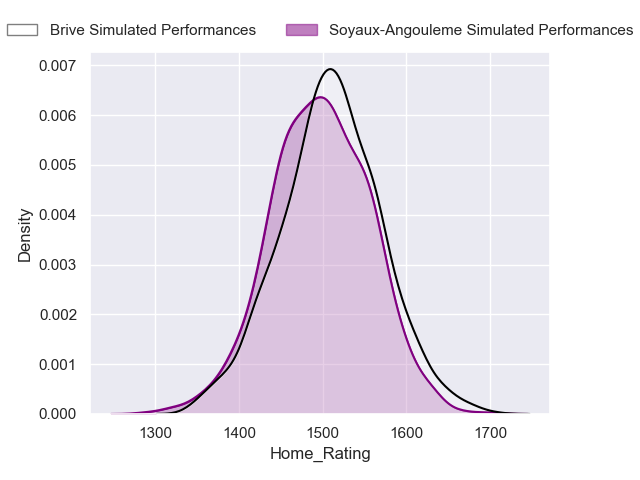
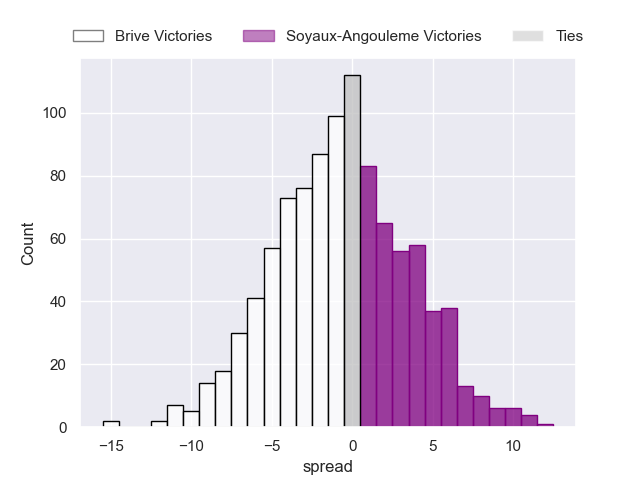
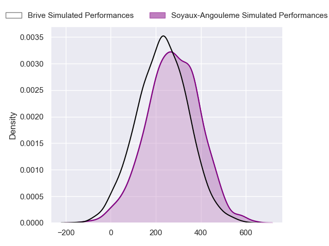
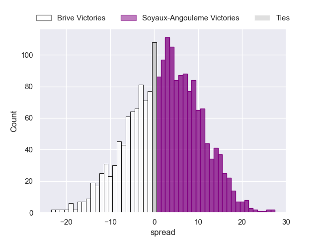
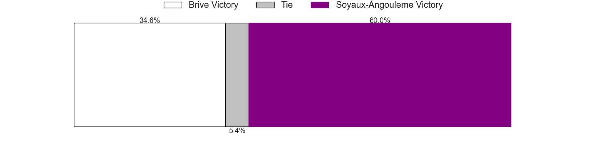

---  
layout: page  
title: Brive at Soyaux-Angouleme  
date: 2024-09-06 18:00:00 -0500  
categories: "Pro D2 2024" match projection  
---
# Brive at Soyaux-Angouleme

# Club Level Predictions

The first set of predictions treats a club as the smallest object, as the club develops its members, organizes a gameplan, and deploys its players as needed for each match. This club model has a prediction of 0.387, which translates to predicting Brive to win by 0.6.

Our Over/Under is 33.5 - and combined with the spread above, we have a predicted scoreline of 17 to 16

Each club has a rating and a rating deviation (similar to a Glicko rating), and expected performances can be generated. This allows for simulated matches and spreads like the ones below.
## Projected Performances - Club Model

## Projected Spreads - Club Model

## Projected Results - Club Model

# Player Level Predictions

Treating teams instead as an entity made up of the currently active players, I have ratings for each player in an altogether different system. These can be combined to form team ratings once teamsheets are announced, weighting starters a bit higher than the reserves. After the match is played, players can be weighted by their minutes on the field, allowing for an accurate measure of the team's composition. With these compiled team ratings, we can make predictions, measure inaccuracy, and update the individual player ratings.
## Prediction without Player Minutes: Soyaux-Angouleme by 2.6

Brive by 1.6 on a neutral pitch

## Projected Performances - Player Model

## Projected Spreads - Player Model

## Projected Results - Player Model

| Away Player               |   Away Percentile |   Number |   Home Percentile | Home Player          |
|:--------------------------|------------------:|---------:|------------------:|:---------------------|
| Omar Odishvili            |            nan    |        1 |             74.68 | Vivien Devisme       |
| Lucas Da Silva            |            nan    |        2 |            nan    | Motu Matu'U          |
| Vakh Abdaladze            |            nan    |        3 |            nan    | Yassin Boutemanni    |
| Courtney Lawes            |             97.41 |        4 |            nan    | Ian Kitwanga         |
| Konstantin Mikautadze     |              3.29 |        5 |            nan    | Sikeli Nabou         |
| Retief Marais             |            nan    |        6 |            nan    | Germain Burgaud      |
| Ross Moriarty             |            nan    |        7 |            nan    | Clément Sentubéry    |
| Taniela Sadrugu           |            nan    |        8 |            nan    | Maxence Lemardelet   |
| Léo Carbonneau            |             59.28 |        9 |            nan    | Lucas Zamora         |
| Curwin Bosch              |             84.36 |       10 |            nan    | Ben Botica           |
| Erwan Dridi               |            nan    |       11 |             61.14 | Jonny May            |
| Sam Johnson               |            nan    |       12 |            nan    | George Tilsley       |
| Georges Shvelidze         |            nan    |       13 |            nan    | Ledua Mau            |
| Mathis Ferté              |             55.16 |       14 |            nan    | Matthys Gratien      |
| Thomas Zénon              |            nan    |       15 |            nan    | Rémi Brosset         |
| Benjamin Boudou           |            nan    |       16 |            nan    | Rayne Barka          |
| Nathan Fraissenon         |            nan    |       17 |            nan    | Georgy Balakarev (2) |
| Asier Usarraga Latierro   |            nan    |       18 |            nan    | Enzo Morand-Bruyat   |
| Samuel Maximin            |            nan    |       19 |            nan    | Léo Morand-Bruyat    |
| Rahboni Warren-Vosayaco   |            nan    |       20 |            nan    | Alex Masibaka (2)    |
| Maxence Biasotto          |             62.75 |       21 |            nan    | Adrien Bau           |
| Stuart Olding             |            nan    |       22 |            nan    | Arthur Proult        |
| Francisco Coria Marchetti |            nan    |       23 |            nan    | Omar Dahir           |

