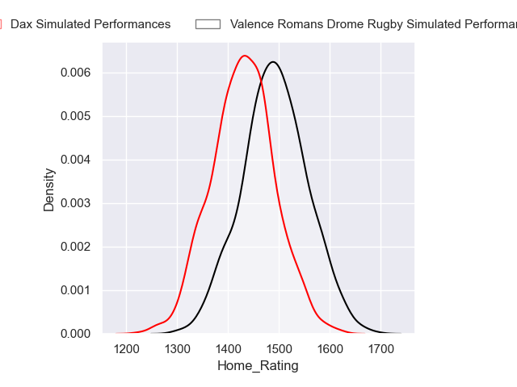
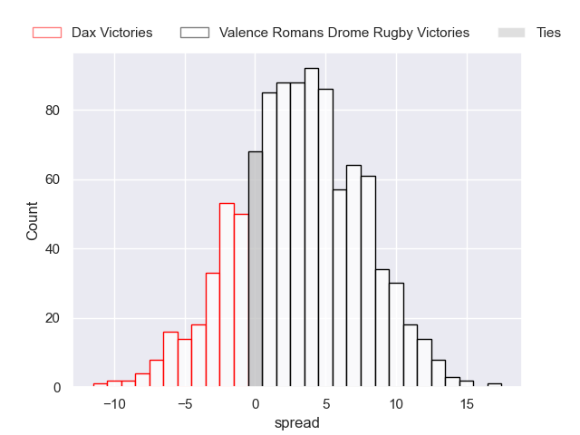
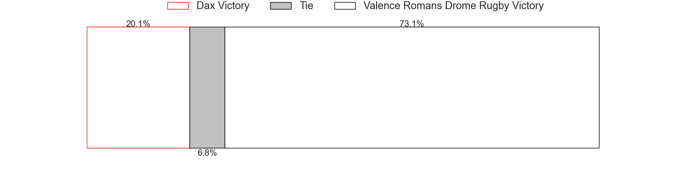
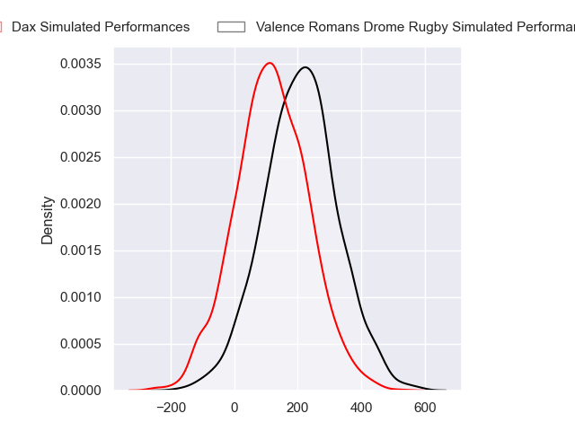
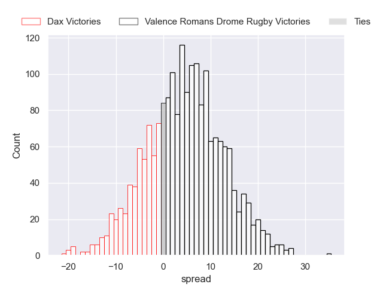
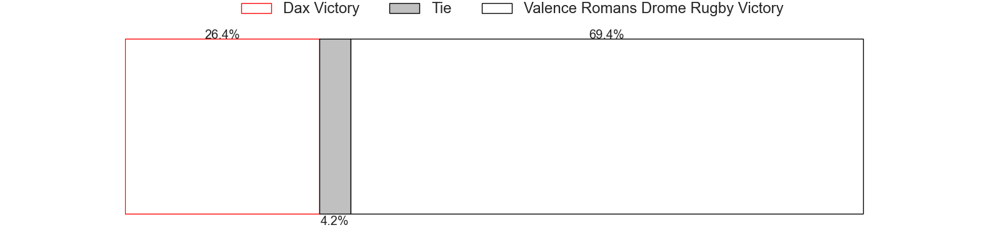

---  
layout: page  
title: Dax at Valence Romans Drome Rugby  
date: 2024-09-06 18:00:00 -0500  
categories: "Pro D2 2024" match projection  
---
# Dax at Valence Romans Drome Rugby

# Club Level Predictions

The first set of predictions treats a club as the smallest object, as the club develops its members, organizes a gameplan, and deploys its players as needed for each match. This club model has a prediction of 0.495, which translates to predicting Dax to win by -3.1.

Our Over/Under is 37.5 - and combined with the spread above, we have a predicted scoreline of 17 to 20

Each club has a rating and a rating deviation (similar to a Glicko rating), and expected performances can be generated. This allows for simulated matches and spreads like the ones below.
## Projected Performances - Club Model

## Projected Spreads - Club Model

## Projected Results - Club Model

# Player Level Predictions

Treating teams instead as an entity made up of the currently active players, I have ratings for each player in an altogether different system. These can be combined to form team ratings once teamsheets are announced, weighting starters a bit higher than the reserves. After the match is played, players can be weighted by their minutes on the field, allowing for an accurate measure of the team's composition. With these compiled team ratings, we can make predictions, measure inaccuracy, and update the individual player ratings.
## Prediction without Player Minutes: Valence Romans Drome Rugby by 4.3

Valence Romans Drome Rugby by 1.3 on a neutral pitch

## Projected Performances - Player Model

## Projected Spreads - Player Model

## Projected Results - Player Model

| Away Player           |   Away Percentile |   Number |   Home Percentile | Home Player         |
|:----------------------|------------------:|---------:|------------------:|:--------------------|
| David Lolohea         |             12.87 |        1 |            nan    | Anthony Aléo        |
| Iban Hiriart-Urruty   |            nan    |        2 |            nan    | Dorian Marco-Pena   |
| Diogo Hasse Ferreira  |              7.69 |        3 |            nan    | Kévin Goze          |
| Brice Ferrer          |             46.81 |        4 |            nan    | Ryan Mccauley       |
| Jean-Baptiste Singer  |            nan    |        5 |            nan    | Florian Goumat      |
| Jean-Baptiste Barrère |            nan    |        6 |            nan    | Éloi Massot         |
| Arnaud Aletti         |            nan    |        7 |            nan    | Thembelani Bholi    |
| Paul Arnaud Ausset    |            nan    |        8 |             21.83 | Ilia Spanderashvili |
| Sylvère Réteau        |            nan    |        9 |            nan    | Thomas Lhuséro      |
| Hugo Cerisier         |            nan    |       10 |            nan    | Lucas Méret         |
| Diego Miranda         |            nan    |       11 |            nan    | Adam Vargas         |
| Jale Vatubua          |              0.22 |       12 |            nan    | Mathieu Guillomot   |
| Benjamin Puntous      |            nan    |       13 |            nan    | Ben Neiceru         |
| Maxime Oltmann        |            nan    |       14 |              3.41 | Owen Lane           |
| Théo Gatelier         |            nan    |       15 |             19.22 | Thomas Roziere      |
| Louis Barrère         |            nan    |       16 |            nan    | Cyril Deligny       |
| Louis Mary            |            nan    |       17 |            nan    | Andréa Pontanier    |
| Etienne Loiret        |            nan    |       18 |            nan    | Darren O'Shea       |
| Ratu Nacika           |            nan    |       19 |            nan    | Matthieu Vachon     |
| Paul Ravier           |            nan    |       20 |            nan    | Mattéo Rodor        |
| Noah Nene             |             40.86 |       21 |            nan    | George Worth        |
| Bastien Daguerre      |            nan    |       22 |            nan    | Adrien Roux         |
| Nephi Leatigaga       |            nan    |       23 |            nan    | Gareth Milasinovich |

