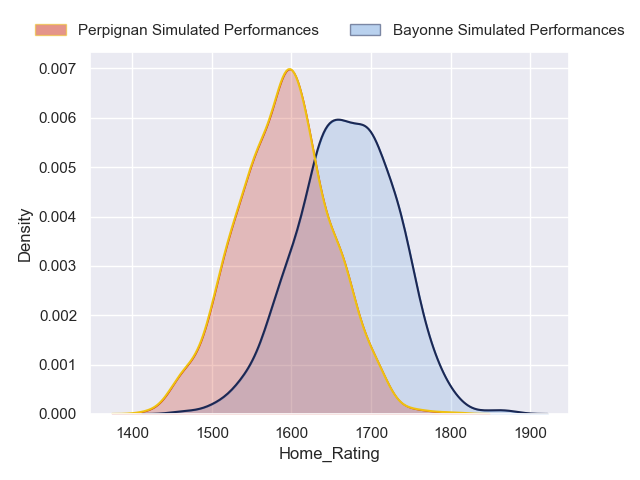
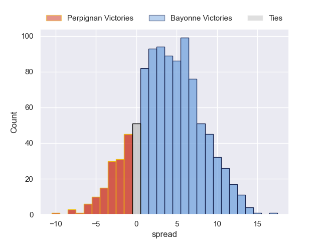
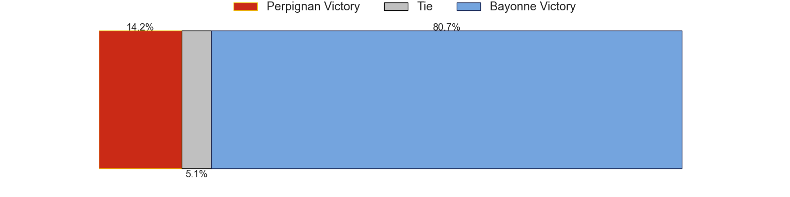
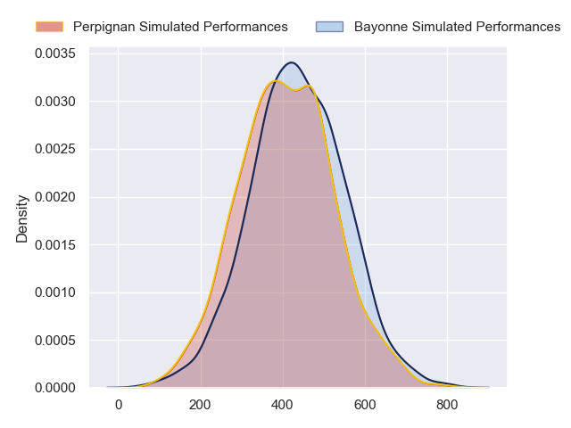
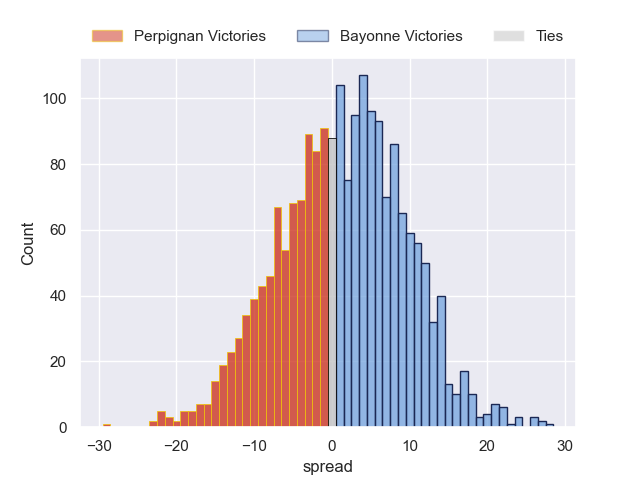

---  
layout: page  
title: Perpignan at Bayonne  
date: 2024-09-07 18:00:00 -0500  
categories: "Top 14 2024" match projection  
---
# Perpignan at Bayonne

# Club Level Predictions

The first set of predictions treats a club as the smallest object, as the club develops its members, organizes a gameplan, and deploys its players as needed for each match. This club model has a prediction of 0.521, which translates to predicting Bayonne to win by 3.9.

Our Over/Under is 43.5 - and combined with the spread above, we have a predicted scoreline of 20 to 24

Each club has a rating and a rating deviation (similar to a Glicko rating), and expected performances can be generated. This allows for simulated matches and spreads like the ones below.
## Projected Performances - Club Model

## Projected Spreads - Club Model

## Projected Results - Club Model

# Player Level Predictions

Treating teams instead as an entity made up of the currently active players, I have ratings for each player in an altogether different system. These can be combined to form team ratings once teamsheets are announced, weighting starters a bit higher than the reserves. After the match is played, players can be weighted by their minutes on the field, allowing for an accurate measure of the team's composition. With these compiled team ratings, we can make predictions, measure inaccuracy, and update the individual player ratings.
## Prediction without Player Minutes: Bayonne by 1.4

Perpignan by 6.8 on a neutral pitch

## Projected Performances - Player Model

## Projected Spreads - Player Model

## Projected Results - Player Model

| Away Player           |   Away Percentile |   Number |   Home Percentile | Home Player             |
|:----------------------|------------------:|---------:|------------------:|:------------------------|
| Bruce Devaux          |             10.86 |        1 |            nan    | Andy Bordelai           |
| Seilala Lam           |             88.14 |        2 |             93.05 | Facundo Bosch           |
| Pietro Ceccarelli     |             81.12 |        3 |             27.32 | Tevita Tatafu           |
| Marvin Orie           |             92.24 |        4 |              3.62 | Veikoso Poloniati       |
| Adrien Warion         |             24.3  |        5 |             14.37 | Lucas Paulos            |
| Patrick Sobela        |             95.88 |        6 |             99.34 | Rodrigo Bruni           |
| Jacobus van Tonder    |             88.07 |        7 |             65.64 | Arthur Iturria          |
| So'otala Fa'aso'o     |             95.41 |        8 |             64.19 | Uzair Cassiem           |
| Tom Ecochard          |             90.6  |        9 |             11.01 | Baptiste Germain        |
| Jake McIntyre         |             93.39 |       10 |             92.73 | Camille Lopez           |
| Ali Crossdale         |             34.63 |       11 |             79.41 | Nadir Megdoud           |
| Jeronimo de la Fuente |             99.67 |       12 |             21.17 | Arnaud Erbinartegaray   |
| Alivereti Duguivalu   |             21.81 |       13 |             60.02 | Sireli Maqala           |
| Tavite Veredamu       |             82.54 |       14 |             83.32 | Aurelien Callandret     |
| Tommaso Allan         |             67.17 |       15 |            nan    | Yohan Orabe             |
| Victor Montgaillard   |            nan    |       16 |             13.39 | Vincent Giudicelli      |
| Giorgi Beria          |             86.97 |       17 |            nan    | Pierre Castillon        |
| Posolo Tuilagi        |             21.82 |       18 |             89.4  | Baptiste Heguy          |
| Lucas Bachelier       |             76.44 |       19 |             89.52 | Giovanni Habel-Kueffner |
| Lucas Velarte         |              8.3  |       20 |             92.38 | Maxime Machenaud        |
| Jefferson Joseph      |            nan    |       21 |             77.75 | Joris Segonds           |
| Eneriko Buliruarua    |              3.85 |       22 |              7.39 | Tom Spring              |
| Kieran Brookes        |             29.07 |       23 |             66.42 | Luke Tagi               |

