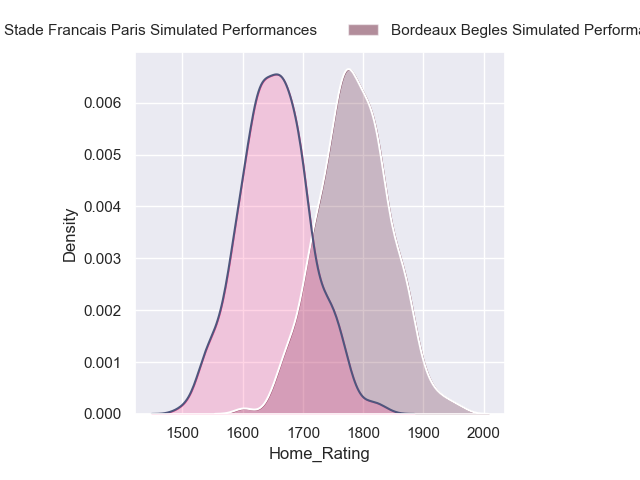
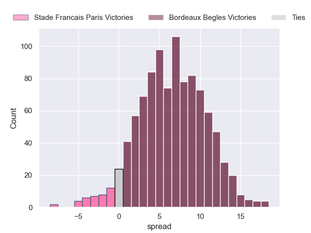
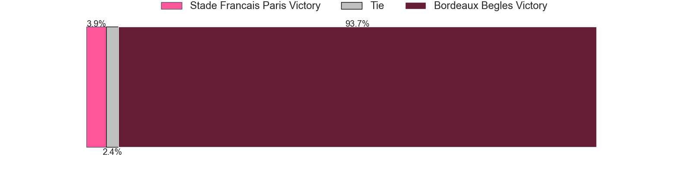
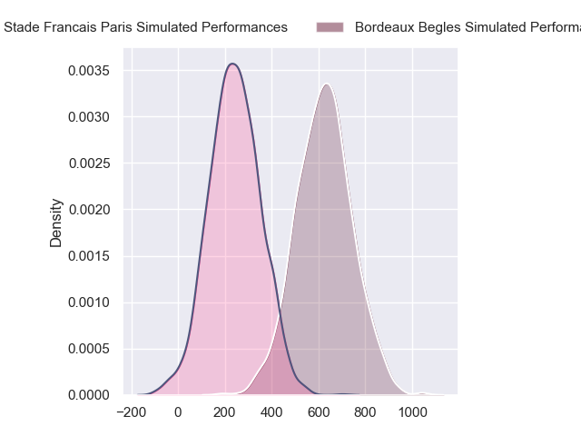
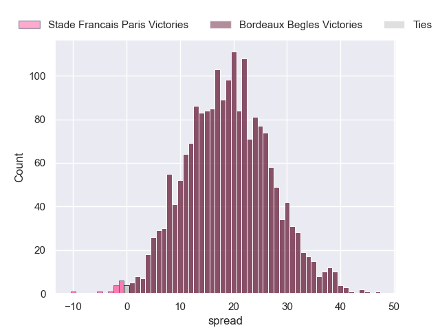
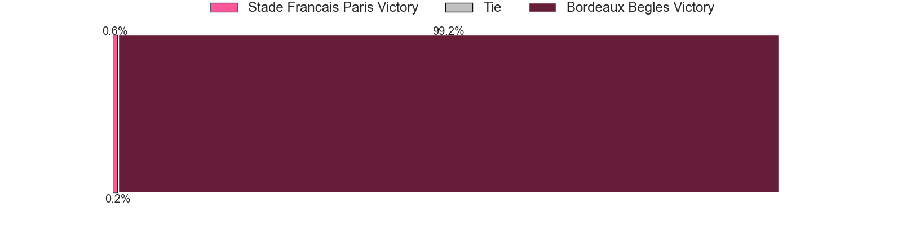

---  
layout: page  
title: Stade Francais Paris at Bordeaux Begles  
date: 2024-09-07 18:00:00 -0500  
categories: "Top 14 2024" match projection  
---
# Stade Francais Paris at Bordeaux Begles

# Club Level Predictions

The first set of predictions treats a club as the smallest object, as the club develops its members, organizes a gameplan, and deploys its players as needed for each match. This club model has a prediction of 0.591, which translates to predicting Bordeaux Begles to win by 6.5.

Our Over/Under is 39.5 - and combined with the spread above, we have a predicted scoreline of 17 to 23

Each club has a rating and a rating deviation (similar to a Glicko rating), and expected performances can be generated. This allows for simulated matches and spreads like the ones below.
## Projected Performances - Club Model

## Projected Spreads - Club Model

## Projected Results - Club Model

# Player Level Predictions

Treating teams instead as an entity made up of the currently active players, I have ratings for each player in an altogether different system. These can be combined to form team ratings once teamsheets are announced, weighting starters a bit higher than the reserves. After the match is played, players can be weighted by their minutes on the field, allowing for an accurate measure of the team's composition. With these compiled team ratings, we can make predictions, measure inaccuracy, and update the individual player ratings.
## Prediction without Player Minutes: Bordeaux Begles by 19.3

Bordeaux Begles by 11.9 on a neutral pitch

## Projected Performances - Player Model

## Projected Spreads - Player Model

## Projected Results - Player Model

| Away Player          |   Away Percentile |   Number |   Home Percentile | Home Player               |
|:---------------------|------------------:|---------:|------------------:|:--------------------------|
| Sergo Abramishvili   |             72.77 |        1 |             76.02 | Jefferson Poirot          |
| Lucas Peyresblanques |             20.17 |        2 |             69.15 | Maxime Lamothe            |
| Paul Alo-Emile       |             91.73 |        3 |             47.37 | Carlu Sadie               |
| Paul Gabrillagues    |             33.51 |        4 |             89.51 | Pierre Bochaton           |
| JJ van der Mescht    |             85.63 |        5 |             93.69 | Cyril Cazeaux             |
| Mathieu Hirigoyen    |              2.78 |        6 |             10.7  | Lachlan Swinton           |
| Pierre Huguet        |             37.86 |        7 |             84.26 | Bastien Vergnes Taillefer |
| Yoan Tanga           |             76.64 |        8 |             67.47 | Marko Gazzotti            |
| Jules Gimbert        |             11.52 |        9 |             99.29 | Maxime Lucu               |
| Louis Carbonel       |             74.45 |       10 |             97.58 | Matthieu Jalibert         |
| Samuel Ezeala        |              8.49 |       11 |             83.41 | Louis Bielle-Biarrey      |
| Julien Delbouis      |             87.33 |       12 |             85.46 | Yoram Moefana             |
| Joe Marchant         |             80.51 |       13 |             87.78 | Nicolas Depoortere        |
| Joe Jonas            |            nan    |       14 |             97.66 | Damian Penaud             |
| Leo Barre            |             77.83 |       15 |             98.26 | Romain Buros              |
| Giacomo Nicotera     |             99.32 |       16 |             30.17 | Romain Latterrade         |
| Moses Alo-Emile      |             74.69 |       17 |             93.23 | Ugo Boniface              |
| Baptiste Pesenti     |             78.8  |       18 |            nan    | Jonny Gray                |
| Sekou Macalou        |             95.68 |       19 |            nan    | Temo Matiu                |
| Brad Weber           |             97.52 |       20 |             84.67 | Mahamadou Diaby           |
| Zack Henry           |             81.94 |       21 |              5.85 | Yann Lesgourgues          |
| Lester Etien         |             92.39 |       22 |              9.69 | Pablo Uberti              |
| Giorgi Melikidze     |             93.98 |       23 |            nan    | Sipili Falatea            |

