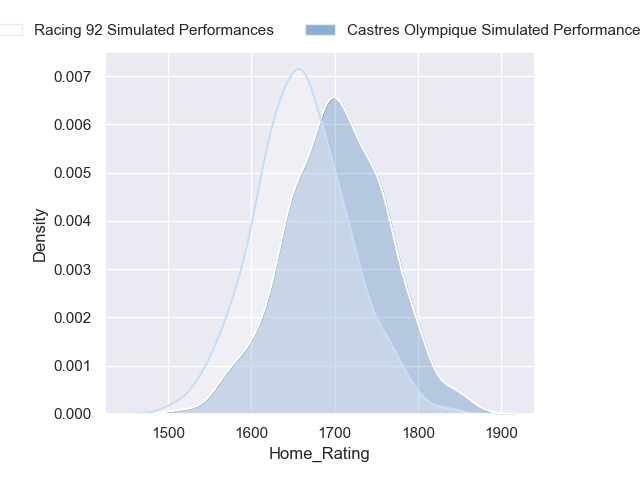
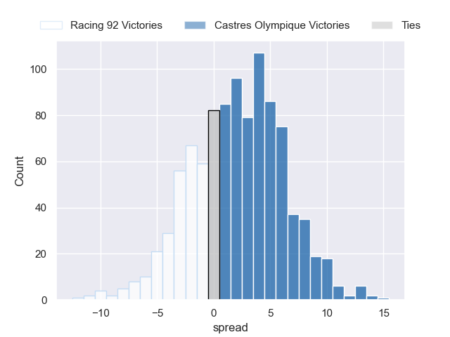
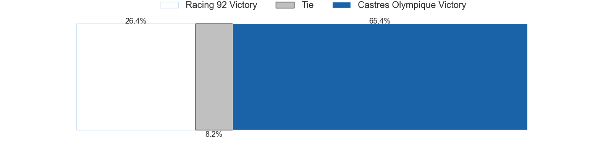
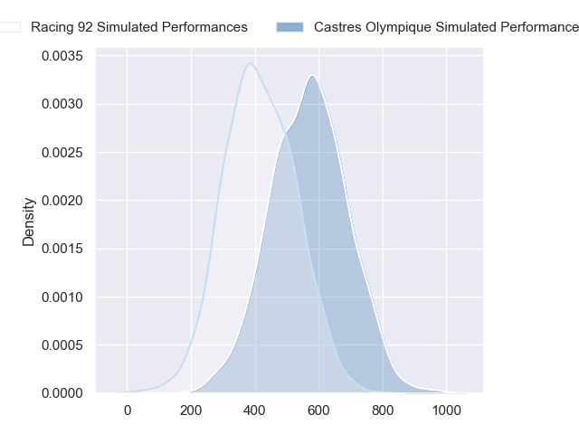
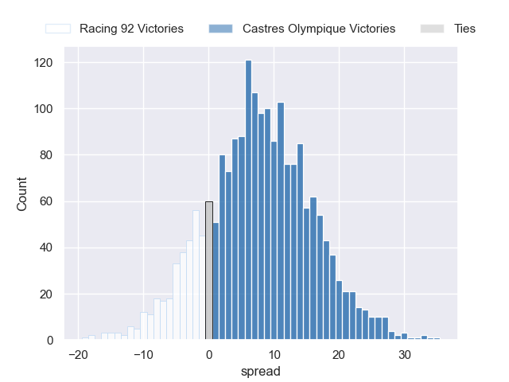
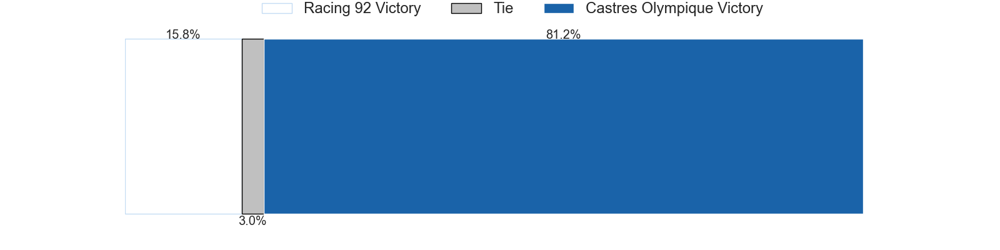

---  
layout: page  
title: Racing 92 at Castres Olympique  
date: 2024-09-07 18:00:00 -0500  
categories: "Top 14 2024" match projection  
---
# Racing 92 at Castres Olympique

# Club Level Predictions

The first set of predictions treats a club as the smallest object, as the club develops its members, organizes a gameplan, and deploys its players as needed for each match. This club model has a prediction of 0.469, which translates to predicting Racing 92 to win by -2.1.

Our Over/Under is 41.5 - and combined with the spread above, we have a predicted scoreline of 20 to 22

Each club has a rating and a rating deviation (similar to a Glicko rating), and expected performances can be generated. This allows for simulated matches and spreads like the ones below.
## Projected Performances - Club Model

## Projected Spreads - Club Model

## Projected Results - Club Model

# Player Level Predictions

Treating teams instead as an entity made up of the currently active players, I have ratings for each player in an altogether different system. These can be combined to form team ratings once teamsheets are announced, weighting starters a bit higher than the reserves. After the match is played, players can be weighted by their minutes on the field, allowing for an accurate measure of the team's composition. With these compiled team ratings, we can make predictions, measure inaccuracy, and update the individual player ratings.
## Prediction without Player Minutes: Castres Olympique by 7.9

Racing 92 by 0.3 on a neutral pitch

## Projected Performances - Player Model

## Projected Spreads - Player Model

## Projected Results - Player Model

| Away Player         |   Away Percentile |   Number |   Home Percentile | Home Player          |
|:--------------------|------------------:|---------:|------------------:|:---------------------|
| Guram Gogichashvili |             33.67 |        1 |             89.64 | Antoine Tichit       |
| Camille Chat        |             93.56 |        2 |             20.85 | Pierre Colonna       |
| Thomas Laclayat     |             79.7  |        3 |             92.65 | Will Collier         |
| Will Rowlands       |             58.01 |        4 |             29.06 | Guillaume Ducat      |
| Romain Taofifenua   |             61.63 |        5 |             97.1  | Leone Nakarawa       |
| Junior Kpoku (2)    |            nan    |        6 |             24.59 | Mathieu Babillot     |
| Cameron Woki        |             92.76 |        7 |             89.3  | Tyler Ardron         |
| Jordan Joseph       |             85.37 |        8 |             56.11 | Abraham Papali'i     |
| Kléo Labarbe        |            nan    |        9 |             36.52 | Jeremy Fernandez     |
| Owen Farrell        |             99.12 |       10 |             87.17 | Julien Dumora        |
| Henry Arundell      |              9.56 |       11 |             86.63 | Remy Baget           |
| Sam James           |             91.63 |       12 |             98.13 | Jack Goodhue         |
| Gael Fickou         |             98.02 |       13 |             16.85 | Adrien Seguret       |
| Josua Tuisova       |             94.83 |       14 |            nan    | Christian Ambadiang  |
| Max Spring          |             20.87 |       15 |             98.24 | Geoffrey Palis       |
| Janick Tarrit       |             32.03 |       16 |             92.2  | Gaetan Barlot        |
| Lino Julien         |             60.82 |       17 |             75.02 | Quentin Walcker      |
| Fabien Sanconnie    |             35.68 |       18 |             83.66 | Florent Vanverberghe |
| Maxime Baudonne     |             56.58 |       19 |             89.2  | Baptiste Delaporte   |
| Clovis Le Bail      |             28.01 |       20 |             49.82 | Gauthier Doubrere    |
| Dan Lancaster       |             32.82 |       21 |             76.65 | Louis Le Brun        |
| Henry Chavancy      |             99.45 |       22 |             68.91 | Vilimoni Botitu      |
| Gia Kharaishvili    |            nan    |       23 |             86.55 | Levan Chilachava     |

