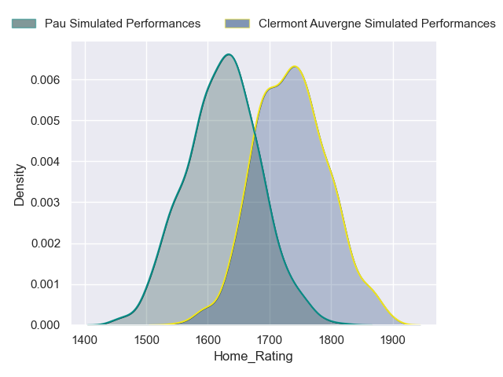
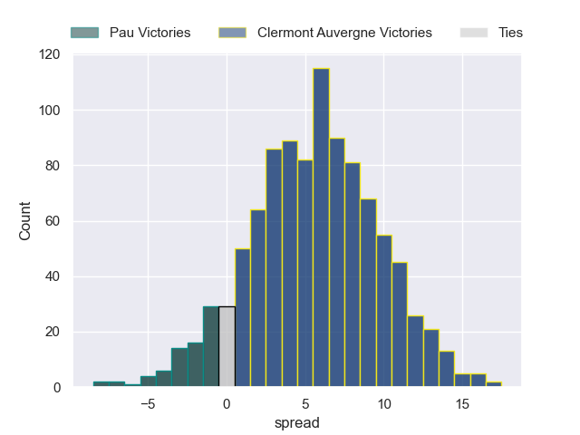
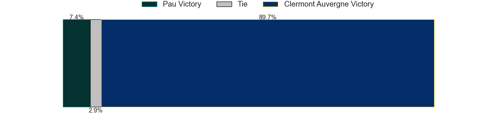
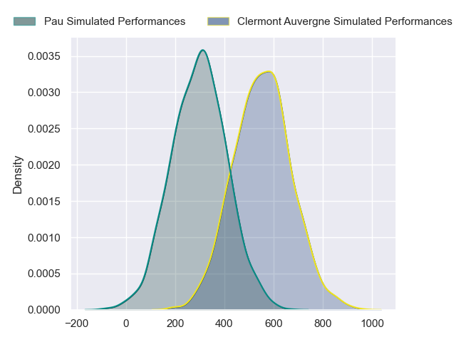
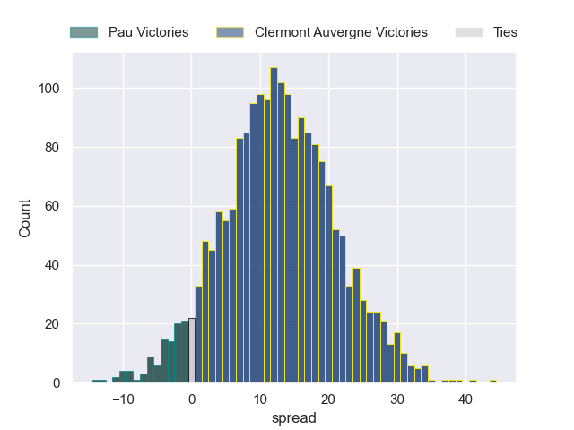
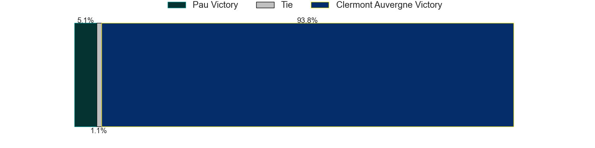

---  
layout: page  
title: Pau at Clermont Auvergne  
date: 2024-09-07 18:00:00 -0500  
categories: "Top 14 2024" match projection  
---
# Pau at Clermont Auvergne

# Club Level Predictions

The first set of predictions treats a club as the smallest object, as the club develops its members, organizes a gameplan, and deploys its players as needed for each match. This club model has a prediction of 0.564, which translates to predicting Clermont Auvergne to win by 5.6.

Our Over/Under is 46.5 - and combined with the spread above, we have a predicted scoreline of 20 to 26

Each club has a rating and a rating deviation (similar to a Glicko rating), and expected performances can be generated. This allows for simulated matches and spreads like the ones below.
## Projected Performances - Club Model

## Projected Spreads - Club Model

## Projected Results - Club Model

# Player Level Predictions

Treating teams instead as an entity made up of the currently active players, I have ratings for each player in an altogether different system. These can be combined to form team ratings once teamsheets are announced, weighting starters a bit higher than the reserves. After the match is played, players can be weighted by their minutes on the field, allowing for an accurate measure of the team's composition. With these compiled team ratings, we can make predictions, measure inaccuracy, and update the individual player ratings.
## Prediction without Player Minutes: Clermont Auvergne by 13.1

Clermont Auvergne by 5.5 on a neutral pitch

## Projected Performances - Player Model

## Projected Spreads - Player Model

## Projected Results - Player Model

| Away Player         |   Away Percentile |   Number |   Home Percentile | Home Player          |
|:--------------------|------------------:|---------:|------------------:|:---------------------|
| Ignacio Calles      |             48.45 |        1 |             55.89 | Sacha Lotrian        |
| Youri Delhommel     |             56.78 |        2 |             75.93 | Etienne Fourcade     |
| Guram Papidze       |             14.2  |        3 |             76.44 | Cristian Ojovan      |
| Thomas Jolmes       |             24.72 |        4 |             95.24 | Rob Simmons          |
| Remi Picquette      |             56.98 |        5 |             77.46 | Thomas Ceyte         |
| Sacha Zegueur       |             38.48 |        6 |             77.07 | Killian Tixeront     |
| Loic Credoz         |             45.88 |        7 |             51.75 | Peceli Yato          |
| Beka Gorgadze       |             76.2  |        8 |             93.45 | Fritz Lee            |
| Dan Robson          |             98.05 |        9 |             75.35 | Baptiste Jauneau     |
| Joe Simmonds        |             88.99 |       10 |             87.89 | Benjamin Urdapilleta |
| Eliott Roudil       |            nan    |       11 |             12.2  | Alivereti Raka       |
| Nathan Decron       |             79.41 |       12 |             91.52 | Leon Darricarrere    |
| Emilien Gailleton   |             84.69 |       13 |             76.78 | Lucas Tauzin         |
| Clement Laporte     |            nan    |       14 |             92.59 | Joris Jurand         |
| Theo Attissogbe     |             55.8  |       15 |             59.41 | Kylan Hamdaoui       |
| Lucas Rey           |             15.76 |       16 |             94.07 | Folau Fainga'a       |
| Daniel Bibi Biziwu  |              8.44 |       17 |             73.27 | Giorgi Akhaladze     |
| Lekima Tagitagivalu |             83.95 |       18 |             88.93 | Thibaud Lanen        |
| Thibaut Hamonou     |              8.85 |       19 |             77.98 | Alexandre Fischer    |
| Thibault Daubagna   |             93.62 |       20 |             89.18 | Sebastien Bezy       |
| Axel Desperes       |             83.26 |       21 |             96.7  | Anthony Belleau      |
| Tumua Manu          |             97.36 |       22 |             95.37 | George Moala         |
| Jon Zabala          |            nan    |       23 |            nan    | Regis Montagne       |

