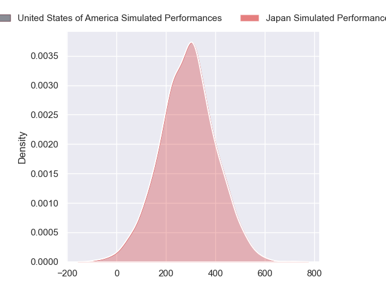
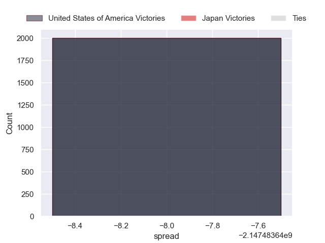

---  
layout: page  
title: United States of America at Japan  
date: 2024-09-07 18:00:00 -0500  
categories: "Pacific Nations Cup 2024" match projection  
---
# United States of America at Japan

# Club Level Predictions

The first set of predictions treats a club as the smallest object, as the club develops its members, organizes a gameplan, and deploys its players as needed for each match. This club model has a prediction of 0.508, which translates to predicting Japan to win by 3.6.

Our Over/Under is 71.5 - and combined with the spread above, we have a predicted scoreline of 34 to 37

Each club has a rating and a rating deviation (similar to a Glicko rating), and expected performances can be generated. This allows for simulated matches and spreads like the ones below.
## Projected Performances - Club Model

## Projected Spreads - Club Model

## Projected Results - Club Model

# Player Level Predictions

Treating teams instead as an entity made up of the currently active players, I have ratings for each player in an altogether different system. These can be combined to form team ratings once teamsheets are announced, weighting starters a bit higher than the reserves. After the match is played, players can be weighted by their minutes on the field, allowing for an accurate measure of the team's composition. With these compiled team ratings, we can make predictions, measure inaccuracy, and update the individual player ratings.
## Prediction without Player Minutes: Japan by 2.7

United States of America by 0.1 on a neutral pitch

## Projected Performances - Player Model

## Projected Spreads - Player Model

## Projected Results - Player Model

| Away Player              |   Away Percentile |   Number |   Home Percentile | Home Player        |
|:-------------------------|------------------:|---------:|------------------:|:-------------------|
| Jack Iscaro              |            nan    |        1 |             62.46 | Shogo Miura        |
| Kapeli Pifeleti          |            nan    |        2 |            nan    | nan                |
| Alex Maughan             |             37.14 |        3 |             53.96 | Keijiro Tamefusa   |
| Vili Helu                |             86.51 |        4 |             37.19 | Junior Waqa        |
| Greg Peterson            |            nan    |        5 |             92.02 | Warner Dearns      |
| Paddy Ryan               |            nan    |        6 |             60.02 | Tiennan Costley    |
| Cory Gilliland-Daniel    |             56.85 |        7 |             86.81 | Kanji Shimokawa    |
| Jamason Fa'anana-Schultz |            nan    |        8 |             84.31 | Faulua Makisi      |
| Ruben de Haas            |            nan    |        9 |            nan    | Shinobu Fujiwara   |
| Luke Carty               |            nan    |       10 |              2.33 | Seungsin Lee       |
| Nate Augspurger          |            nan    |       11 |            nan    | Malo Tuitama       |
| Tommaso Boni             |            nan    |       12 |            nan    | Nik Mccurran       |
| Tavite Lopeti            |            nan    |       13 |             97.45 | Dylan Riley        |
| Conner Mooneyham         |            nan    |       14 |             50.14 | Jone Naikabula     |
| Mitch Wilson             |            nan    |       15 |             56.24 | Takuya Yamasawa    |
| Sean Mcnulty             |             40.07 |       16 |             45.81 | Mamoru Harada      |
| Jake Turnbull            |              8.5  |       17 |             25.65 | Takayoshi Mohara   |
| Paul Mullen              |             31.23 |       18 |             37.7  | Shuhei Takeuchi    |
| Jason Damm               |             43.67 |       19 |              5.36 | Amato Fakatava     |
| Thomas Tu'avao           |             45.4  |       20 |            nan    | Isaiah Mapusua     |
| Moni Tonga'Uiha          |             72.12 |       21 |             32.65 | Taiki Koyama       |
| Juan Philip Smith        |            nan    |       22 |            nan    | Harumichi Tatekawa |
| Dominic Besag            |            nan    |       23 |             48.34 | Tomoki Osada       |

