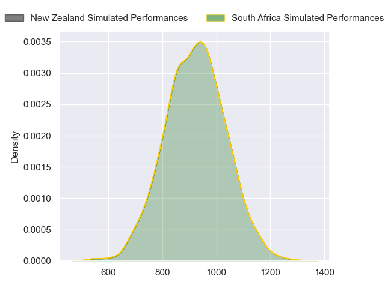
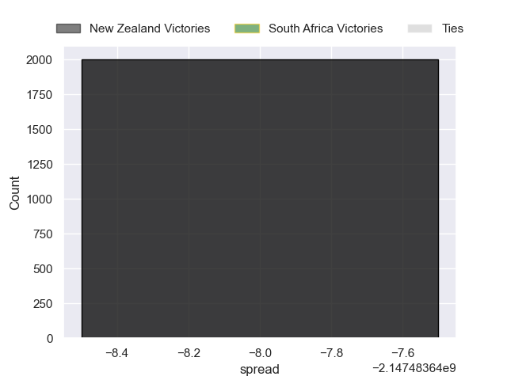

---  
layout: page  
title: New Zealand at South Africa  
date: 2024-09-07 18:00:00 -0500  
categories: "Rugby Championship 2024" match projection  
---
# New Zealand at South Africa

# Club Level Predictions

The first set of predictions treats a club as the smallest object, as the club develops its members, organizes a gameplan, and deploys its players as needed for each match. This club model has a prediction of 0.66, which translates to predicting South Africa to win by 8.9.

Our Over/Under is 49.5 - and combined with the spread above, we have a predicted scoreline of 20 to 29

Each club has a rating and a rating deviation (similar to a Glicko rating), and expected performances can be generated. This allows for simulated matches and spreads like the ones below.
## Projected Performances - Club Model

## Projected Spreads - Club Model

## Projected Results - Club Model

# Player Level Predictions

Treating teams instead as an entity made up of the currently active players, I have ratings for each player in an altogether different system. These can be combined to form team ratings once teamsheets are announced, weighting starters a bit higher than the reserves. After the match is played, players can be weighted by their minutes on the field, allowing for an accurate measure of the team's composition. With these compiled team ratings, we can make predictions, measure inaccuracy, and update the individual player ratings.
## Prediction without Player Minutes: South Africa by 13.3

South Africa by 9.8 on a neutral pitch

## Projected Performances - Player Model

## Projected Spreads - Player Model

## Projected Results - Player Model

| Away Player         |   Away Percentile |   Number |   Home Percentile | Home Player               |
|:--------------------|------------------:|---------:|------------------:|:--------------------------|
| Tamaiti Williams    |             89.47 |        1 |             99.92 | Ox Nche                   |
| Codie Taylor        |             98.64 |        2 |             98.14 | Bongi Mbonambi            |
| Tyrel Lomax         |             83.38 |        3 |             90.48 | Frans Malherbe            |
| Scott Barrett       |             94.31 |        4 |             99.17 | Eben Etzebeth             |
| Tupou Vaa'i         |             93.38 |        5 |             90.8  | Ruan Nortje               |
| Wallace Sititi      |            nan    |        6 |             90.74 | Siya Kolisi               |
| Sam Cane            |             99.07 |        7 |             96.69 | Pieter-Steph du Toit      |
| Ardie Savea         |             97.16 |        8 |             84.93 | Jasper Wiese              |
| Cortez Ratima       |             80.32 |        9 |             71.28 | Grant Williams            |
| Damian McKenzie     |             97.8  |       10 |             86.34 | Handre Pollard            |
| Mark Tele'a         |             78.63 |       11 |             99.8  | Cheslin Kolbe             |
| Jordie Barrett      |             92.73 |       12 |             99.89 | Damian de Allende         |
| Rieko Ioane         |             84.36 |       13 |             98.79 | Jesse Kriel               |
| Sevu Reece          |             77.56 |       14 |             99.61 | Canan Moodie              |
| Will Jordan         |             97.76 |       15 |             97.83 | Willie le Roux            |
| Asafo Aumua         |             95.93 |       16 |            100    | Malcolm Marx              |
| Ofa Tu'ungafasi     |             99.58 |       17 |             92.82 | Gerhard Steenekamp        |
| Fletcher Newell     |              1.67 |       18 |             68.5  | Vincent Koch              |
| Sam Darry           |             53.26 |       19 |             86.24 | Kwagga Smith              |
| Luke Jacobson       |             96.71 |       20 |             89.96 | Elrigh Louw               |
| TJ Perenara         |             96.81 |       21 |             90.96 | Jaden Hendrikse           |
| Anton Lienert-Brown |             97.03 |       22 |             78.41 | Sacha Feinberg-Mngomezulu |
| Beauden Barrett     |            100    |       23 |             87.89 | Lukhanyo Am               |

