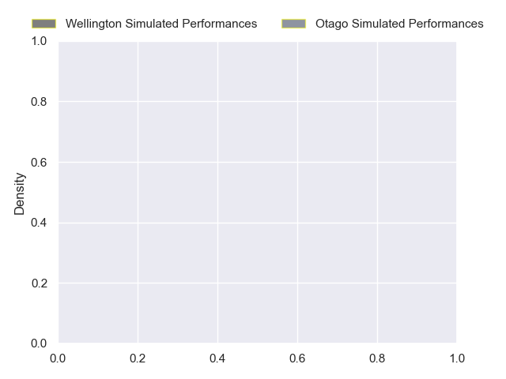
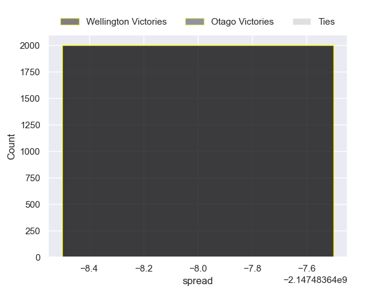

---  
layout: page  
title: Wellington at Otago  
date: 2024-09-11 18:00:00 -0500  
categories: "NPC 2024" match projection  
---
# Wellington at Otago

# Club Level Predictions

The first set of predictions treats a club as the smallest object, as the club develops its members, organizes a gameplan, and deploys its players as needed for each match. This club model has a prediction of 0.159, which translates to predicting Wellington to win by 11.0.

Our Over/Under is 54.5 - and combined with the spread above, we have a predicted scoreline of 33 to 22

Each club has a rating and a rating deviation (similar to a Glicko rating), and expected performances can be generated. This allows for simulated matches and spreads like the ones below.
## Projected Performances - Club Model

## Projected Spreads - Club Model

## Projected Results - Club Model

# Player Level Predictions

Treating teams instead as an entity made up of the currently active players, I have ratings for each player in an altogether different system. These can be combined to form team ratings once teamsheets are announced, weighting starters a bit higher than the reserves. After the match is played, players can be weighted by their minutes on the field, allowing for an accurate measure of the team's composition. With these compiled team ratings, we can make predictions, measure inaccuracy, and update the individual player ratings.
## Prediction without Player Minutes: Wellington by nan

Wellington by 2.1 on a neutral pitch

## Projected Performances - Player Model

## Projected Spreads - Player Model

## Projected Results - Player Model

| Away Player           |   Away Percentile |   Number |   Home Percentile | Home Player          |
|:----------------------|------------------:|---------:|------------------:|:---------------------|
| Yota Kamimori         |            nan    |        1 |            nan    | Abraham Pole         |
| Harry Press           |            nan    |        2 |            nan    | Henry Bell           |
| Bradley Crichton      |            nan    |        3 |            nan    | Rohan Wingham        |
| Caleb Delany          |            nan    |        4 |            nan    | Ale Aho              |
| Akira Ieremia         |            nan    |        5 |             15.02 | Will Tucker          |
| Dominic Ropeti        |            nan    |        6 |            nan    | Oliver Haig          |
| Sione Halalilo        |            nan    |        7 |            nan    | Lucas Casey          |
|                       |             26.77 |        8 |            nan    | Christian Lio-Willie |
| Nui Muriwai           |            nan    |        9 |            nan    | Nathan Hastie        |
| Callum Harkin         |            nan    |       10 |             54.77 | Ajay Faleafaga       |
| Pepesana Patafilo     |            nan    |       11 |            nan    | nan                  |
| Peter Umaga-Jensen    |            nan    |       12 |             26.77 |                      |
| Matt Proctor          |             76.73 |       13 |            nan    | Hudson Creighton     |
| Tom Maiava            |            nan    |       14 |             43.02 | Waqa Nalaga          |
| Stanley Solomon       |            nan    |       15 |            nan    | Finn Hurley          |
| Penieli Poasa         |            nan    |       16 |             26.77 |                      |
| PJ Sheck              |            nan    |       17 |            nan    | Benjamin Lopas       |
| Siale Lauaki          |            nan    |       18 |            nan    | Saula Ma'u           |
|                       |             26.77 |       19 |            nan    | Sam Fischli          |
| Jeremiah Avei-Collins |            nan    |       20 |            nan    | nan                  |
| Kyle Preston          |            nan    |       21 |             40.55 | Dylan Pledger        |
| Sam Clarke            |            nan    |       22 |            nan    | Cameron Millar       |
| nan                   |            nan    |       23 |            nan    | Thomas Umaga-Jensen  |

