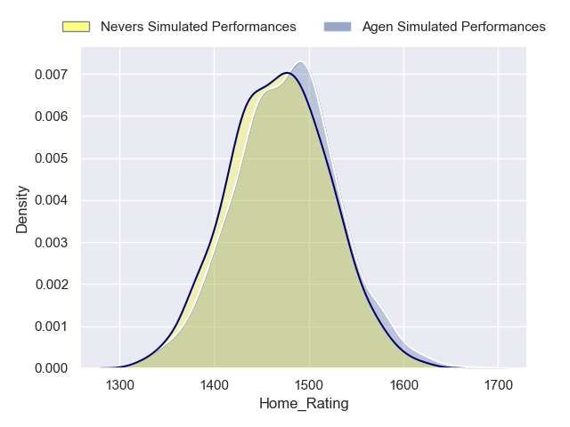
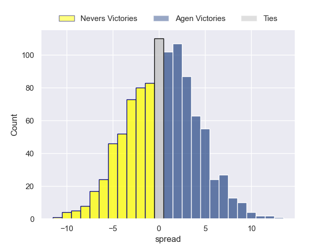
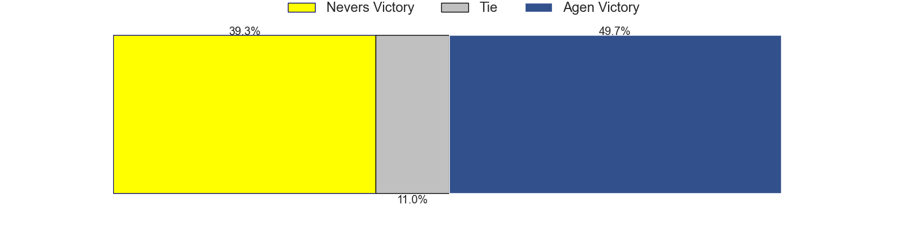
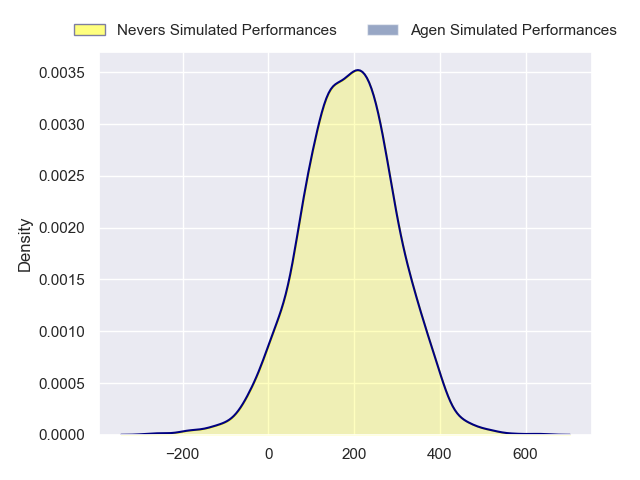
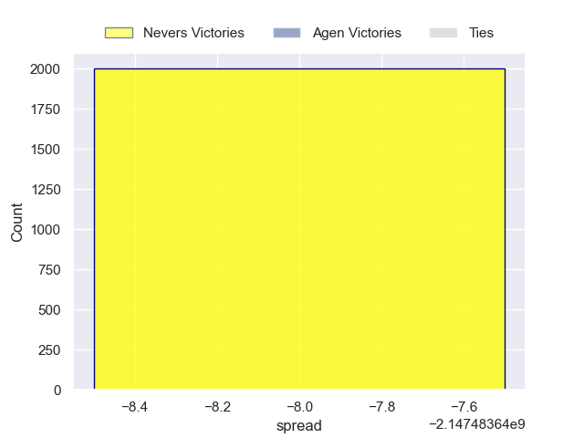

---  
layout: page  
title: Nevers at Agen  
date: 2024-09-20 18:00:00 -0500  
categories: "Pro D2 2024" match projection  
---
# Nevers at Agen

# Club Level Predictions

The first set of predictions treats a club as the smallest object, as the club develops its members, organizes a gameplan, and deploys its players as needed for each match. This club model has a prediction of 0.416, which translates to predicting Nevers to win by -0.4.

Our Over/Under is 48.5 - and combined with the spread above, we have a predicted scoreline of 24 to 24

Each club has a rating and a rating deviation (similar to a Glicko rating), and expected performances can be generated. This allows for simulated matches and spreads like the ones below.
## Projected Performances - Club Model

## Projected Spreads - Club Model

## Projected Results - Club Model

# Player Level Predictions

Treating teams instead as an entity made up of the currently active players, I have ratings for each player in an altogether different system. These can be combined to form team ratings once teamsheets are announced, weighting starters a bit higher than the reserves. After the match is played, players can be weighted by their minutes on the field, allowing for an accurate measure of the team's composition. With these compiled team ratings, we can make predictions, measure inaccuracy, and update the individual player ratings.
## Prediction without Player Minutes: Agen by 6.8

Nevers by 1.4 on a neutral pitch

## Projected Performances - Player Model

## Projected Spreads - Player Model

## Projected Results - Player Model

| Away Player                |   Away Percentile |   Number |   Home Percentile | Home Player         |
|:---------------------------|------------------:|---------:|------------------:|:--------------------|
| Aitor Kitutu               |            nan    |        1 |            nan    | Hans Lombard-Buret  |
| Jean-Maxence Jules-Rosette |            nan    |        2 |            nan    | Santiago Socino     |
| Cleopas Kundiona           |            nan    |        3 |            nan    | Alex Burin          |
| Ugo Vignolles              |             44.17 |        4 |            nan    | Evan Olmstead       |
| Chris Gabriel              |            nan    |        5 |            nan    | John Madigan        |
| Luka Plataret              |            nan    |        6 |            nan    | Julien Lebian       |
| Kévin Noah                 |            nan    |        7 |            nan    | Arnaud Duputs       |
| Jason Fraser               |            nan    |        8 |              3.5  | Fotu Lokotui        |
| Simon Tarel                |            nan    |        9 |            nan    | Jack Maunder        |
| Shaun Reynolds             |            nan    |       10 |            nan    | Billy Searle        |
| Arthur Mathiron            |            nan    |       11 |            nan    | Iban Etcheverry     |
| Rudy Derrieux              |            nan    |       12 |            nan    | Clément Garrigues   |
| Paula Walisoliso           |            nan    |       13 |            nan    | Kolinio Ramoka      |
| Gabin Rocher               |            nan    |       14 |             71.02 | Lucas Martins       |
| Dylan Jaminet              |            nan    |       15 |            nan    | Loris Tolot         |
| Jonathan Maïau             |            nan    |       16 |            nan    | Pierre Jouvin       |
| Tornike Mataradze          |            nan    |       17 |            nan    | Mamuka Mstoiani     |
| Lasha Jaiani               |            nan    |       18 |            nan    | Mathieu De Giovanni |
| Hugues Bastide             |            nan    |       19 |            nan    | Valentin Gayraud    |
| Rati Zazadze (2)           |            nan    |       20 |            nan    | Dorian Bellot       |
| Hugo Bouyssou              |            nan    |       21 |            nan    | Franck Pourteau     |
| Tom Deleuze                |            nan    |       22 |            nan    | Peyo Muscarditz     |
| Farai Mudariki             |            nan    |       23 |            nan    | Lasha Macharashvili |

