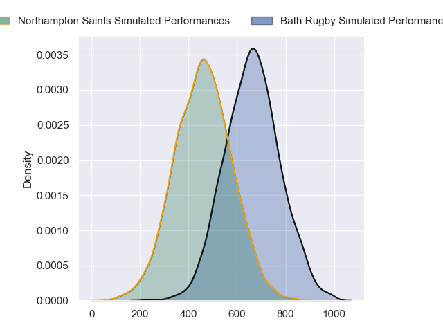
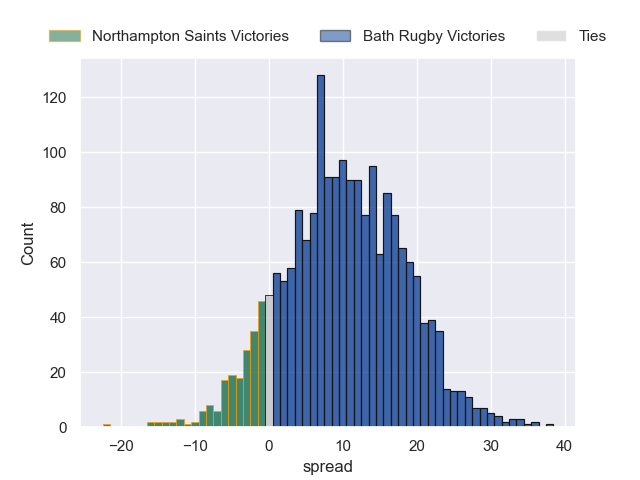
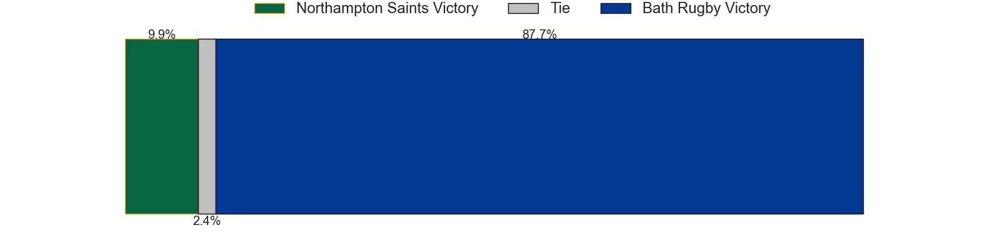

---  
layout: page  
title: Northampton Saints at Bath Rugby  
date: 2024-09-20 18:00:00 -0500  
categories: "Premiership 2024" match projection  
---
# Northampton Saints at Bath Rugby

# Club Level Predictions

The first set of predictions treats a club as the smallest object, as the club develops its members, organizes a gameplan, and deploys its players as needed for each match. This club model has a prediction of 0.474, which translates to predicting Northampton Saints to win by -2.7.

Our Over/Under is 64.5 - and combined with the spread above, we have a predicted scoreline of 31 to 33

Each club has a rating and a rating deviation (similar to a Glicko rating), and expected performances can be generated. This allows for simulated matches and spreads like the ones below.
## Projected Performances - Club Model

## Projected Spreads - Club Model

## Projected Results - Club Model

# Player Level Predictions

Treating teams instead as an entity made up of the currently active players, I have ratings for each player in an altogether different system. These can be combined to form team ratings once teamsheets are announced, weighting starters a bit higher than the reserves. After the match is played, players can be weighted by their minutes on the field, allowing for an accurate measure of the team's composition. With these compiled team ratings, we can make predictions, measure inaccuracy, and update the individual player ratings.
## Prediction without Player Minutes: Bath Rugby by 10.4

Bath Rugby by 2.3 on a neutral pitch

## Projected Performances - Player Model

## Projected Spreads - Player Model

## Projected Results - Player Model

| Away Player        |   Away Percentile |   Number |   Home Percentile | Home Player        |
|:-------------------|------------------:|---------:|------------------:|:-------------------|
| Emmanuel Iyogun    |             51.28 |        1 |             93.19 | Beno Obano         |
| Curtis Langdon     |             94.13 |        2 |             98.17 | Tom Dunn           |
| Trevor Davison     |              3.71 |        3 |             29    | Will Stuart        |
| Angus Scott-Young  |             65.34 |        4 |             96.34 | Quinn Roux         |
| Chunya Munga       |             84.68 |        5 |             79.36 | Charlie Ewels      |
| Josh Kemeny        |              9.19 |        6 |             91.81 | Ted Hill           |
| Tom Pearson        |             96.23 |        7 |             97.79 | Miles Reid         |
| Sam Graham         |             99.3  |        8 |             79.44 | Alfie Barbeary     |
| Tom James          |             24.48 |        9 |             88.99 | Ben Spencer        |
| Fin Smith          |             86.81 |       10 |            100    | Finn Russell       |
| Ollie Sleightholme |             94.9  |       11 |             25.2  | Will Muir          |
| Rory Hutchinson    |             84.41 |       12 |             75.17 | Will Butt          |
| Fraser Dingwall    |             94.17 |       13 |             93.59 | Ollie Lawrence     |
| James Ramm         |             77.8  |       14 |             92.65 | Joe Cokanasiga     |
| George Furbank     |             98.83 |       15 |             30.61 | Tom de Glanville   |
| Robbie Smith       |             50.46 |       16 |             56.88 | Niall Annett       |
| Tom West           |             67.37 |       17 |             87.8  | Francois van Wyk   |
| Luke Green         |             75.29 |       18 |             42    | Archie Griffin     |
| Callum Hunter-Hill |             36.96 |       19 |             11.32 | Jacques du Plessis |
| Juarno Augustus    |             74.07 |       20 |              7.31 | Guy Pepper         |
| Archie McParland   |             76.09 |       21 |             79.7  | Louis Schreuder    |
| Toby Thame         |             59.21 |       22 |             41.97 | Orlando Bailey     |
| Tommy Freeman      |             98.57 |       23 |             37.38 | Jaco Coetzee       |

