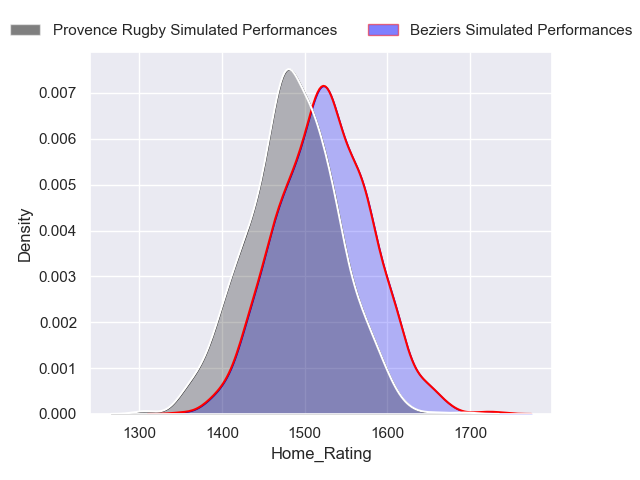
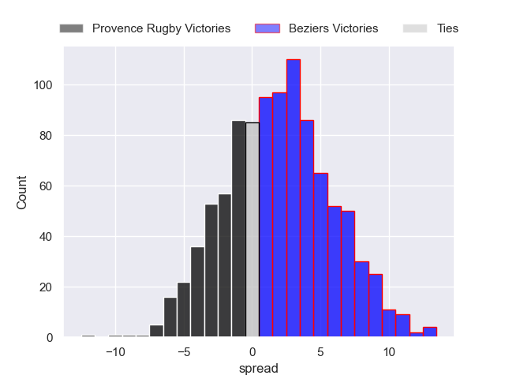
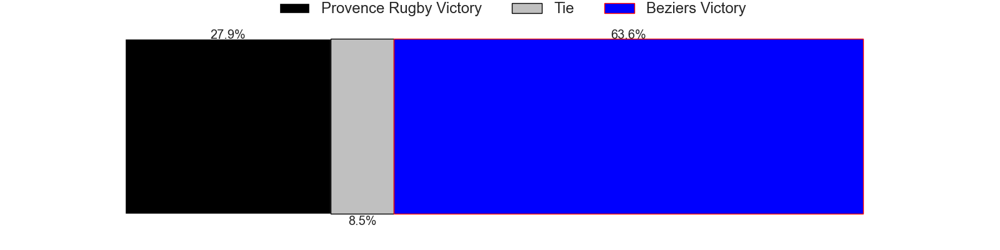
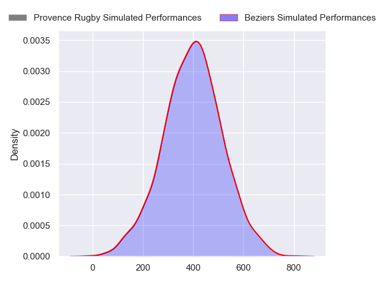
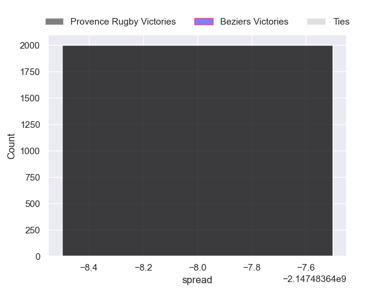

---  
layout: page  
title: Provence Rugby at Beziers  
date: 2024-09-20 18:00:00 -0500  
categories: "Pro D2 2024" match projection  
---
# Provence Rugby at Beziers

# Club Level Predictions

The first set of predictions treats a club as the smallest object, as the club develops its members, organizes a gameplan, and deploys its players as needed for each match. This club model has a prediction of 0.456, which translates to predicting Provence Rugby to win by -1.9.

Our Over/Under is 51.5 - and combined with the spread above, we have a predicted scoreline of 25 to 27

Each club has a rating and a rating deviation (similar to a Glicko rating), and expected performances can be generated. This allows for simulated matches and spreads like the ones below.
## Projected Performances - Club Model

## Projected Spreads - Club Model

## Projected Results - Club Model

# Player Level Predictions

Treating teams instead as an entity made up of the currently active players, I have ratings for each player in an altogether different system. These can be combined to form team ratings once teamsheets are announced, weighting starters a bit higher than the reserves. After the match is played, players can be weighted by their minutes on the field, allowing for an accurate measure of the team's composition. With these compiled team ratings, we can make predictions, measure inaccuracy, and update the individual player ratings.
## Prediction without Player Minutes: Beziers by 9.2

Beziers by 0.7 on a neutral pitch

## Projected Performances - Player Model

## Projected Spreads - Player Model

## Projected Results - Player Model

| Away Player       |   Away Percentile |   Number |   Home Percentile | Home Player         |
|:------------------|------------------:|---------:|------------------:|:--------------------|
| Julius Nostadt    |            nan    |        1 |            nan    | Youssef Amrouni     |
| Thomas Sauveterre |            nan    |        2 |            nan    | Yanis Boulassel     |
| Tomas Francis     |            nan    |        3 |            nan    | Christian Judge     |
| Andrés Zafra      |            nan    |        4 |             45.84 | Gillian Benoy       |
| Izack Rodda       |            nan    |        5 |            nan    | Hans N'Kinsi        |
| Tornike Jalagonia |            nan    |        6 |             70.76 | Clement Doumenc     |
| Bilel Taieb       |            nan    |        7 |            nan    | Clément Ancely      |
| Josh Tyrell       |            nan    |        8 |            nan    | Otunuku Pauta       |
| Kévin Viallard    |            nan    |        9 |            nan    | Samuel Marques      |
| Jules Soulan      |            nan    |       10 |            nan    | Charly Malié        |
| Sione Tui         |            nan    |       11 |            nan    | Aminiasi Tuimaba    |
| Inga Finau        |            nan    |       12 |            nan    | Taleta Tupuola      |
| Eto Bainivalu     |            nan    |       13 |            nan    | Branden Holder      |
| Adrien Lapègue    |            nan    |       14 |            nan    | Pierre Courtaud     |
| Thomas Salles     |            nan    |       15 |            nan    | Victor Dreuille     |
| Ian Boubila       |            nan    |       16 |            nan    | Jose Luis Gonzalez  |
| Nicolás Toth      |            nan    |       17 |             15.21 | Francisco Fernandes |
| Jérôme Dufour     |            nan    |       18 |            nan    | Pierre Gayraud      |
| Charly Gambini    |             68.81 |       19 |            nan    | Sias Koen           |
| Arthur Coville    |            nan    |       20 |            nan    | Damien Añon         |
| Jules Plisson     |            nan    |       21 |            nan    | Gabin Lorre         |
| Mathias Colombet  |            nan    |       22 |            nan    | Watisoni Votu       |
| Enrique Pieretto  |             39.26 |       23 |            nan    | John Henry Fincham  |

