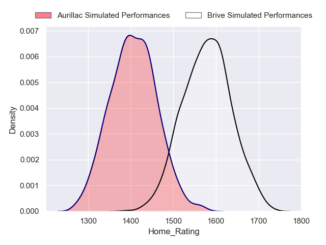
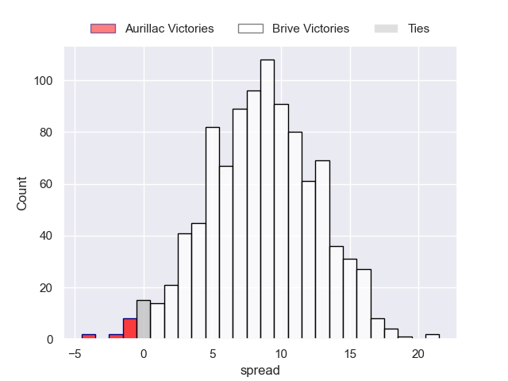
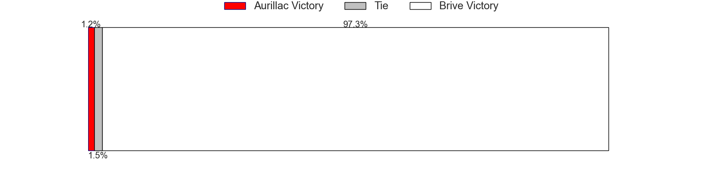
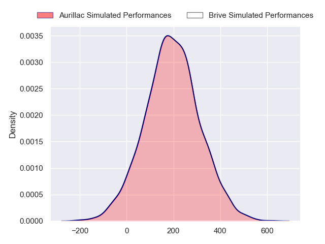
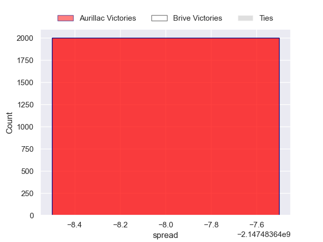
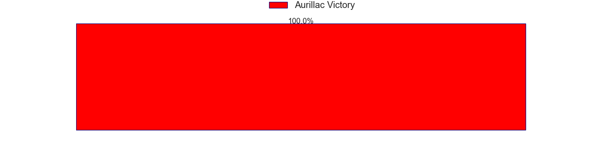

---  
layout: page  
title: Aurillac at Brive  
date: 2024-09-20 18:00:00 -0500  
categories: "Pro D2 2024" match projection  
---
# Aurillac at Brive

# Club Level Predictions

The first set of predictions treats a club as the smallest object, as the club develops its members, organizes a gameplan, and deploys its players as needed for each match. This club model has a prediction of 0.654, which translates to predicting Brive to win by 8.6.

Our Over/Under is 43.5 - and combined with the spread above, we have a predicted scoreline of 17 to 26

Each club has a rating and a rating deviation (similar to a Glicko rating), and expected performances can be generated. This allows for simulated matches and spreads like the ones below.
## Projected Performances - Club Model

## Projected Spreads - Club Model

## Projected Results - Club Model

# Player Level Predictions

Treating teams instead as an entity made up of the currently active players, I have ratings for each player in an altogether different system. These can be combined to form team ratings once teamsheets are announced, weighting starters a bit higher than the reserves. After the match is played, players can be weighted by their minutes on the field, allowing for an accurate measure of the team's composition. With these compiled team ratings, we can make predictions, measure inaccuracy, and update the individual player ratings.
## Prediction without Player Minutes: Aurillac by nan

Aurillac by 0.1 on a neutral pitch

## Projected Performances - Player Model

## Projected Spreads - Player Model

## Projected Results - Player Model

| Away Player           |   Away Percentile |   Number |   Home Percentile | Home Player               |
|:----------------------|------------------:|---------:|------------------:|:--------------------------|
| Gymaël Jean-Jacques   |            nan    |        1 |            nan    | Simon-Pierre Chauvac      |
| Basa Khonelidze       |            nan    |        2 |            nan    | Lucas Da Silva            |
| Valentin Welsch       |            nan    |        3 |            nan    | Marcel Van Der Merwe      |
| Koen Bloemen          |             73.7  |        4 |            nan    | Courtney Lawes            |
| Mehdi Slamani         |            nan    |        5 |            nan    | Sitaleki Timani           |
| Aleksandre Burduli    |            nan    |        6 |            nan    | Retief Marais             |
| Théo Cambon           |            nan    |        7 |            nan    | Asier Usarraga Latierro   |
| Didier Tison          |            nan    |        8 |            nan    | Taniela Sadrugu           |
| David Delarue         |            nan    |        9 |             58.82 | Léo Carbonneau            |
| Ugo Seunes            |            nan    |       10 |            nan    | Curwin Bosch              |
| Axel Bévia            |            nan    |       11 |            nan    | Erwan Dridi               |
| Ofa Manuofetoa        |            nan    |       12 |            nan    | Sam Johnson               |
| Hugo Bastard          |            nan    |       13 |            nan    | Georges Shvelidze         |
| Simeli Yabaki         |            nan    |       14 |            nan    | Benjamin Lefranc          |
| Dachi Papunashvili    |            nan    |       15 |             54.91 | Mathis Ferté              |
| Luka Nioradze         |            nan    |       16 |            nan    | Benjamin Boudou           |
| Irakli Mchedlidze     |            nan    |       17 |            nan    | Wesley Tapueluelu         |
| Abongile Nonkontwana  |            nan    |       18 |            nan    | Julien Delannoy           |
| Mael Perrin           |             39.51 |       19 |            nan    | Samuel Maximin            |
| Lucas Oudard          |            nan    |       20 |            nan    | Max Lestro                |
| Mikheil Alania        |             68.31 |       21 |            nan    | Hugo Verdu                |
| Karl Martin           |            nan    |       22 |            nan    | Thomas Laranjeira         |
| Giorgi Kartvelishvili |            nan    |       23 |            nan    | Francisco Coria Marchetti |

