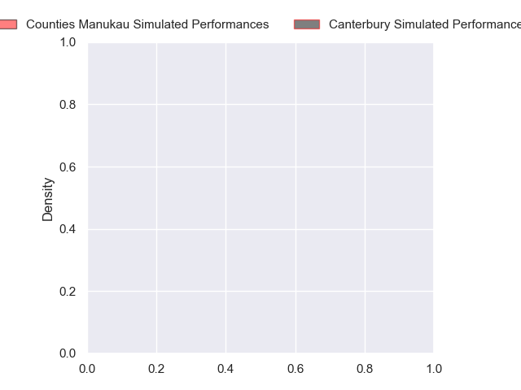
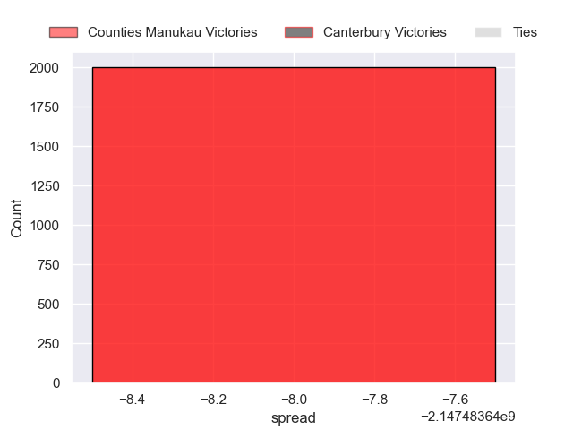

---  
layout: page  
title: Counties Manukau at Canterbury  
date: 2024-09-20 18:00:00 -0500  
categories: "NPC 2024" match projection  
---
# Counties Manukau at Canterbury

# Club Level Predictions

The first set of predictions treats a club as the smallest object, as the club develops its members, organizes a gameplan, and deploys its players as needed for each match. This club model has a prediction of 0.757, which translates to predicting Canterbury to win by 10.3.

Each club has a rating and a rating deviation (similar to a Glicko rating), and expected performances can be generated. This allows for simulated matches and spreads like the ones below.
## Projected Performances - Club Model

## Projected Spreads - Club Model

## Projected Results - Club Model

# Player Level Predictions

Treating teams instead as an entity made up of the currently active players, I have ratings for each player in an altogether different system. These can be combined to form team ratings once teamsheets are announced, weighting starters a bit higher than the reserves. After the match is played, players can be weighted by their minutes on the field, allowing for an accurate measure of the team's composition. With these compiled team ratings, we can make predictions, measure inaccuracy, and update the individual player ratings.
## Prediction without Player Minutes: Counties Manukau by nan

Counties Manukau by nan on a neutral pitch

## Projected Performances - Player Model

## Projected Spreads - Player Model

## Projected Results - Player Model

| Away Player          |   Away Percentile |   Number |   Home Percentile | Home Player        |
|:---------------------|------------------:|---------:|------------------:|:-------------------|
| Kauvaka Kaivelata    |            nan    |        1 |               nan | Finlay Brewis      |
| Zuriel Togiatama     |            nan    |        2 |               nan | Brodie McAlister   |
| Suetena Asomua       |            nan    |        3 |               nan | Joe Moody          |
| William Furniss      |            nan    |        4 |               nan | Liam Jack          |
| James Thompson       |            nan    |        5 |               nan | Zach Gallagher     |
| Adam Brash           |            nan    |        6 |               nan | Corey Kellow       |
| Cameron Church       |            nan    |        7 |               nan | Tom Christie       |
| Hoskins Sotutu       |            nan    |        8 |               nan | Billy Harmon       |
| Jonathan Taumateine  |            nan    |        9 |               nan | Nic Shearer        |
| AJ Alatimu           |            nan    |       10 |               nan | James White        |
| Peniasi Malimali     |            nan    |       11 |               nan | Ngatungane Punivai |
| Riley Hohepa         |            nan    |       12 |               nan | Dallas McLeod      |
| Tevita Ofa           |            nan    |       13 |               nan | Braydon Ennor      |
| Josh Gray            |            nan    |       14 |               nan | Chay Fihaki        |
| Simon-Peter Toleafoa |            nan    |       15 |               nan | Johnny McNicholl   |
| Ioane Moananu        |            nan    |       16 |               nan | Ben Funnell        |
| Ezekiel Lindenmuth   |             30.86 |       17 |               nan | Tau Junior Fifita  |
| Keran van Staden     |            nan    |       18 |               nan | Seb Calder         |
| Leo Ngatai-Tafau     |            nan    |       19 |               nan | Alex Grogan        |
| Alamanda Motuga      |            nan    |       20 |               nan | Tahlor Cahill      |
| Liam Daniela         |            nan    |       21 |               nan | Tyson Belworthy    |
| Gibson Popoali'i     |            nan    |       22 |               nan | Ryan Crotty        |
| Blake Makiri         |            nan    |       23 |               nan | Manasa Mataele     |

