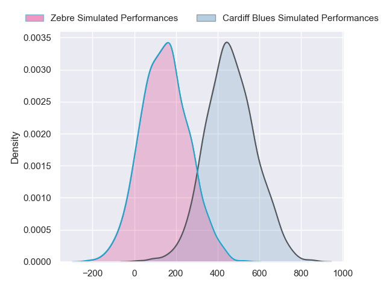
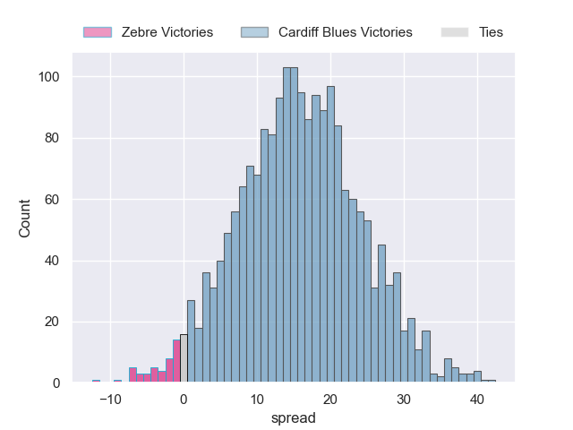
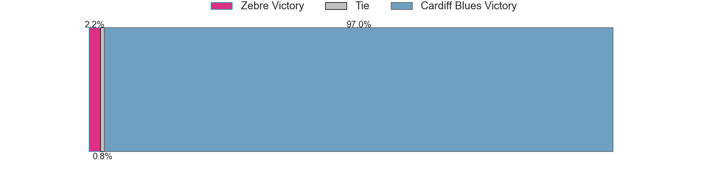

---  
layout: page  
title: Zebre at Cardiff Blues  
date: 2024-09-20 18:00:00 -0500  
categories: "United Rugby Championship 2024" match projection  
---
# Zebre at Cardiff Blues

# Club Level Predictions

The first set of predictions treats a club as the smallest object, as the club develops its members, organizes a gameplan, and deploys its players as needed for each match. This club model has a prediction of 0.727, which translates to predicting Cardiff Blues to win by 11.9.

Our Over/Under is 55.5 - and combined with the spread above, we have a predicted scoreline of 22 to 34

Each club has a rating and a rating deviation (similar to a Glicko rating), and expected performances can be generated. This allows for simulated matches and spreads like the ones below.
## Projected Performances - Club Model

## Projected Spreads - Club Model

## Projected Results - Club Model

# Player Level Predictions

Treating teams instead as an entity made up of the currently active players, I have ratings for each player in an altogether different system. These can be combined to form team ratings once teamsheets are announced, weighting starters a bit higher than the reserves. After the match is played, players can be weighted by their minutes on the field, allowing for an accurate measure of the team's composition. With these compiled team ratings, we can make predictions, measure inaccuracy, and update the individual player ratings.
## Prediction without Player Minutes: Cardiff Blues by 16.0

Cardiff Blues by 8.9 on a neutral pitch

## Projected Performances - Player Model

## Projected Spreads - Player Model

## Projected Results - Player Model

| Away Player            |   Away Percentile |   Number |   Home Percentile | Home Player      |
|:-----------------------|------------------:|---------:|------------------:|:-----------------|
| Luca Rizzoli           |             45.98 |        1 |             58.27 | Danny Southworth |
| Tommaso Di Bartolomeo  |            nan    |        2 |             82.75 | Liam Belcher     |
| Matteo Nocera          |              2.39 |        3 |             11.85 | Keiron Assiratti |
| Matteo Canali          |             89.68 |        4 |             93.01 | Josh McNally     |
| Leonard Krumov         |              2.77 |        5 |             18.87 | Teddy Williams   |
| Davide Ruggeri         |             38.32 |        6 |             86.16 | James Botham     |
| Samuele Locatelli      |            nan    |        7 |             79.73 | Daniel Thomas    |
| Giovanni Licata        |             16.82 |        8 |             95.79 | Ben Donnell      |
| Ratko Jelic            |            nan    |        9 |             82.16 | Aled Davies      |
| Giovanni Montemauri    |              2.64 |       10 |             81.29 | Callum Sheedy    |
| Jacopo Trulla          |              5.82 |       11 |             21.63 | Iwan Stephens    |
| Luca Morisi            |             94.99 |       12 |             68.82 | Ben Thomas       |
| Giulio Bertaccini      |            nan    |       13 |             93.24 | Rey Lee-Lo       |
| Ben Cambriani          |            nan    |       14 |             82.4  | Mason Grady      |
| Geronimo Prisciantelli |             89.95 |       15 |             28.04 | Cameron Winnett  |
| Giampietro Ribaldi     |              8.99 |       16 |             40.18 | Evan Lloyd       |
| Danilo Fischetti       |             37.14 |       17 |             93.37 | Ed Byrne         |
| Juan Pitinari          |             19.63 |       18 |             35.28 | Rhys Litterick   |
| Andrea Zambonin        |             40.84 |       19 |              6.77 | Rory Thornton    |
| Giacomo Ferrari        |             37.21 |       20 |             91.36 | Alun Lawrence    |
| Patricio Baronio       |            nan    |       21 |            nan    | Johan Mulder     |
| Francesco Ruffolo      |            nan    |       22 |             71.7  | Tinus de Beer    |
| Giacomo Da Re          |            nan    |       23 |              6.43 | Harri Millard    |

