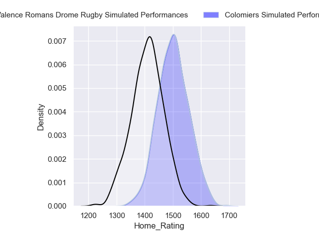
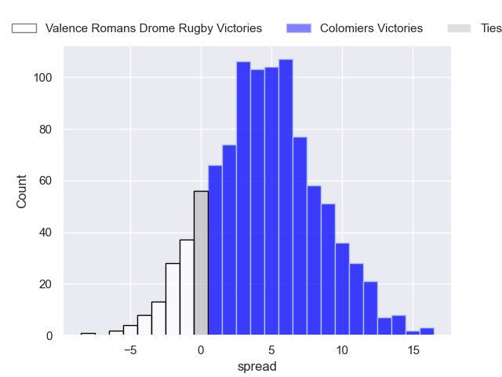
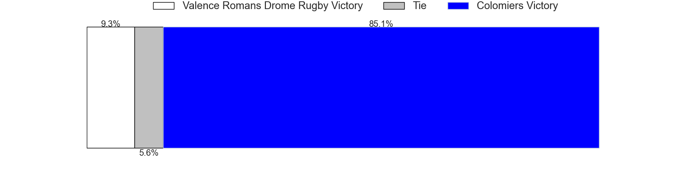
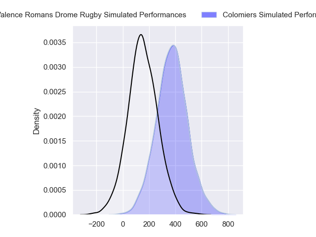
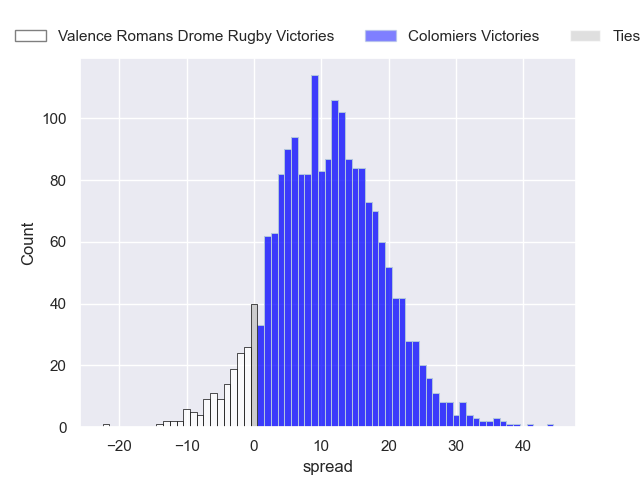
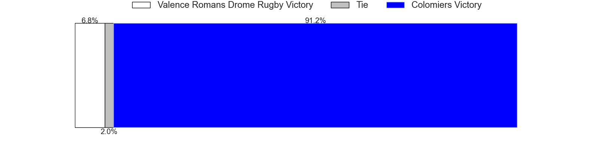

---  
layout: page  
title: Valence Romans Drome Rugby at Colomiers  
date: 2024-09-20 18:00:00 -0500  
categories: "Pro D2 2024" match projection  
---
# Valence Romans Drome Rugby at Colomiers

# Club Level Predictions

The first set of predictions treats a club as the smallest object, as the club develops its members, organizes a gameplan, and deploys its players as needed for each match. This club model has a prediction of 0.539, which translates to predicting Colomiers to win by 4.6.

Our Over/Under is 37.5 - and combined with the spread above, we have a predicted scoreline of 16 to 21

Each club has a rating and a rating deviation (similar to a Glicko rating), and expected performances can be generated. This allows for simulated matches and spreads like the ones below.
## Projected Performances - Club Model

## Projected Spreads - Club Model

## Projected Results - Club Model

# Player Level Predictions

Treating teams instead as an entity made up of the currently active players, I have ratings for each player in an altogether different system. These can be combined to form team ratings once teamsheets are announced, weighting starters a bit higher than the reserves. After the match is played, players can be weighted by their minutes on the field, allowing for an accurate measure of the team's composition. With these compiled team ratings, we can make predictions, measure inaccuracy, and update the individual player ratings.
## Prediction without Player Minutes: Colomiers by 11.3

Colomiers by 3.3 on a neutral pitch

## Projected Performances - Player Model

## Projected Spreads - Player Model

## Projected Results - Player Model

| Away Player         |   Away Percentile |   Number |   Home Percentile | Home Player             |
|:--------------------|------------------:|---------:|------------------:|:------------------------|
| Julien Royer        |            nan    |        1 |            nan    | Guillaume Tartas        |
| Cyril Deligny       |            nan    |        2 |            nan    | Pablo Dimcheff          |
| Gareth Milasinovich |            nan    |        3 |            nan    | Michaël Simutoga        |
| Éloi Massot         |            nan    |        4 |            nan    | Jean Thomas             |
| Yassine Maamry      |            nan    |        5 |            nan    | Maxime Granouillet      |
| Axel Bruchet        |            nan    |        6 |            nan    | Anthony Coletta         |
| Adrien Roux         |            nan    |        7 |            nan    | Jérémy Béchu            |
| Ilia Spanderashvili |             17.99 |        8 |            nan    | Caleb Timu              |
| Mattéo Rodor        |            nan    |        9 |            nan    | Ugo Séguéla             |
| Lucas Méret         |            nan    |       10 |            nan    | Joaquin De La Vega      |
| Mosese Mawalu       |            nan    |       11 |             17.45 | Anzelo Tuitavuki        |
| Louis Marrou        |            nan    |       12 |            nan    | Ray Nu'U                |
| Mathieu Guillomot   |            nan    |       13 |             89.74 | Rodrigo Marta           |
| Owen Lane           |              2.45 |       14 |             84.59 | Vincent Pinto           |
| Joris De Moura      |             41.12 |       15 |            nan    | Valentin Saurs          |
| Dorian Marco-Pena   |            nan    |       16 |            nan    | Théo Lachaud            |
| Anthony Aléo        |            nan    |       17 |            nan    | Pierre-Emmanuel Pacheco |
| Nathan Huguen       |            nan    |       18 |            nan    | Janse Roux              |
| Otar Giorgadze      |             64.02 |       19 |            nan    | Aldric Lescure          |
| Thomas Lhuséro      |            nan    |       20 |            nan    | Dorian Laborde          |
| George Worth        |            nan    |       21 |            nan    | Mathis Galthié          |
| Loan Réal           |            nan    |       22 |            nan    | Ugo Pacome              |
| Kévin Goze          |            nan    |       23 |            nan    | Robin Bellemand         |

