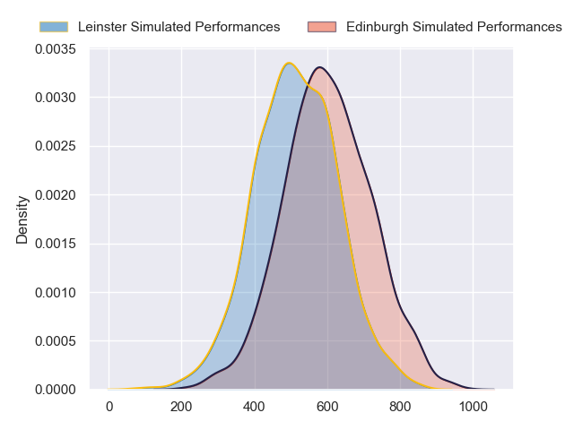
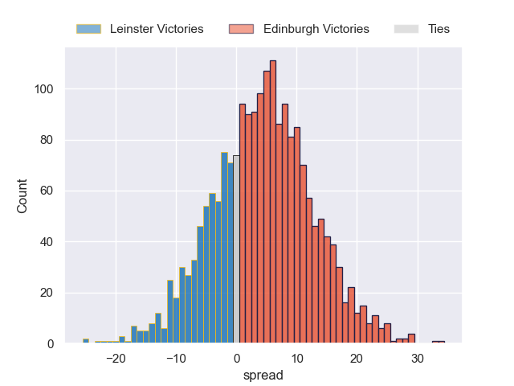

---  
layout: page  
title: Leinster at Edinburgh  
date: 2024-09-20 18:00:00 -0500  
categories: "United Rugby Championship 2024" match projection  
---
# Leinster at Edinburgh

# Club Level Predictions

The first set of predictions treats a club as the smallest object, as the club develops its members, organizes a gameplan, and deploys its players as needed for each match. This club model has a prediction of 0.264, which translates to predicting Leinster to win by 5.5.

Our Over/Under is 56.5 - and combined with the spread above, we have a predicted scoreline of 31 to 26

Each club has a rating and a rating deviation (similar to a Glicko rating), and expected performances can be generated. This allows for simulated matches and spreads like the ones below.
## Projected Performances - Club Model

## Projected Spreads - Club Model

## Projected Results - Club Model

# Player Level Predictions

Treating teams instead as an entity made up of the currently active players, I have ratings for each player in an altogether different system. These can be combined to form team ratings once teamsheets are announced, weighting starters a bit higher than the reserves. After the match is played, players can be weighted by their minutes on the field, allowing for an accurate measure of the team's composition. With these compiled team ratings, we can make predictions, measure inaccuracy, and update the individual player ratings.
## Prediction without Player Minutes: Edinburgh by 4.5

Leinster by 2.1 on a neutral pitch

## Projected Performances - Player Model

## Projected Spreads - Player Model

## Projected Results - Player Model

| Away Player          |   Away Percentile |   Number |   Home Percentile | Home Player         |
|:---------------------|------------------:|---------:|------------------:|:--------------------|
| Michael Milne        |             69.32 |        1 |             93.46 | Pierre Schoeman     |
| Gus Mccarthy         |            nan    |        2 |             65.14 | Dave Cherry         |
| Thomas Clarkson      |             82.58 |        3 |             99.03 | Paul Hill           |
| Conor O'Tighearnaigh |            nan    |        4 |             88.9  | Marshall Sykes      |
| James Ryan           |             96.45 |        5 |             95.23 | Grant Gilchrist     |
| Max Deegan           |             92.47 |        6 |            100    | Jamie Ritchie       |
| Scott Penny          |             88.04 |        7 |             59.8  | Hamish Watson       |
| Jack Conan           |             99.07 |        8 |             29.35 | Ben Muncaster       |
| Jamison Gibson-Park  |             97.53 |        9 |             90.13 | Ali Price           |
| Sam Prendergast      |             19.18 |       10 |             75.54 | Ross Thompson       |
| Jordan Larmour       |             89.08 |       11 |             88.98 | Duhan van der Merwe |
| Charlie Tector       |            nan    |       12 |             82.63 | Matt Currie         |
| Garry Ringrose       |             98.48 |       13 |            nan    | Mosese Tuipulotu    |
| Tommy O'Brien        |             56.73 |       14 |             40.31 | Darcy Graham        |
| Jamie Osborne        |             92.99 |       15 |             92.29 | Wes Goosen          |
| John McKee           |             68.99 |       16 |             86.06 | Ewan Ashman         |
| Cian Healy           |             93.72 |       17 |             13.7  | Boan Venter         |
| Rabah Slimani        |             91.42 |       18 |            nan    | D'Arcy Rae          |
| Brian Deeny          |             52.39 |       19 |             91.56 | Jamie Hodgson       |
| James Culhane        |            nan    |       20 |             72.43 | Magnus Bradbury     |
| Luke McGrath         |             99.05 |       21 |             81.59 | Ben Vellacott       |
| Ross Byrne           |             95.44 |       22 |             80.58 | Ben Healy           |
| Rob Russell          |             70    |       23 |             61.73 | Emiliano Boffelli   |

