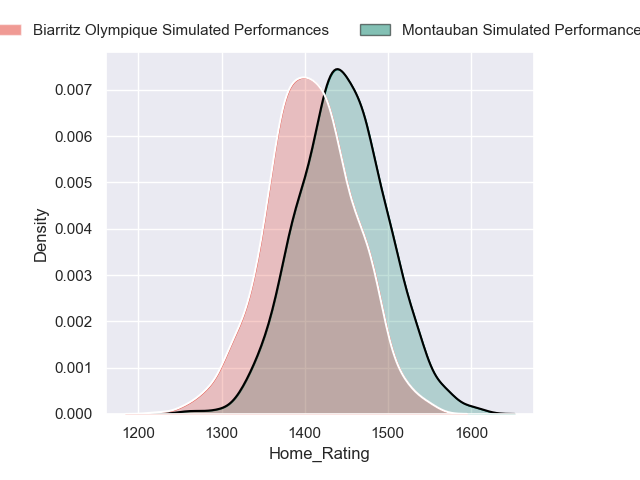
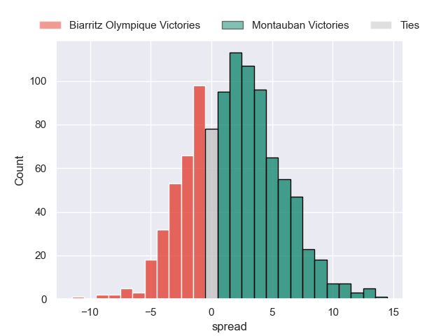
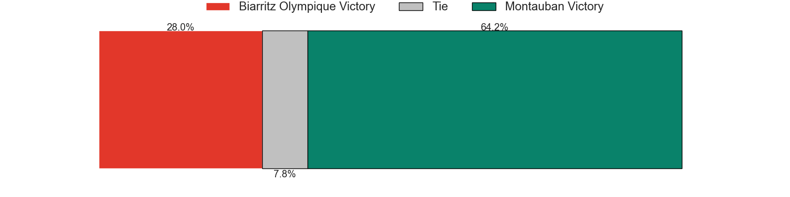
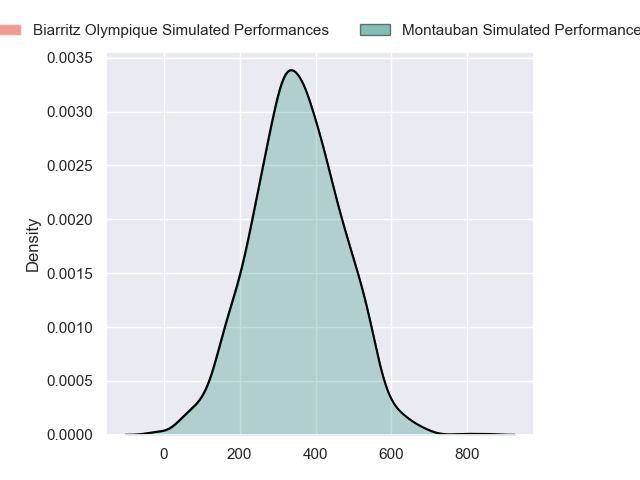
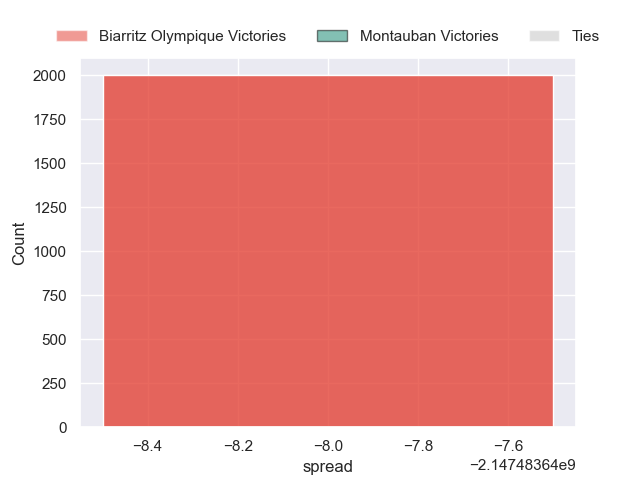

---  
layout: page  
title: Biarritz Olympique at Montauban  
date: 2024-09-20 18:00:00 -0500  
categories: "Pro D2 2024" match projection  
---
# Biarritz Olympique at Montauban

# Club Level Predictions

The first set of predictions treats a club as the smallest object, as the club develops its members, organizes a gameplan, and deploys its players as needed for each match. This club model has a prediction of 0.458, which translates to predicting Biarritz Olympique to win by -1.9.

Our Over/Under is 47.5 - and combined with the spread above, we have a predicted scoreline of 23 to 24

Each club has a rating and a rating deviation (similar to a Glicko rating), and expected performances can be generated. This allows for simulated matches and spreads like the ones below.
## Projected Performances - Club Model

## Projected Spreads - Club Model

## Projected Results - Club Model

# Player Level Predictions

Treating teams instead as an entity made up of the currently active players, I have ratings for each player in an altogether different system. These can be combined to form team ratings once teamsheets are announced, weighting starters a bit higher than the reserves. After the match is played, players can be weighted by their minutes on the field, allowing for an accurate measure of the team's composition. With these compiled team ratings, we can make predictions, measure inaccuracy, and update the individual player ratings.
## Prediction without Player Minutes: Montauban by 8.2

Montauban by 1.5 on a neutral pitch

## Projected Performances - Player Model

## Projected Spreads - Player Model

## Projected Results - Player Model

| Away Player             |   Away Percentile |   Number |   Home Percentile | Home Player         |
|:------------------------|------------------:|---------:|------------------:|:--------------------|
| Giorgi Nutsubidze       |            nan    |        1 |            nan    | Léo Aouf            |
| Clément Martinez        |            nan    |        2 |            nan    | Kévin Firmin        |
| Giorgi Dzmanashvili (2) |            nan    |        3 |            nan    | Facundo Pomponio    |
| Charlie Matthews        |            nan    |        4 |             16.06 | Tjiuee Uanivi       |
| Adrian Motoc            |            nan    |        5 |            nan    | Lewis Bean          |
| Filimo Taofifenua       |            nan    |        6 |            nan    | Fred Quercy         |
| Ekain Imaz Agirre       |            nan    |        7 |            nan    | Kyllian Ringuet     |
| Masivesi Dakuwaqa       |            nan    |        8 |             85.49 | Sikhumbuzo Notshe   |
| Pierre Pagès            |            nan    |        9 |            nan    | Hugo Zabalza        |
| Edgar Retière           |            nan    |       10 |            nan    | Jérôme Bosviel      |
| Arthur Bonneval         |            nan    |       11 |            nan    | Yvan Reilhac        |
| Yann David              |            nan    |       12 |            nan    | Jt Jackson          |
| Mathieu Acebes          |            nan    |       13 |            nan    | Maxime Espeut       |
| Zach Kibirige           |            nan    |       14 |            nan    | Stephane Ahmed      |
| Gervais Cordin          |            nan    |       15 |            nan    | Baptiste Mouchous   |
| Brendan Lebrun          |            nan    |       16 |            nan    | Badri Alkhazashvili |
| Zakaria El Fakir        |            nan    |       17 |            nan    | Thomas Bué          |
| Piula Fa'asalele        |             79.91 |       18 |            nan    | Noa Kanika          |
| Jessy Jegerlehner       |            nan    |       19 |            nan    | Tyrone Viiga        |
| Kerman Aurrekoetxea     |             60.72 |       20 |            nan    | Yoan Cottin         |
| Enzo Selponi            |            nan    |       21 |            nan    | Thomas Fortunel     |
| Yohan Tapie             |            nan    |       22 |            nan    | Simon Renda         |
| Nikoloz Narmania        |            nan    |       23 |            nan    | Luka Azariashvili   |

