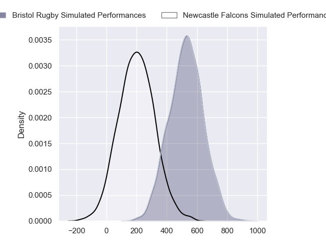
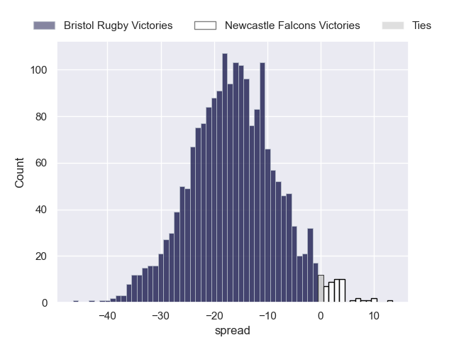

---  
layout: page  
title: Bristol Rugby at Newcastle Falcons  
date: 2024-09-20 18:00:00 -0500  
categories: "Premiership 2024" match projection  
---
# Bristol Rugby at Newcastle Falcons

# Club Level Predictions

The first set of predictions treats a club as the smallest object, as the club develops its members, organizes a gameplan, and deploys its players as needed for each match. This club model has a prediction of 0.218, which translates to predicting Bristol Rugby to win by 7.4.

Our Over/Under is 60.5 - and combined with the spread above, we have a predicted scoreline of 34 to 27

Each club has a rating and a rating deviation (similar to a Glicko rating), and expected performances can be generated. This allows for simulated matches and spreads like the ones below.
## Projected Performances - Club Model

## Projected Spreads - Club Model

## Projected Results - Club Model

# Player Level Predictions

Treating teams instead as an entity made up of the currently active players, I have ratings for each player in an altogether different system. These can be combined to form team ratings once teamsheets are announced, weighting starters a bit higher than the reserves. After the match is played, players can be weighted by their minutes on the field, allowing for an accurate measure of the team's composition. With these compiled team ratings, we can make predictions, measure inaccuracy, and update the individual player ratings.
## Prediction without Player Minutes: Bristol Rugby by 16.6

Bristol Rugby by 24.6 on a neutral pitch

## Projected Performances - Player Model

## Projected Spreads - Player Model

## Projected Results - Player Model

| Away Player                |   Away Percentile |   Number |   Home Percentile | Home Player         |
|:---------------------------|------------------:|---------:|------------------:|:--------------------|
| Ellis Genge                |             64.81 |        1 |              1.06 | Adam Brocklebank    |
| Harry Thacker              |             89.36 |        2 |              0.55 | Jamie Blamire       |
| Max Lahiff                 |             59.42 |        3 |             57.38 | Richard Palframan   |
| James Dun                  |             94.67 |        4 |             21.2  | John Hawkins        |
| Joe Batley                 |             90.57 |        5 |             14.21 | Kiran McDonald      |
| Steven Luatua              |             99.45 |        6 |             19.87 | Philip van der Walt |
| Jake Heenan                |            nan    |        7 |             97.56 | Tom Gordon          |
| Fitz Harding               |             96.01 |        8 |              1.64 | Callum Chick        |
| Harry Randall              |             96.58 |        9 |              0.57 | Sam Stuart          |
| AJ MacGinty                |             95.68 |       10 |              8.39 | Brett Connon        |
| Gabriel Ibitoye            |             93.06 |       11 |             49.8  | Ben Stevenson       |
| James Williams             |             80.65 |       12 |            nan    | Sammy Arnold        |
| Benhard Janse van Rensburg |             95.45 |       13 |             39.51 | Connor Doherty      |
| Ratu Naulago               |             64.8  |       14 |             27.76 | Adam Radwan         |
| Max Malins                 |             45.33 |       15 |             12.62 | Elliott Obatoyinbo  |
| Gabriel Oghre              |             69.91 |       16 |             64.59 | Ollie Fletcher      |
| Jake Woolmore              |             83.55 |       17 |             21.93 | Luan de Bruin       |
| George Kloska              |            nan    |       18 |             71.44 | Murray McCallum     |
| Josh Caulfield             |             66.04 |       19 |             69.32 | Freddie Lockwood    |
| Benjamín Grondona          |            nan    |       20 |            nan    | Adam Scott          |
| Kieran Marmion             |             33.97 |       21 |            nan    | Joe Davis           |
| Joe Jenkins                |             34.62 |       22 |             83.88 | Louis Brown         |
| Richard Lane               |             75.93 |       23 |             88.37 | Ben Redshaw         |

