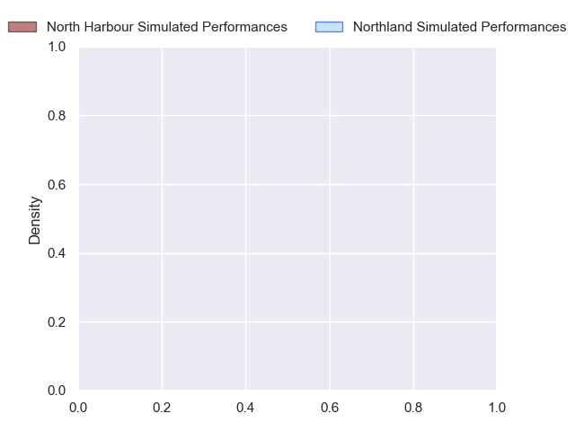
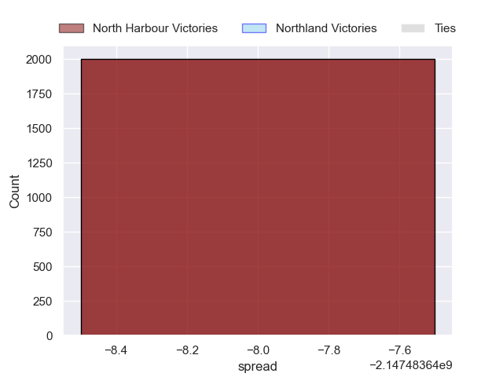

---  
layout: page  
title: North Harbour at Northland  
date: 2024-09-20 18:00:00 -0500  
categories: "NPC 2024" match projection  
---
# North Harbour at Northland

# Club Level Predictions

The first set of predictions treats a club as the smallest object, as the club develops its members, organizes a gameplan, and deploys its players as needed for each match. This club model has a prediction of 0.381, which translates to predicting North Harbour to win by 4.0.

Each club has a rating and a rating deviation (similar to a Glicko rating), and expected performances can be generated. This allows for simulated matches and spreads like the ones below.
## Projected Performances - Club Model

## Projected Spreads - Club Model

## Projected Results - Club Model

# Player Level Predictions

Treating teams instead as an entity made up of the currently active players, I have ratings for each player in an altogether different system. These can be combined to form team ratings once teamsheets are announced, weighting starters a bit higher than the reserves. After the match is played, players can be weighted by their minutes on the field, allowing for an accurate measure of the team's composition. With these compiled team ratings, we can make predictions, measure inaccuracy, and update the individual player ratings.
## Prediction without Player Minutes: North Harbour by nan

North Harbour by 14.5 on a neutral pitch

## Projected Performances - Player Model

## Projected Spreads - Player Model

## Projected Results - Player Model

| Away Player       |   Away Percentile |   Number |   Home Percentile | Home Player        |
|:------------------|------------------:|---------:|------------------:|:-------------------|
| Fatongia Paea     |            nan    |        1 |               nan | Rob Cobb           |
| Shilo Klein       |            nan    |        2 |               nan | Matt Moulds        |
| Tevita Mafileo    |             90.89 |        3 |               nan | Chris Apoua        |
| Cam Christie      |            nan    |        4 |               nan | Allan Craig        |
| Felix Kalapu      |            nan    |        5 |               nan | Sam Caird          |
| Cameron Suafoa    |            nan    |        6 |               nan | Terrell Peita      |
| Jed Melvin        |            nan    |        7 |               nan | Matt Matich        |
| Lotu Inisi        |            nan    |        8 |               nan | Simon Parker       |
| Bryn Hall         |            nan    |        9 |               nan | Sam Nock           |
| Tane Edmed        |            nan    |       10 |               nan | Rivez Reihana      |
| Sofai Maka        |            nan    |       11 |               nan | Heremaia Murray    |
| Fine Inisi        |            nan    |       12 |               nan | Corey Evans        |
| Tom Barham        |            nan    |       13 |               nan | Quinton Nichols    |
| Moses Leo         |            nan    |       14 |               nan | Nathan Salmon      |
| Shaun Stevenson   |            nan    |       15 |               nan | Jordan Trainor     |
| Bryn Gordon       |            nan    |       16 |               nan | Richie Asiata      |
| Sione Mafileo     |            nan    |       17 |               nan | Esile Fono         |
| Ben Ruzich        |            nan    |       18 |               nan | Remsy Lemisio      |
| James Fiebig      |            nan    |       19 |               nan | Liam Hallam-Eames  |
| Karl Ruzich       |            nan    |       20 |               nan | Rob Rush           |
| Siaosi Nginingini |            nan    |       21 |               nan | Lisati Milo-Harris |
| Oscar Koller      |             25.42 |       22 |               nan | Tevita Latu        |
| Tima Fainga'Anuku |            nan    |       23 |               nan | Tevita Nabura      |

