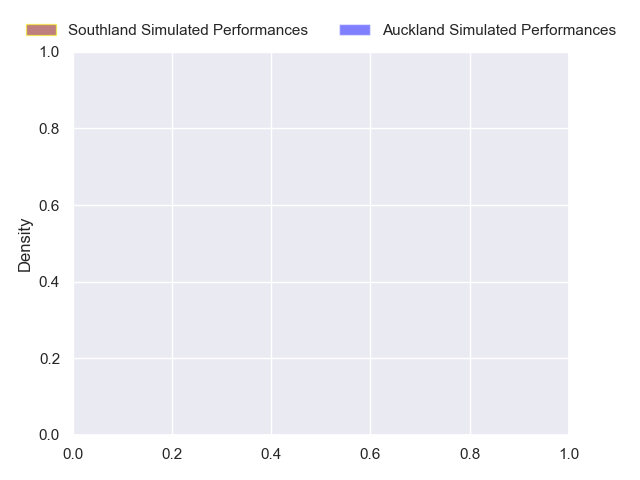
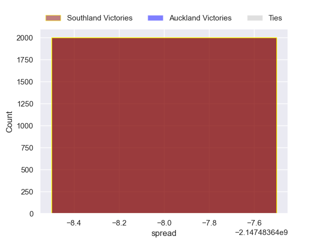

---  
layout: page  
title: Southland at Auckland  
date: 2024-09-21 18:00:00 -0500  
categories: "NPC 2024" match projection  
---
# Southland at Auckland

# Club Level Predictions

The first set of predictions treats a club as the smallest object, as the club develops its members, organizes a gameplan, and deploys its players as needed for each match. This club model has a prediction of 0.801, which translates to predicting Auckland to win by 12.5.

Each club has a rating and a rating deviation (similar to a Glicko rating), and expected performances can be generated. This allows for simulated matches and spreads like the ones below.
## Projected Performances - Club Model

## Projected Spreads - Club Model

## Projected Results - Club Model

# Player Level Predictions

Treating teams instead as an entity made up of the currently active players, I have ratings for each player in an altogether different system. These can be combined to form team ratings once teamsheets are announced, weighting starters a bit higher than the reserves. After the match is played, players can be weighted by their minutes on the field, allowing for an accurate measure of the team's composition. With these compiled team ratings, we can make predictions, measure inaccuracy, and update the individual player ratings.
## Prediction without Player Minutes: Southland by nan

Auckland by 9.0 on a neutral pitch

## Projected Performances - Player Model

## Projected Spreads - Player Model

## Projected Results - Player Model

| Away Player           |   Away Percentile |   Number |   Home Percentile | Home Player            |
|:----------------------|------------------:|---------:|------------------:|:-----------------------|
| Jack Sexton           |            nan    |        1 |            nan    | Tito Tuipulotu         |
| Nic Souchon           |            nan    |        2 |            nan    | Soane Vikena           |
| Hamdahn Tuipulotu     |            nan    |        3 |            nan    | Marcel Renata          |
| Josh Bekhuis          |            nan    |        4 |            nan    | Josh Beehre            |
| Daniel Maiava         |            nan    |        5 |            nan    | Tuaina Taii Tualima    |
| Blair Ryall           |            nan    |        6 |            nan    | Che Clark              |
| Leroy Ferguson        |            nan    |        7 |            nan    | Anton Segner           |
| Semisi Tupou Ta'eiloa |            nan    |        8 |            nan    | Akira Ioane            |
| Lachie Albert         |            nan    |        9 |            nan    | Kemara Hauiti-Parapara |
| Jason Robertson       |             53.24 |       10 |             25.18 | Rico Simpson           |
| Charlie Powell        |            nan    |       11 |            nan    | AJ Lam                 |
| Isaac Te Tamaki       |            nan    |       12 |            nan    | Bryce Heem             |
| Angus Simmers         |            nan    |       13 |            nan    | Xavi Taele             |
| Michael Manson        |            nan    |       14 |            nan    | Caleb Tangitau         |
| Jake Strachan         |            nan    |       15 |            nan    | Zarn Sullivan          |
| Jack Taylor           |            nan    |       16 |            nan    | Mills Sanerivi         |
| Joe Walsh             |            nan    |       17 |            nan    | Oscar Cowley-Andrea    |
| Sean Paranihi         |            nan    |       18 |            nan    | Sione Ahio             |
| Dylan Nel             |            nan    |       19 |             35.63 | Ola Tauelangi          |
| Hayden Michaels       |            nan    |       20 |              8.08 | Niko Jones             |
| Liam Howley           |            nan    |       21 |            nan    | Chris Vunipola         |
| Byron Smith           |            nan    |       22 |            nan    | Tanielu Tele'a         |
| Tayne Harvey          |            nan    |       23 |             13.79 | Vaiolini Ekuasi        |

