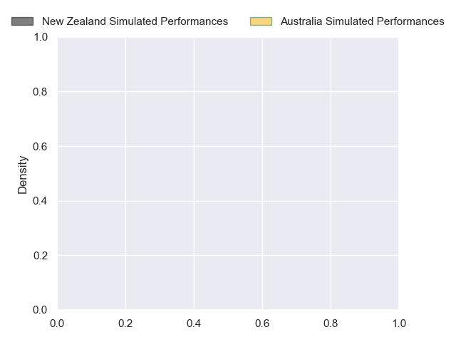
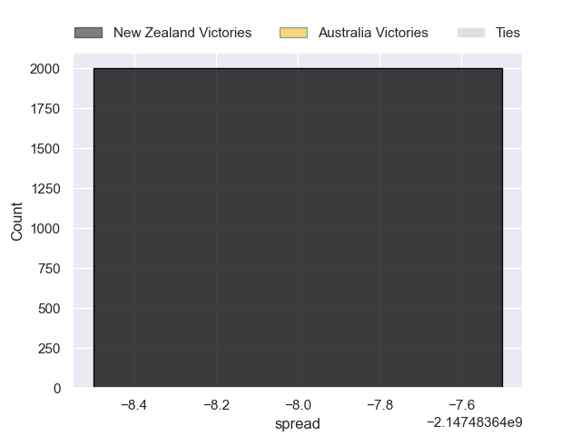

---  
layout: page  
title: New Zealand at Australia  
date: 2024-09-21 18:00:00 -0500  
categories: "Rugby Championship 2024" match projection  
---
# New Zealand at Australia

# Club Level Predictions

The first set of predictions treats a club as the smallest object, as the club develops its members, organizes a gameplan, and deploys its players as needed for each match. This club model has a prediction of 0.247, which translates to predicting New Zealand to win by 6.1.

Our Over/Under is 62.5 - and combined with the spread above, we have a predicted scoreline of 35 to 28

Each club has a rating and a rating deviation (similar to a Glicko rating), and expected performances can be generated. This allows for simulated matches and spreads like the ones below.
## Projected Performances - Club Model

## Projected Spreads - Club Model

## Projected Results - Club Model

# Player Level Predictions

Treating teams instead as an entity made up of the currently active players, I have ratings for each player in an altogether different system. These can be combined to form team ratings once teamsheets are announced, weighting starters a bit higher than the reserves. After the match is played, players can be weighted by their minutes on the field, allowing for an accurate measure of the team's composition. With these compiled team ratings, we can make predictions, measure inaccuracy, and update the individual player ratings.
## Prediction without Player Minutes: Australia by 2.4

New Zealand by 1.6 on a neutral pitch

## Projected Performances - Player Model

## Projected Spreads - Player Model

## Projected Results - Player Model

| Away Player         |   Away Percentile |   Number |   Home Percentile | Home Player          |
|:--------------------|------------------:|---------:|------------------:|:---------------------|
| Ethan de Groot      |            nan    |        1 |            nan    | Angus Bell           |
| Codie Taylor        |             98.72 |        2 |            nan    | Matt Faessler        |
| Tyrel Lomax         |             86.47 |        3 |            nan    | Taniela Tupou        |
| Scott Barrett       |             93.9  |        4 |            nan    | Nick Frost           |
| Tupou Vaa'i         |             93.23 |        5 |            nan    | Jeremy Williams      |
| Wallace Sititi      |            nan    |        6 |            nan    | Rob Valetini         |
| Sam Cane            |             98.67 |        7 |             96.57 | Fraser McReight      |
| Ardie Savea         |             97.43 |        8 |            nan    | Harry Wilson         |
| Cortez Ratima       |             83.49 |        9 |             99.43 | Nic White            |
| Damian McKenzie     |             97.6  |       10 |            nan    | Noah Lolesio         |
| Caleb Clarke        |             85.92 |       11 |            nan    | Marika Koroibete     |
| Jordie Barrett      |             92.42 |       12 |             83.92 | Hunter Paisami       |
| Rieko Ioane         |             91.14 |       13 |            nan    | Len Ikitau           |
| Will Jordan         |             96.22 |       14 |            nan    | Andrew Kellaway      |
| Beauden Barrett     |            100    |       15 |            nan    | Tom Wright           |
| Asafo Aumua         |             95.6  |       16 |             85.32 | Brandon Paenga-Amosa |
| Tamaiti Williams    |             90.98 |       17 |             96.82 | James Slipper        |
| Pasilio Tosi        |            nan    |       18 |             98.14 | Allan Alaalatoa      |
| Sam Darry           |             55.72 |       19 |            nan    | Lukhan Salakaia-Loto |
| Luke Jacobson       |            nan    |       20 |             61.92 | Langi Gleeson        |
| TJ Perenara         |             97.15 |       21 |             83.68 | Tate McDermott       |
| Anton Lienert-Brown |             95.69 |       22 |             83.93 | Tom Lynagh           |
| Sevu Reece          |             75.61 |       23 |             77.14 | Dylan Pietsch        |

