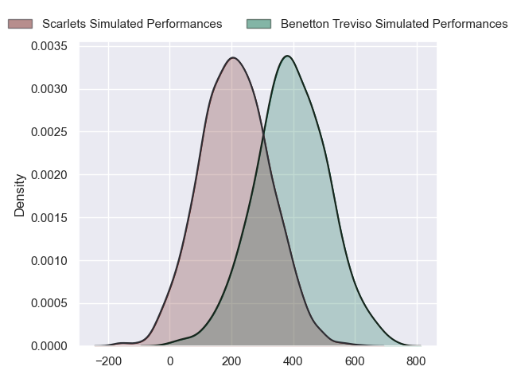
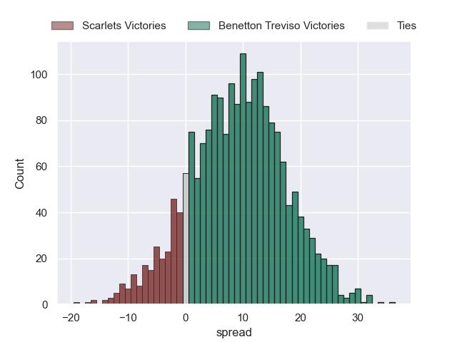
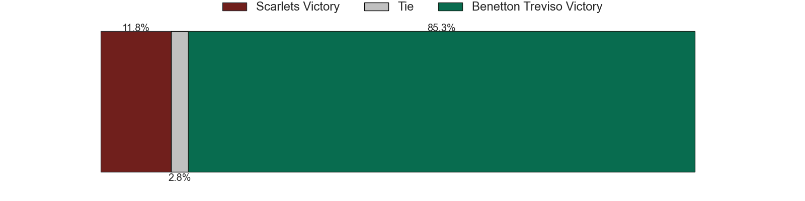

---  
layout: page  
title: Scarlets at Benetton Treviso  
date: 2024-09-21 18:00:00 -0500  
categories: "United Rugby Championship 2024" match projection  
---
# Scarlets at Benetton Treviso

# Club Level Predictions

The first set of predictions treats a club as the smallest object, as the club develops its members, organizes a gameplan, and deploys its players as needed for each match. This club model has a prediction of 0.717, which translates to predicting Benetton Treviso to win by 11.5.

Our Over/Under is 56.5 - and combined with the spread above, we have a predicted scoreline of 23 to 34

Each club has a rating and a rating deviation (similar to a Glicko rating), and expected performances can be generated. This allows for simulated matches and spreads like the ones below.
## Projected Performances - Club Model

## Projected Spreads - Club Model

## Projected Results - Club Model

# Player Level Predictions

Treating teams instead as an entity made up of the currently active players, I have ratings for each player in an altogether different system. These can be combined to form team ratings once teamsheets are announced, weighting starters a bit higher than the reserves. After the match is played, players can be weighted by their minutes on the field, allowing for an accurate measure of the team's composition. With these compiled team ratings, we can make predictions, measure inaccuracy, and update the individual player ratings.
## Prediction without Player Minutes: Benetton Treviso by 9.4

Benetton Treviso by 4.1 on a neutral pitch

## Projected Performances - Player Model

## Projected Spreads - Player Model

## Projected Results - Player Model

| Away Player          |   Away Percentile |   Number |   Home Percentile | Home Player           |
|:---------------------|------------------:|---------:|------------------:|:----------------------|
| Kemsley Mathias      |             81.26 |        1 |             78.6  | Mirco Spagnolo        |
| Marnus Van Der Merwe |            nan    |        2 |              0.73 | Siua Maile            |
| Sam Wainwright       |             15.38 |        3 |            nan    | Nahuel Tetaz Chaparro |
| Alex Craig           |             40.18 |        4 |             64.59 | Scott Scrafton        |
| Max Douglas          |            nan    |        5 |             89.35 | Eli Snyman            |
| Taine Plumtree       |             80.84 |        6 |             62.68 | Alessandro Izekor     |
| Jarrod Taylor        |             55.26 |        7 |             75.19 | Manuel Zuliani        |
| Vaea Fifita          |             95.33 |        8 |             79.91 | Toa Halafihi          |
| Gareth Davies        |             72.87 |        9 |             31.31 | Andy Uren             |
| Sam Costelow         |             64.51 |       10 |             74.07 | Jacob Umaga           |
| Blair Murray         |            nan    |       11 |             59.8  | Onisi Ratave          |
| Ioan Lloyd           |              6.24 |       12 |             64.45 | Marco Zanon           |
| Macs Page            |             30.77 |       13 |             63.75 | Malakai Fekitoa       |
| Ellis Mee            |             13.79 |       14 |             72.76 | Louis Lynagh          |
| Tom Rogers           |             37.14 |       15 |             95.09 | Rhyno Smith           |
| Ryan Elias           |             94.5  |       16 |              7.34 | Marco Manfredi        |
| Sam O'Connor         |            nan    |       17 |            nan    | Destiny Aminu         |
| Gabe Hawley          |            nan    |       18 |            nan    | Riccardo Genovese     |
| Jac Price            |              3.55 |       19 |             34.63 | Riccardo Favretto     |
| Carwyn Tuipulotu     |             54.91 |       20 |             92.69 | Sebastian Negri       |
| Efan Jones           |             31.69 |       21 |             75.9  | Alessandro Garbisi    |
| Johnny Williams      |             77.97 |       22 |             69.3  | Leonardo Marin        |
| Jac Davies           |            nan    |       23 |             84.9  | Paolo Odogwu          |

