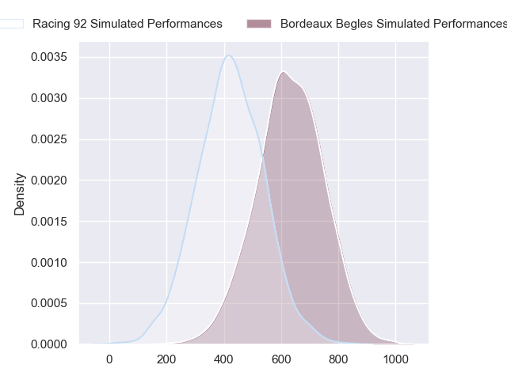
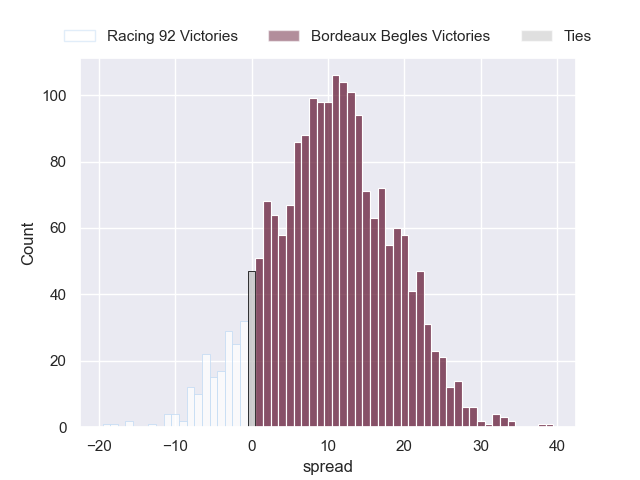
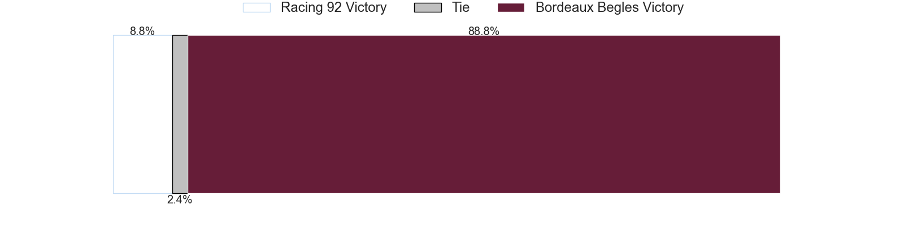

---  
layout: page  
title: Racing 92 at Bordeaux Begles  
date: 2024-09-21 18:00:00 -0500  
categories: "Top 14 2024" match projection  
---
# Racing 92 at Bordeaux Begles

# Club Level Predictions

The first set of predictions treats a club as the smallest object, as the club develops its members, organizes a gameplan, and deploys its players as needed for each match. This club model has a prediction of 0.585, which translates to predicting Bordeaux Begles to win by 6.2.

Our Over/Under is 48.5 - and combined with the spread above, we have a predicted scoreline of 21 to 28

Each club has a rating and a rating deviation (similar to a Glicko rating), and expected performances can be generated. This allows for simulated matches and spreads like the ones below.
## Projected Performances - Club Model

## Projected Spreads - Club Model

## Projected Results - Club Model

# Player Level Predictions

Treating teams instead as an entity made up of the currently active players, I have ratings for each player in an altogether different system. These can be combined to form team ratings once teamsheets are announced, weighting starters a bit higher than the reserves. After the match is played, players can be weighted by their minutes on the field, allowing for an accurate measure of the team's composition. With these compiled team ratings, we can make predictions, measure inaccuracy, and update the individual player ratings.
## Prediction without Player Minutes: Bordeaux Begles by 10.4

Bordeaux Begles by 3.0 on a neutral pitch

## Projected Performances - Player Model

## Projected Spreads - Player Model

## Projected Results - Player Model

| Away Player           |   Away Percentile |   Number |   Home Percentile | Home Player               |
|:----------------------|------------------:|---------:|------------------:|:--------------------------|
| Guram Gogichashvili   |             46.07 |        1 |            nan    | Jefferson Poirot          |
| Robin Couly           |            nan    |        2 |            nan    | Maxime Lamothe            |
| Thomas Laclayat       |             84.62 |        3 |            nan    | Carlu Sadie               |
| Boris Palu            |             79.47 |        4 |            nan    | Jonny Gray                |
| Romain Taofifenua     |             55.83 |        5 |            nan    | Cyril Cazeaux             |
| Ibrahim Diallo        |             51.61 |        6 |            nan    | Bastien Vergnes Taillefer |
| Maxime Baudonne       |             55.48 |        7 |            nan    | Marko Gazzotti            |
| Hacjivah Dayimani     |             95.35 |        8 |            nan    | Temo Matiu                |
| Nolann Le Garrec      |             79.51 |        9 |            nan    | Maxime Lucu               |
| Owen Farrell          |             99.04 |       10 |            nan    | Matthieu Jalibert         |
| Henry Arundell        |             31.33 |       11 |            nan    | Louis Bielle-Biarrey      |
| Dan Lancaster         |             33.09 |       12 |            nan    | Yoram Moefana             |
| Gael Fickou           |             98.14 |       13 |            nan    | Nicolas Depoortere        |
| Josua Tuisova         |             93.88 |       14 |            nan    | Damian Penaud             |
| Sam James             |             91.82 |       15 |            nan    | Romain Buros              |
| Diego Escobar Alvarez |             35.96 |       16 |            nan    | Romain Latterrade         |
| Eddy Ben Arous        |             98.05 |       17 |             22.9  | Matis Perchaud            |
| Will Rowlands         |             53.61 |       18 |             98.45 | Adam Coleman              |
| Cameron Woki          |             90.7  |       19 |            nan    | Lachlan Swinton           |
| Clovis Le Bail        |             29.03 |       20 |             89.25 | Tevita Tatafu             |
| Henry Chavancy        |             99.18 |       21 |            nan    | Yann Lesgourgues          |
| Max Spring            |             12.85 |       22 |            nan    | Rohan Janse Van Rensburg  |
| Gia Kharaishvili      |            nan    |       23 |            nan    | Sipili Falatea            |

