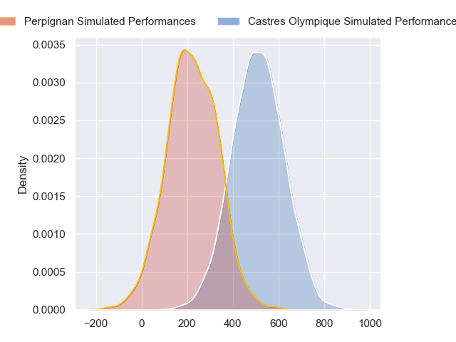
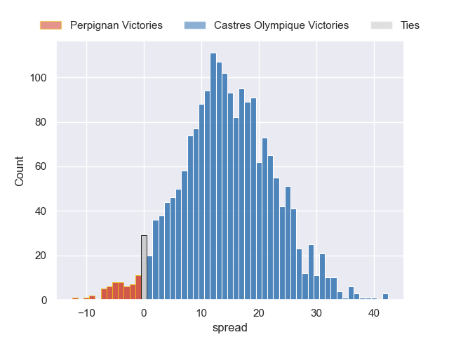
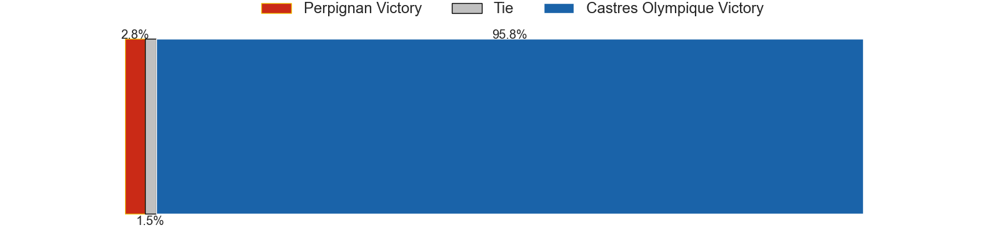

---  
layout: page  
title: Perpignan at Castres Olympique  
date: 2024-09-21 18:00:00 -0500  
categories: "Top 14 2024" match projection  
---
# Perpignan at Castres Olympique

# Club Level Predictions

The first set of predictions treats a club as the smallest object, as the club develops its members, organizes a gameplan, and deploys its players as needed for each match. This club model has a prediction of 0.6, which translates to predicting Castres Olympique to win by 6.9.

Our Over/Under is 50.5 - and combined with the spread above, we have a predicted scoreline of 22 to 29

Each club has a rating and a rating deviation (similar to a Glicko rating), and expected performances can be generated. This allows for simulated matches and spreads like the ones below.
## Projected Performances - Club Model

## Projected Spreads - Club Model

## Projected Results - Club Model

# Player Level Predictions

Treating teams instead as an entity made up of the currently active players, I have ratings for each player in an altogether different system. These can be combined to form team ratings once teamsheets are announced, weighting starters a bit higher than the reserves. After the match is played, players can be weighted by their minutes on the field, allowing for an accurate measure of the team's composition. With these compiled team ratings, we can make predictions, measure inaccuracy, and update the individual player ratings.
## Prediction without Player Minutes: Castres Olympique by 15.1

Castres Olympique by 6.9 on a neutral pitch

## Projected Performances - Player Model

## Projected Spreads - Player Model

## Projected Results - Player Model

| Away Player           |   Away Percentile |   Number |   Home Percentile | Home Player           |
|:----------------------|------------------:|---------:|------------------:|:----------------------|
| Giorgi Beria          |             87.09 |        1 |             80.55 | Quentin Walcker       |
| Victor Montgaillard   |            nan    |        2 |             92.29 | Gaetan Barlot         |
| Kieran Brookes        |             30.33 |        3 |             94.08 | Will Collier          |
| Adrien Warion         |             24.64 |        4 |             27.86 | Guillaume Ducat       |
| Posolo Tuilagi        |             17.98 |        5 |             82.91 | Florent Vanverberghe  |
| Jacobus van Tonder    |             83.94 |        6 |             17.39 | Mathieu Babillot      |
| Alan Brazo            |             78.18 |        7 |             89.37 | Baptiste Delaporte    |
| Lucas Velarte         |            nan    |        8 |             51.64 | Abraham Papali'i      |
| Gela Aprasidze        |             62.43 |        9 |             26.19 | Jeremy Fernandez      |
| Antoine Aucagne       |            nan    |       10 |             73.14 | Louis Le Brun         |
| Lucas Dubois          |             88.08 |       11 |             82.14 | Nathanael Hulleu      |
| Eneriko Buliruarua    |              3.96 |       12 |             97.79 | Jack Goodhue          |
| Alivereti Duguivalu   |             10.84 |       13 |             64.57 | Vilimoni Botitu       |
| Jefferson-Lee Joseph  |            nan    |       14 |            nan    | Christian Ambadiang   |
| Louis Dupichot        |             59.58 |       15 |             97.43 | Geoffrey Palis        |
| Vakhtang Jintcharadze |            nan    |       16 |             34.13 | Loris Zarantonello    |
| Akato Fakatika        |            nan    |       17 |             47.57 | Lois Guerois-Galisson |
| Tristan Labouteley    |              9.43 |       18 |              1.88 | Gauthier Maravat      |
| So'otala Fa'aso'o     |             93.93 |       19 |             57.92 | Baptiste Cope         |
| Tom Ecochard          |             85.39 |       20 |             57.31 | Santiago Arata        |
| Jake McIntyre         |             89.21 |       21 |             72.42 | Pierre Popelin        |
| Apisai Naqalevu       |             56.06 |       22 |              8.51 | Adrien Seguret        |
| Nemo Roelofse         |             74.71 |       23 |             16.89 | Nicolas Corato        |

