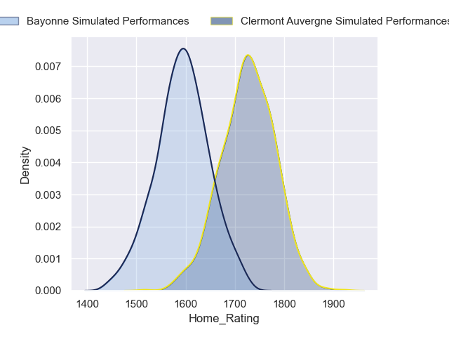
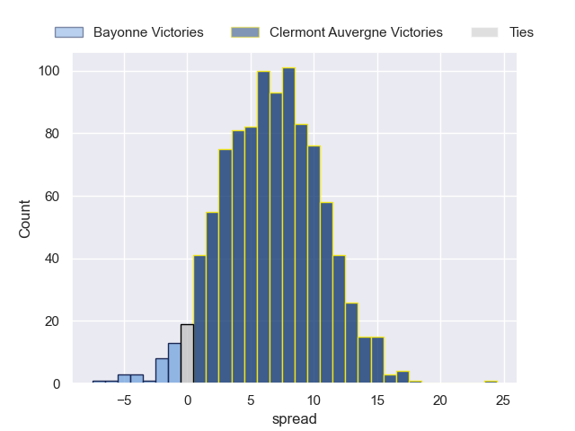
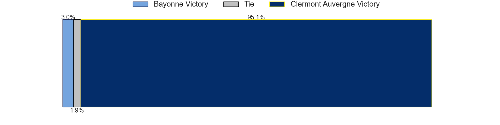
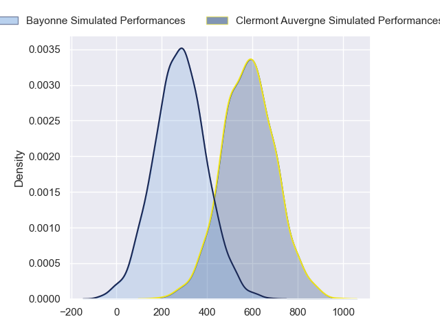
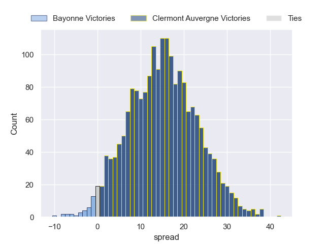
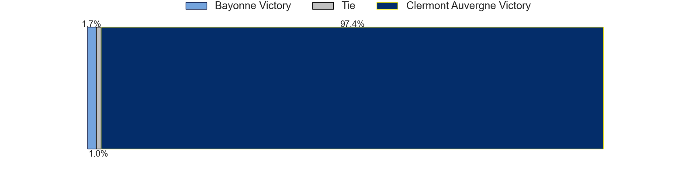

---  
layout: page  
title: Bayonne at Clermont Auvergne  
date: 2024-09-21 18:00:00 -0500  
categories: "Top 14 2024" match projection  
---
# Bayonne at Clermont Auvergne

# Club Level Predictions

The first set of predictions treats a club as the smallest object, as the club develops its members, organizes a gameplan, and deploys its players as needed for each match. This club model has a prediction of 0.599, which translates to predicting Clermont Auvergne to win by 6.7.

Our Over/Under is 50.5 - and combined with the spread above, we have a predicted scoreline of 22 to 29

Each club has a rating and a rating deviation (similar to a Glicko rating), and expected performances can be generated. This allows for simulated matches and spreads like the ones below.
## Projected Performances - Club Model

## Projected Spreads - Club Model

## Projected Results - Club Model

# Player Level Predictions

Treating teams instead as an entity made up of the currently active players, I have ratings for each player in an altogether different system. These can be combined to form team ratings once teamsheets are announced, weighting starters a bit higher than the reserves. After the match is played, players can be weighted by their minutes on the field, allowing for an accurate measure of the team's composition. With these compiled team ratings, we can make predictions, measure inaccuracy, and update the individual player ratings.
## Prediction without Player Minutes: Clermont Auvergne by 15.3

Clermont Auvergne by 7.6 on a neutral pitch

## Projected Performances - Player Model

## Projected Spreads - Player Model

## Projected Results - Player Model

| Away Player             |   Away Percentile |   Number |   Home Percentile | Home Player          |
|:------------------------|------------------:|---------:|------------------:|:---------------------|
| Andy Bordelai           |             36.52 |        1 |             72.59 | Giorgi Akhaladze     |
| Vincent Giudicelli      |              7.52 |        2 |             90.09 | Folau Fainga'a       |
| Pascal Cotet            |            nan    |        3 |             71.97 | Cristian Ojovan      |
| Veikoso Poloniati       |              3.22 |        4 |             82.8  | Thibaud Lanen        |
| Alex Moon               |             97.56 |        5 |             68.37 | Thomas Ceyte         |
| Esteban Capilla         |            nan    |        6 |             51.83 | Peceli Yato          |
| Baptiste Heguy          |             89.26 |        7 |             85.75 | Pita Gus Sowakula    |
| Giovanni Habel-Kueffner |             89.95 |        8 |             92.99 | Fritz Lee            |
| Maxime Machenaud        |             93.17 |        9 |             72.11 | Baptiste Jauneau     |
| Joris Segonds           |             77.94 |       10 |             94.72 | Anthony Belleau      |
| Aurelien Callandret     |             82.45 |       11 |             11.94 | Alivereti Raka       |
| Guillaume Martocq       |             15.85 |       12 |             95.34 | George Moala         |
| Sireli Maqala           |             63.05 |       13 |             65.03 | Lucas Tauzin         |
| Cheikh Tiberghien       |             10.28 |       14 |             46.12 | Yerim Fall           |
| Yohan Orabe             |            nan    |       15 |             89.72 | Alex Newsome         |
| Lucas Martin            |            nan    |       16 |             75.96 | Etienne Fourcade     |
| Pierre Castillon        |            nan    |       17 |             30.06 | Sacha Lotrian        |
| Denis Marchois          |             97.45 |       18 |             72.65 | Anthime Hemery       |
| Baptiste Chouzenoux     |             90.37 |       19 |             75.53 | Killian Tixeront     |
| Guillaume Rouet         |             33.78 |       20 |             90.51 | Sebastien Bezy       |
| Camille Lopez           |             87.53 |       21 |             87.77 | Benjamin Urdapilleta |
| Arnaud Erbinartegaray   |             10.02 |       22 |             87.41 | Leon Darricarrere    |
| Luke Tagi               |             76.22 |       23 |            nan    | Régis Montagne       |

