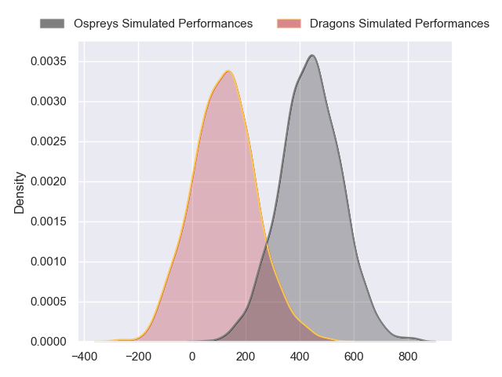
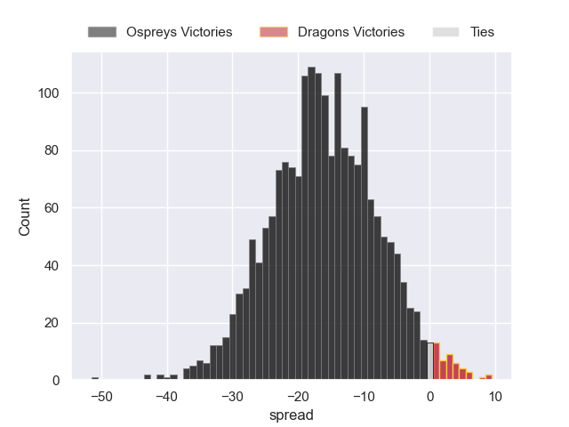
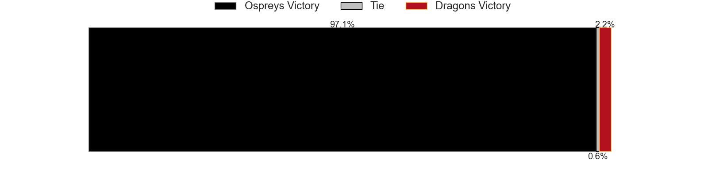

---  
layout: page  
title: Ospreys at Dragons  
date: 2024-09-21 18:00:00 -0500  
categories: "United Rugby Championship 2024" match projection  
---
# Ospreys at Dragons

# Club Level Predictions

The first set of predictions treats a club as the smallest object, as the club develops its members, organizes a gameplan, and deploys its players as needed for each match. This club model has a prediction of 0.239, which translates to predicting Ospreys to win by 6.5.

Our Over/Under is 55.5 - and combined with the spread above, we have a predicted scoreline of 31 to 24

Each club has a rating and a rating deviation (similar to a Glicko rating), and expected performances can be generated. This allows for simulated matches and spreads like the ones below.
## Projected Performances - Club Model

## Projected Spreads - Club Model

## Projected Results - Club Model

# Player Level Predictions

Treating teams instead as an entity made up of the currently active players, I have ratings for each player in an altogether different system. These can be combined to form team ratings once teamsheets are announced, weighting starters a bit higher than the reserves. After the match is played, players can be weighted by their minutes on the field, allowing for an accurate measure of the team's composition. With these compiled team ratings, we can make predictions, measure inaccuracy, and update the individual player ratings.
## Prediction without Player Minutes: Ospreys by 16.2

Ospreys by 22.2 on a neutral pitch

## Projected Performances - Player Model

## Projected Spreads - Player Model

## Projected Results - Player Model

| Away Player            |   Away Percentile |   Number |   Home Percentile | Home Player        |
|:-----------------------|------------------:|---------:|------------------:|:-------------------|
| Gareth Thomas          |             62.42 |        1 |             64.01 | Rodrigo Martinez   |
| Dewi Lake              |             65.69 |        2 |             23.85 | Brodie Coghlan     |
| Tom Botha              |             83.91 |        3 |             27.41 | Leon Brown         |
| James Ratti            |             86.24 |        4 |              0.78 | Matthew Screech    |
| Adam Beard             |             97.78 |        5 |             38.51 | Ben Carter         |
| Jac Morgan             |             95.9  |        6 |             29.79 | Ryan Woodman       |
| Justin Tipuric         |             98.23 |        7 |              0.44 | Harrison Keddie    |
| Morgan Morris          |             17.76 |        8 |             10.88 | Shane Lewis-Hughes |
| Reuben Morgan-Williams |             85.77 |        9 |              6.83 | Dane Blacker       |
| Dan Edwards            |             74.82 |       10 |             67.06 | Lloyd Evans        |
| Ryan Conbeer           |             23.78 |       11 |              3.88 | Jared Rosser       |
| Keiran Williams        |             93.47 |       12 |             62.59 | Aneurin Owen       |
| Owen Watkin            |             99.07 |       13 |             32.63 | Joe Westwood       |
| Luke Morgan            |             34.39 |       14 |             28.98 | Rio Dyer           |
| Jack Walsh             |             72.43 |       15 |              9.11 | Angus O'Brien      |
| Lewis Lloyd            |             62.75 |       16 |             12.11 | James Benjamin     |
| Steff Thomas           |            nan    |       17 |              2.56 | Rhodri Jones       |
| Math Iorwerth-Scott    |            nan    |       18 |             51.99 | Luke Yendle        |
| Huw Owen-Sutton        |             72.59 |       19 |             16.76 | George Nott        |
| Harri Deaves           |             90.59 |       20 |             44.96 | Dan Lydiate        |
| Luke Davies            |             66.6  |       21 |             87.67 | Rhodri Williams    |
| Phil Cokanasiga        |             73.54 |       22 |             50.12 | Harry Wilson       |
| Max Nagy               |             85.28 |       23 |             29.67 | Ewan Rosser        |

