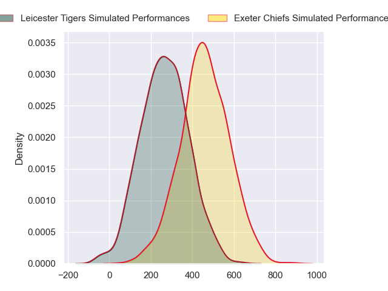
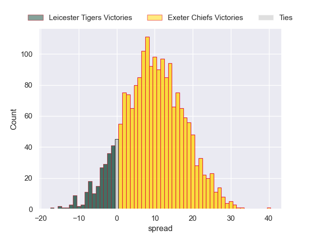
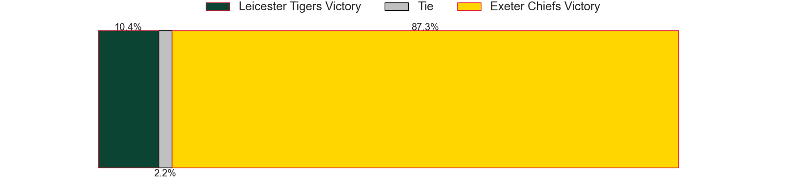

---  
layout: page  
title: Leicester Tigers at Exeter Chiefs  
date: 2024-09-21 18:00:00 -0500  
categories: "Premiership 2024" match projection  
---
# Leicester Tigers at Exeter Chiefs

# Club Level Predictions

The first set of predictions treats a club as the smallest object, as the club develops its members, organizes a gameplan, and deploys its players as needed for each match. This club model has a prediction of 0.494, which translates to predicting Leicester Tigers to win by -3.2.

Our Over/Under is 63.5 - and combined with the spread above, we have a predicted scoreline of 30 to 33

Each club has a rating and a rating deviation (similar to a Glicko rating), and expected performances can be generated. This allows for simulated matches and spreads like the ones below.
## Projected Performances - Club Model

## Projected Spreads - Club Model

## Projected Results - Club Model

# Player Level Predictions

Treating teams instead as an entity made up of the currently active players, I have ratings for each player in an altogether different system. These can be combined to form team ratings once teamsheets are announced, weighting starters a bit higher than the reserves. After the match is played, players can be weighted by their minutes on the field, allowing for an accurate measure of the team's composition. With these compiled team ratings, we can make predictions, measure inaccuracy, and update the individual player ratings.
## Prediction without Player Minutes: Exeter Chiefs by 9.8

Exeter Chiefs by 4.5 on a neutral pitch

## Projected Performances - Player Model

## Projected Spreads - Player Model

## Projected Results - Player Model

| Away Player           |   Away Percentile |   Number |   Home Percentile | Home Player          |
|:----------------------|------------------:|---------:|------------------:|:---------------------|
| Nicky Smith           |             87.36 |        1 |             98.76 | Scott Sio            |
| Charlie Clare         |             10.28 |        2 |             89.91 | Dan Frost            |
| Joe Heyes             |             90.54 |        3 |             68.35 | Ehren Painter        |
| Harry Wells           |             87.68 |        4 |             49.17 | Rusiate Tuima        |
| Ollie Chessum         |             84.91 |        5 |              8.97 | Richard Capstick     |
| Hanro Liebenberg      |             95.02 |        6 |             90.03 | Ethan Roots          |
| Olly Cracknell        |             38.32 |        7 |             86.49 | Ross Vintcent        |
| Kyle Hatherell        |              4.22 |        8 |             83.18 | Greg Fisilau         |
| Jack van Poortvliet   |             72.68 |        9 |             69.26 | Niall Armstrong      |
| Jamie Shillcock       |             72.86 |       10 |             68.59 | Harvey Skinner       |
| Ollie Hassell-Collins |             85.61 |       11 |             92.14 | Olly Woodburn        |
| Solomone Kata         |             41.14 |       12 |             58.04 | Joe Hawkins          |
| Izaia Perese          |             22.55 |       13 |             84.29 | Ben Hammersley       |
| Josh Bassett          |             78.16 |       14 |             92.96 | Immanuel Feyi-Waboso |
| Freddie Steward       |             18.93 |       15 |              2.1  | Josh Hodge           |
| Finn Theobald-Thomas  |             40.73 |       16 |             95.41 | Jack Yeandle         |
| James Cronin          |             91.34 |       17 |             69.67 | Will Goodrick-Clarke |
| Dan Cole              |             52.79 |       18 |             94.78 | Josh Iosefa-Scott    |
| Côme Joussain         |             21.75 |       19 |             53.72 | Jack Dunne           |
| Tommy Reffell         |             84.39 |       20 |             56.27 | Christ Tshiunza      |
| Ben Youngs            |             85.2  |       21 |             89.37 | Tom Cairns           |
| Ben Volavola          |             36.21 |       22 |             71.94 | Will Haydon-Wood     |
| Dan Kelly             |             92.19 |       23 |            nan    | Paul Brown-Bampoe    |

