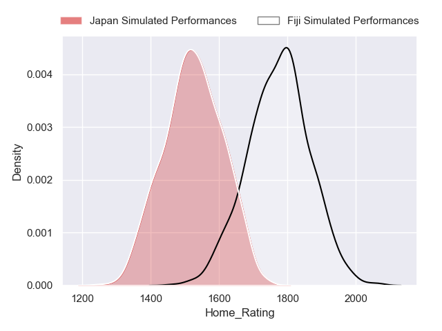
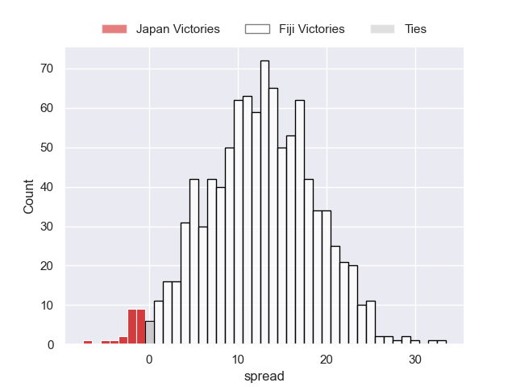
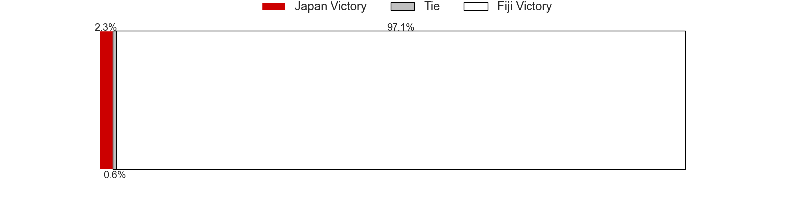
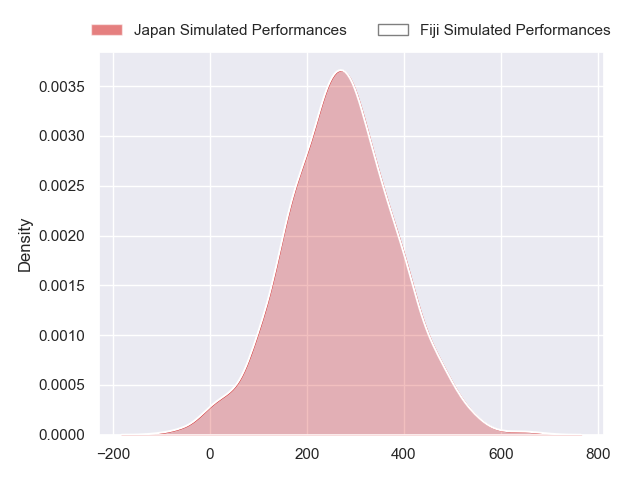
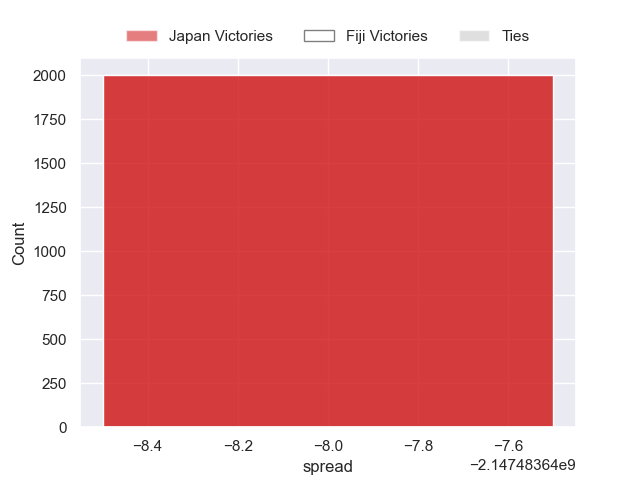

---  
layout: page  
title: Japan at Fiji  
date: 2024-09-21 18:00:00 -0500  
categories: "Pacific Nations Cup 2024" match projection  
---
# Japan at Fiji

# Club Level Predictions

The first set of predictions treats a club as the smallest object, as the club develops its members, organizes a gameplan, and deploys its players as needed for each match. This club model has a prediction of 0.746, which translates to predicting Fiji to win by 12.5.

Our Over/Under is 63.5 - and combined with the spread above, we have a predicted scoreline of 25 to 38

Each club has a rating and a rating deviation (similar to a Glicko rating), and expected performances can be generated. This allows for simulated matches and spreads like the ones below.
## Projected Performances - Club Model

## Projected Spreads - Club Model

## Projected Results - Club Model

# Player Level Predictions

Treating teams instead as an entity made up of the currently active players, I have ratings for each player in an altogether different system. These can be combined to form team ratings once teamsheets are announced, weighting starters a bit higher than the reserves. After the match is played, players can be weighted by their minutes on the field, allowing for an accurate measure of the team's composition. With these compiled team ratings, we can make predictions, measure inaccuracy, and update the individual player ratings.
## Prediction without Player Minutes: Japan by nan

Japan by 0.5 on a neutral pitch

## Projected Performances - Player Model

## Projected Spreads - Player Model

## Projected Results - Player Model

| Away Player        |   Away Percentile |   Number |   Home Percentile | Home Player             |
|:-------------------|------------------:|---------:|------------------:|:------------------------|
| Shogo Miura        |            nan    |        1 |            nan    | Eroni Mawi              |
| Mamoru Harada      |            nan    |        2 |            nan    | Tevita Ikanivere        |
| Shuhei Takeuchi    |            nan    |        3 |            nan    | Samu Tawake             |
| Epineri Uluiviti   |            nan    |        4 |            nan    | Isoa Nasilasila         |
| Warner Dearns      |            nan    |        5 |            nan    | Temo Mayanavanua        |
| Amato Fakatava     |            nan    |        6 |            nan    | Meli Derenalagi         |
| Kanji Shimokawa    |            nan    |        7 |            nan    | Kitione Salawa          |
| Faulua Makisi      |            nan    |        8 |            nan    | Elia Canakaivata        |
| Shinobu Fujiwara   |            nan    |        9 |            nan    | Frank Lomani            |
| Harumichi Tatekawa |            nan    |       10 |            nan    | Caleb Muntz             |
| Malo Tuitama       |            nan    |       11 |             69.16 | Ilaisa Droasese         |
| Nik Mccurran       |            nan    |       12 |            nan    | Inia Tabuavou           |
| Dylan Riley        |            nan    |       13 |            nan    | Iosefo Masi             |
| Tomoki Osada       |            nan    |       14 |            nan    | Vuate Karawalevu        |
| Seungsin Lee       |            nan    |       15 |            nan    | Isaiah Armstrong-Ravula |
| Kenta Matsuoka     |            nan    |       16 |             40.92 | Mesu Dolokoto           |
| Takato Okabe       |            nan    |       17 |            nan    | Haereiti Hetet          |
| Keijiro Tamefusa   |            nan    |       18 |            nan    | Meli Tuni               |
| Isaiah Mapusua     |            nan    |       19 |            nan    | Mesake Vocevoce         |
| Tiennan Costley    |            nan    |       20 |            nan    | Albert Tuisue           |
| Taiki Koyama       |             34.16 |       21 |             57.87 | Peni Matawalu           |
| Yusuke Kajimura    |            nan    |       22 |             69.35 | Apisalome Vota          |
| Junta Hamano       |            nan    |       23 |            nan    | Ponipate Loganimasi     |

