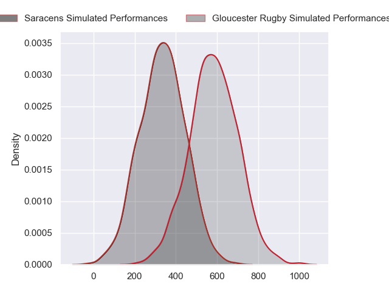
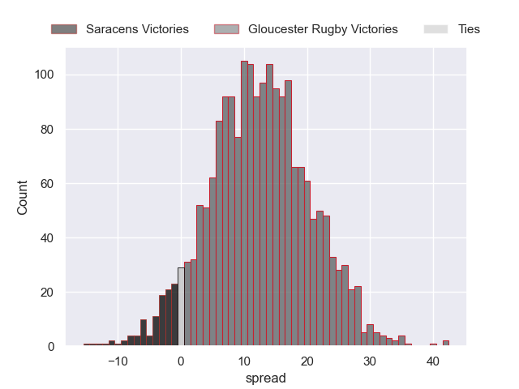
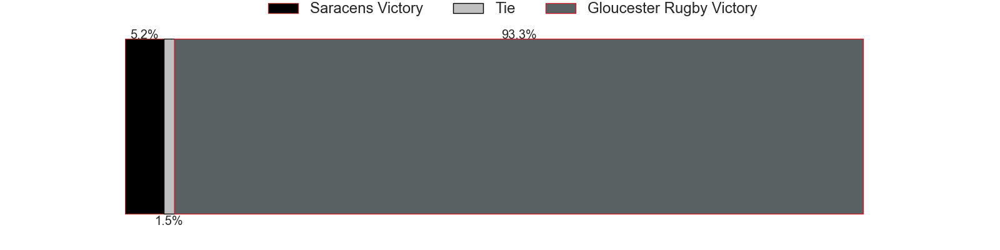

---  
layout: page  
title: Saracens at Gloucester Rugby  
date: 2024-09-21 18:00:00 -0500  
categories: "Premiership 2024" match projection  
---
# Saracens at Gloucester Rugby

# Club Level Predictions

The first set of predictions treats a club as the smallest object, as the club develops its members, organizes a gameplan, and deploys its players as needed for each match. This club model has a prediction of 0.346, which translates to predicting Saracens to win by 2.4.

Our Over/Under is 67.5 - and combined with the spread above, we have a predicted scoreline of 35 to 33

Each club has a rating and a rating deviation (similar to a Glicko rating), and expected performances can be generated. This allows for simulated matches and spreads like the ones below.
## Projected Performances - Club Model

## Projected Spreads - Club Model

## Projected Results - Club Model

# Player Level Predictions

Treating teams instead as an entity made up of the currently active players, I have ratings for each player in an altogether different system. These can be combined to form team ratings once teamsheets are announced, weighting starters a bit higher than the reserves. After the match is played, players can be weighted by their minutes on the field, allowing for an accurate measure of the team's composition. With these compiled team ratings, we can make predictions, measure inaccuracy, and update the individual player ratings.
## Prediction without Player Minutes: Gloucester Rugby by 12.6

Gloucester Rugby by 4.3 on a neutral pitch

## Projected Performances - Player Model

## Projected Spreads - Player Model

## Projected Results - Player Model

| Away Player     |   Away Percentile |   Number |   Home Percentile | Home Player        |
|:----------------|------------------:|---------:|------------------:|:-------------------|
| Rhys Carré      |             14.24 |        1 |             82.94 | Val Rapava-Ruskin  |
| Theo Dan        |             15.23 |        2 |             93.76 | Jack Singleton     |
| Marco Riccioni  |             66.67 |        3 |             63.57 | Afolabi Fasogbon   |
| Maro Itoje      |             97.89 |        4 |             87.01 | Freddie Thomas     |
| Hugh Tizard     |             64.04 |        5 |             76.91 | Matias Alemanno    |
| Andy Christie   |             45.96 |        6 |             92.8  | Ruan Ackermann     |
| Toby Knight     |             70.65 |        7 |             53.6  | Lewis Ludlow       |
| Tom Willis      |             17.06 |        8 |             49.77 | Zach Mercer        |
| Ivan van Zyl    |             81.97 |        9 |             87.29 | Tomos Williams     |
| Fergus Burke    |             50.84 |       10 |            nan    | Gareth Anscombe    |
| Rotimi Segun    |             69.49 |       11 |             78.88 | Ollie Thorley      |
| Nick Tompkins   |             98.6  |       12 |             95.57 | Max Llewellyn      |
| Alex Lozowski   |             42.77 |       13 |             76.81 | Chris Harris       |
| Tobias Elliott  |             35.41 |       14 |             94.59 | Christian Wade     |
| Elliot Daly     |             90.19 |       15 |             77.57 | George Barton      |
| Jamie George    |             99.82 |       16 |             74.5  | Seb Blake          |
| Sam Crean       |             79.22 |       17 |              6.63 | Mayco Vivas        |
| Alec Clarey     |             41.2  |       18 |             91.87 | Kirill Gotovtsev   |
| Harry Wilson    |             38.98 |       19 |             76.14 | Freddie Clarke     |
| Nick Isiekwe    |             92.34 |       20 |             63.08 | Jack Clement       |
| Ben Earl        |             97.2  |       21 |             91.08 | Caolan Englefield  |
| Charlie Bracken |             12.33 |       22 |             66.67 | Charlie Atkinson   |
| Alex Goode      |             87.62 |       23 |             35.78 | Sebastien Atkinson |

