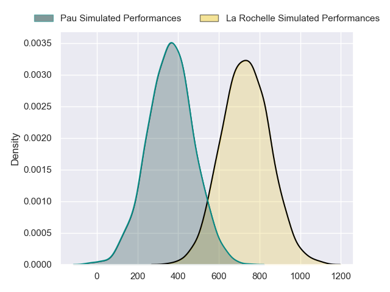
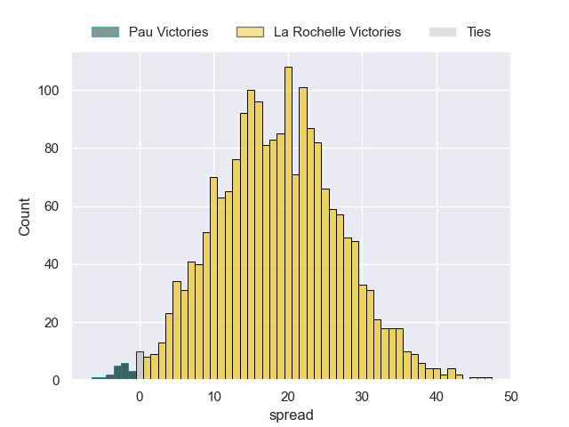
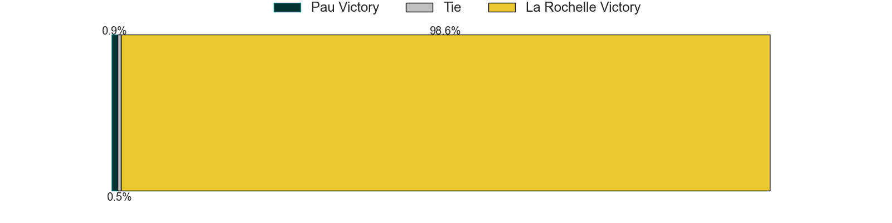

---  
layout: page  
title: Pau at La Rochelle  
date: 2024-09-21 18:00:00 -0500  
categories: "Top 14 2024" match projection  
---
# Pau at La Rochelle

# Club Level Predictions

The first set of predictions treats a club as the smallest object, as the club develops its members, organizes a gameplan, and deploys its players as needed for each match. This club model has a prediction of 0.653, which translates to predicting La Rochelle to win by 8.7.

Our Over/Under is 52.5 - and combined with the spread above, we have a predicted scoreline of 22 to 30

Each club has a rating and a rating deviation (similar to a Glicko rating), and expected performances can be generated. This allows for simulated matches and spreads like the ones below.
## Projected Performances - Club Model

## Projected Spreads - Club Model

## Projected Results - Club Model

# Player Level Predictions

Treating teams instead as an entity made up of the currently active players, I have ratings for each player in an altogether different system. These can be combined to form team ratings once teamsheets are announced, weighting starters a bit higher than the reserves. After the match is played, players can be weighted by their minutes on the field, allowing for an accurate measure of the team's composition. With these compiled team ratings, we can make predictions, measure inaccuracy, and update the individual player ratings.
## Prediction without Player Minutes: La Rochelle by 19.0

La Rochelle by 11.8 on a neutral pitch

## Projected Performances - Player Model

## Projected Spreads - Player Model

## Projected Results - Player Model

| Away Player                  |   Away Percentile |   Number |   Home Percentile | Home Player         |
|:-----------------------------|------------------:|---------:|------------------:|:--------------------|
| Guram Papidze                |             11.94 |        1 |             30.77 | Louis Penverne      |
| Romain Ruffenach             |             72.66 |        2 |            nan    | Pierre Bourgarit    |
| Harry Williams               |             96.11 |        3 |             99.56 | Uini Atonio         |
| Remi Picquette               |             67.59 |        4 |            nan    | Thomas Lavault      |
| Lekima Tagitagivalu          |             84.5  |        5 |            nan    | Will Skelton        |
| Joel Kpoku                   |             74.2  |        6 |            nan    | Kane Douglas        |
| Loic Credoz                  |             53.93 |        7 |              9.63 | Paul Boudehent      |
| Paulo Tauiliili-Pelesasa (2) |            nan    |        8 |            nan    | Gregory Alldritt    |
| Thibault Daubagna            |             94.12 |        9 |            nan    | Thomas Berjon       |
| Axel Desperes                |             82.94 |       10 |             80.82 | Hugo Reus           |
| Aymeric Luc                  |             37.24 |       11 |            nan    | Dillyn Leyds        |
| Tumua Manu                   |             96.97 |       12 |            nan    | Jonathan Danty      |
| Emilien Gailleton            |             84.38 |       13 |             50.93 | Simeli Daunivucu    |
| Aaron Grandidier             |            nan    |       14 |            nan    | Jack Nowell         |
| Jack Maddocks                |             85.98 |       15 |             99.77 | Brice Dulin         |
| Youri Delhommel              |             57.06 |       16 |             90.28 | Tolu Latu           |
| Daniel Bibi Biziwu           |              8.84 |       17 |            nan    | Reda Wardi          |
| Jimi Maximin                 |            nan    |       18 |            nan    | Judicael Cancoriet  |
| Sacha Zegueur                |             39.53 |       19 |            nan    | Matthias Haddad     |
| Dan Robson                   |             98.29 |       20 |             86.34 | Teddy Iribaren      |
| Joe Simmonds                 |             85.37 |       21 |            nan    | Antoine Hastoy      |
| Elliot Roudil                |             24.08 |       22 |            nan    | Jules Favre         |
| Jon Zabala                   |             69.76 |       23 |             46.51 | Aleksandre Kuntelia |

