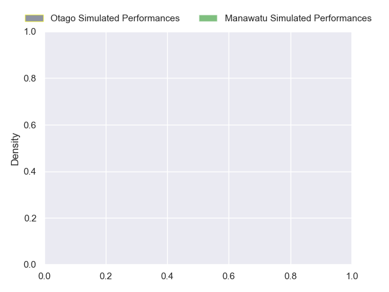
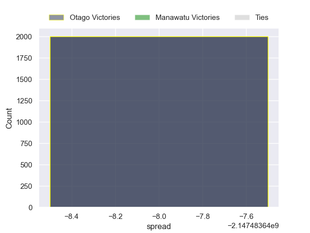

---  
layout: page  
title: Otago at Manawatu  
date: 2024-09-21 18:00:00 -0500  
categories: "NPC 2024" match projection  
---
# Otago at Manawatu

# Club Level Predictions

The first set of predictions treats a club as the smallest object, as the club develops its members, organizes a gameplan, and deploys its players as needed for each match. This club model has a prediction of 0.264, which translates to predicting Otago to win by 9.4.

Each club has a rating and a rating deviation (similar to a Glicko rating), and expected performances can be generated. This allows for simulated matches and spreads like the ones below.
## Projected Performances - Club Model

## Projected Spreads - Club Model

## Projected Results - Club Model

# Player Level Predictions

Treating teams instead as an entity made up of the currently active players, I have ratings for each player in an altogether different system. These can be combined to form team ratings once teamsheets are announced, weighting starters a bit higher than the reserves. After the match is played, players can be weighted by their minutes on the field, allowing for an accurate measure of the team's composition. With these compiled team ratings, we can make predictions, measure inaccuracy, and update the individual player ratings.
## Prediction without Player Minutes: Otago by nan

Otago by nan on a neutral pitch

## Projected Performances - Player Model

## Projected Spreads - Player Model

## Projected Results - Player Model

| Away Player          |   Away Percentile |   Number |   Home Percentile | Home Player          |
|:---------------------|------------------:|---------:|------------------:|:---------------------|
| Benjamin Lopas       |               nan |        1 |            nan    | Joe Gavigan          |
| Liam Coltman         |               nan |        2 |            nan    | Vernon Bason         |
| Saula Ma'u           |               nan |        3 |            nan    | Flyn Yates           |
| Fabian Holland       |               nan |        4 |            nan    | Stan van den Hoven   |
| Will Stodart         |               nan |        5 |            nan    | Lachlan Shaw         |
| Oliver Haig          |               nan |        6 |            nan    | TK Howden            |
| Sam Fischli          |               nan |        7 |            nan    | Mosese Bason         |
| Christian Lio-Willie |               nan |        8 |            nan    | Brayden Iose         |
| James Arscott        |               nan |        9 |            nan    | Jordi Viljoen        |
| Cameron Millar       |               nan |       10 |            nan    | Reece MacDonald      |
| Josh Whaanga         |               nan |       11 |            nan    | Pena Va'a            |
| Thomas Umaga-Jensen  |               nan |       12 |            nan    | Jason Emery          |
| Hudson Creighton     |               nan |       13 |            nan    | Kyle Brown           |
| Kyan Rangitutia      |               nan |       14 |            nan    | Taniela Filimone     |
| Finn Hurley          |               nan |       15 |            nan    | Drew Wild            |
| Henry Bell           |               nan |       16 |            nan    | Raymond Tuputupu     |
| Abraham Pole         |               nan |       17 |            nan    | Malakai Hala         |
| Rohan Wingham        |               nan |       18 |            nan    | Feleti Sae-Ta'Ufo'Ou |
| Will Tucker          |               nan |       19 |            nan    | Josh Taula           |
| Harry Taylor         |               nan |       20 |            nan    | Julian Goerke        |
| Nathan Hastie        |               nan |       21 |             46.11 | Luke Campbell        |
| Ajay Faleafaga       |               nan |       22 |            nan    | Brett Cameron        |
| Levi Harmon          |               nan |       23 |            nan    | James Tofa           |

