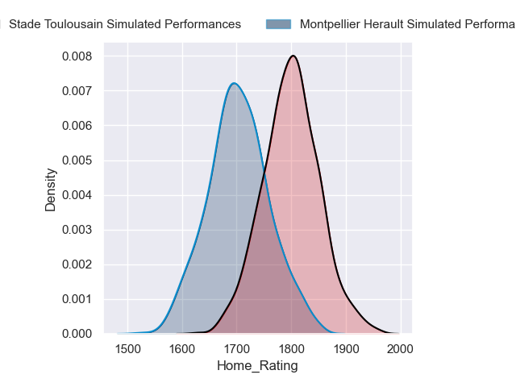
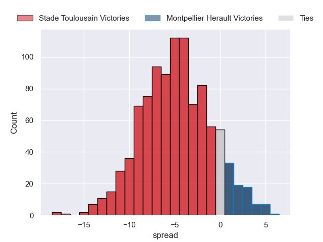
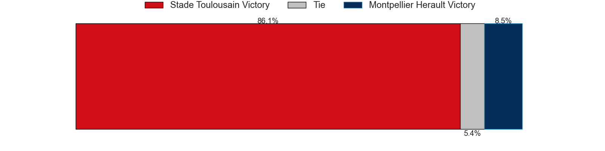
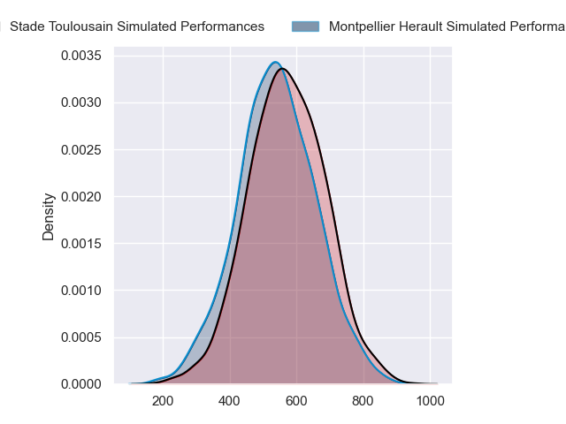
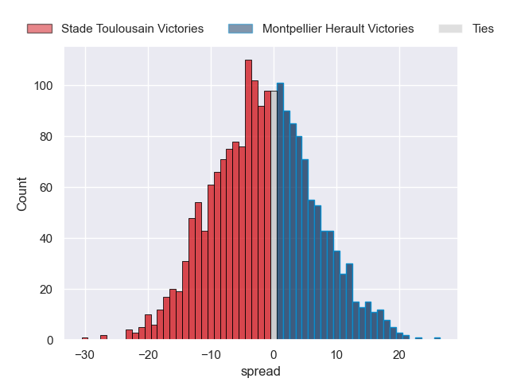
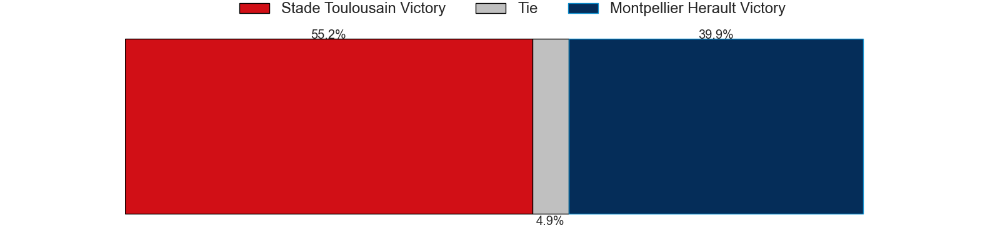

---  
layout: page  
title: Stade Toulousain at Montpellier Herault  
date: 2024-09-21 18:00:00 -0500  
categories: "Top 14 2024" match projection  
---
# Stade Toulousain at Montpellier Herault

# Club Level Predictions

The first set of predictions treats a club as the smallest object, as the club develops its members, organizes a gameplan, and deploys its players as needed for each match. This club model has a prediction of 0.278, which translates to predicting Stade Toulousain to win by 4.8.

Our Over/Under is 62.5 - and combined with the spread above, we have a predicted scoreline of 34 to 29

Each club has a rating and a rating deviation (similar to a Glicko rating), and expected performances can be generated. This allows for simulated matches and spreads like the ones below.
## Projected Performances - Club Model

## Projected Spreads - Club Model

## Projected Results - Club Model

# Player Level Predictions

Treating teams instead as an entity made up of the currently active players, I have ratings for each player in an altogether different system. These can be combined to form team ratings once teamsheets are announced, weighting starters a bit higher than the reserves. After the match is played, players can be weighted by their minutes on the field, allowing for an accurate measure of the team's composition. With these compiled team ratings, we can make predictions, measure inaccuracy, and update the individual player ratings.
## Prediction without Player Minutes: Stade Toulousain by 1.6

Stade Toulousain by 9.2 on a neutral pitch

## Projected Performances - Player Model

## Projected Spreads - Player Model

## Projected Results - Player Model

| Away Player          |   Away Percentile |   Number |   Home Percentile | Home Player         |
|:---------------------|------------------:|---------:|------------------:|:--------------------|
| Rodrigue Neti        |             68.79 |        1 |             83.82 | Enzo Forletta       |
| Guillaume Cramont    |             80.37 |        2 |             66.61 | Vano Karkadze       |
| David Ainu'u         |             93.1  |        3 |             82.49 | Luka Japaridze      |
| Richie Arnold        |             89.46 |        4 |             91.45 | Yacouba Camara      |
| Emmanuel Meafou      |             90.68 |        5 |             53.05 | Tyler Duguid        |
| Leo Banos            |             84.72 |        6 |             82.28 | Lenni Nouchi        |
| Jack Willis          |             95.24 |        7 |             35.55 | Alexandre Becognee  |
| Theo Ntamack         |             52.1  |        8 |             96.5  | Billy Vunipola      |
| Naoto Saito          |             10.06 |        9 |             54.08 | Leo Coly            |
| Thomas Ramos         |             96.73 |       10 |             87.29 | Domingo Miotti      |
| Matthis Lebel        |             97.24 |       11 |             99.08 | George Bridge       |
| Pierre-Louis Barassi |             89.98 |       12 |             56.64 | Arthur Vincent      |
| Dimitri Delibes      |             79.14 |       13 |             14.1  | Thomas Darmon       |
| Ange Capuozzo        |             97.86 |       14 |             91.12 | Madosh Tambwe       |
| Blair Kinghorn       |             99.9  |       15 |            nan    | Stuart Hogg         |
| Peato Mauvaka        |             97.43 |       16 |             87.71 | Christopher Tolofua |
| Hugo Reilhes         |            nan    |       17 |              1.41 | Baptiste Erdocio    |
| Thibaud Flament      |             95.01 |       18 |             40.73 | Florian Verhaeghe   |
| Anthony Jelonch      |             98.83 |       19 |             81.24 | Bastien Chalureau   |
| Clement Verge        |             71.92 |       20 |             50.72 | Sam Simmonds        |
| Paul Graou           |             39.47 |       21 |            nan    | Alexis Bernadet     |
| Paul Costes          |             75.06 |       22 |             17.72 | Auguste Cadot       |
| Joel Merkler         |             84.35 |       23 |            nan    | Wilfrid Hounkpatin  |

