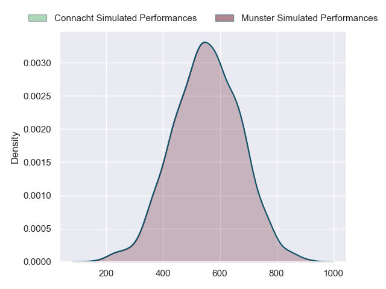
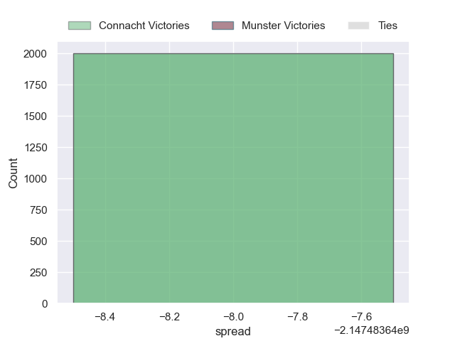

---  
layout: page  
title: Connacht at Munster  
date: 2024-09-21 18:00:00 -0500  
categories: "United Rugby Championship 2024" match projection  
---
# Connacht at Munster

# Club Level Predictions

The first set of predictions treats a club as the smallest object, as the club develops its members, organizes a gameplan, and deploys its players as needed for each match. This club model has a prediction of 0.673, which translates to predicting Munster to win by 9.4.

Our Over/Under is 50.5 - and combined with the spread above, we have a predicted scoreline of 20 to 30

Each club has a rating and a rating deviation (similar to a Glicko rating), and expected performances can be generated. This allows for simulated matches and spreads like the ones below.
## Projected Performances - Club Model

## Projected Spreads - Club Model

## Projected Results - Club Model

# Player Level Predictions

Treating teams instead as an entity made up of the currently active players, I have ratings for each player in an altogether different system. These can be combined to form team ratings once teamsheets are announced, weighting starters a bit higher than the reserves. After the match is played, players can be weighted by their minutes on the field, allowing for an accurate measure of the team's composition. With these compiled team ratings, we can make predictions, measure inaccuracy, and update the individual player ratings.
## Prediction without Player Minutes: Munster by 13.4

Munster by 7.1 on a neutral pitch

## Projected Performances - Player Model

## Projected Spreads - Player Model

## Projected Results - Player Model

| Away Player           |   Away Percentile |   Number |   Home Percentile | Home Player      |
|:----------------------|------------------:|---------:|------------------:|:-----------------|
| Denis Buckley         |             90.01 |        1 |             95.93 | Jeremy Loughman  |
| Dave Heffernan        |             55.23 |        2 |            nan    | Diarmuid Barron  |
| Jack Aungier          |             77.72 |        3 |             95.23 | John Ryan        |
| Joe Joyce             |             96.67 |        4 |             99.11 | Jean Kleyn       |
| Darragh Murray        |             39.96 |        5 |             22.2  | Fineen Wycherley |
| Josh Murphy           |            nan    |        6 |             56.92 | Ruadhan Quinn    |
| Conor Oliver          |             87.04 |        7 |             47.51 | John Hodnett     |
| Cian Prendergast      |             56.81 |        8 |             86.21 | Gavin Coombes    |
| Ben Murphy            |            nan    |        9 |             81.4  | Craig Casey      |
| Josh Ioane            |             51.87 |       10 |             76.5  | Billy Burns      |
| Shayne Bolton         |             68.78 |       11 |             95.31 | Shane Daly       |
| Cathal Forde          |             18.41 |       12 |             97.2  | Alex Nankivell   |
| Piers O'Conor         |             57.71 |       13 |             59.44 | Tom Farrell      |
| Mack Hansen           |             83.64 |       14 |              9.11 | Thaakir Abrahams |
| Santiago Cordero      |            nan    |       15 |             84.81 | Mike Haley       |
| Dylan Tierney-Martin  |            nan    |       16 |             93.39 | Niall Scannell   |
| Peter Dooley          |             97.79 |       17 |             39.79 | Josh Wycherley   |
| Sam Illo              |            nan    |       18 |             94.96 | Oli Jager        |
| Oisin Dowling         |             74.14 |       19 |             81.78 | Jack O'Donoghue  |
| Shamus Hurley-Langton |             55.59 |       20 |             87.71 | Alex Kendellen   |
| Caolin Blade          |             79.32 |       21 |            nan    | Ethan Coughlan   |
| David Hawkshaw        |             68.88 |       22 |             29.98 | Tony Butler      |
| Sean Jansen           |             14.02 |       23 |             20.75 | Sean O'Brien     |

