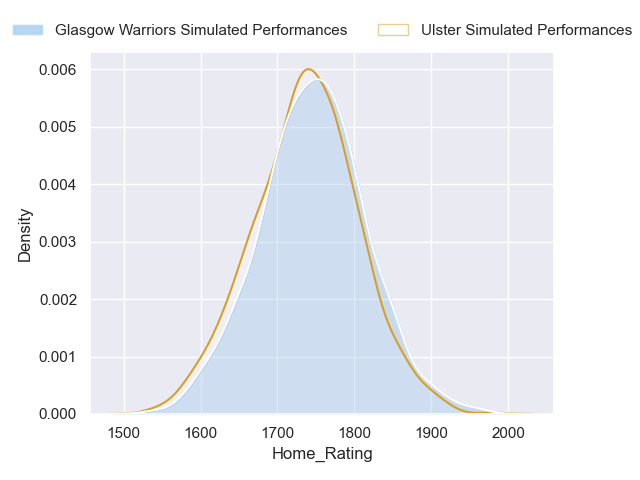
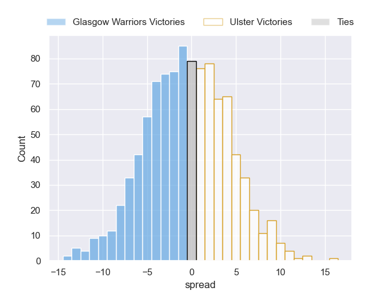
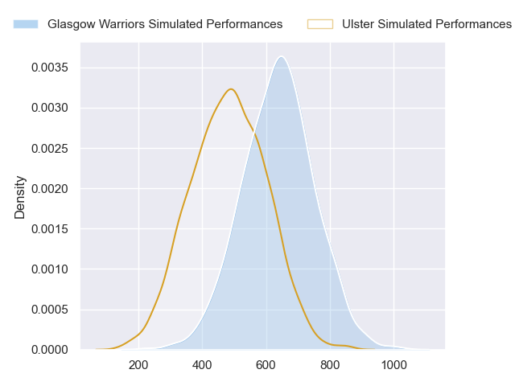
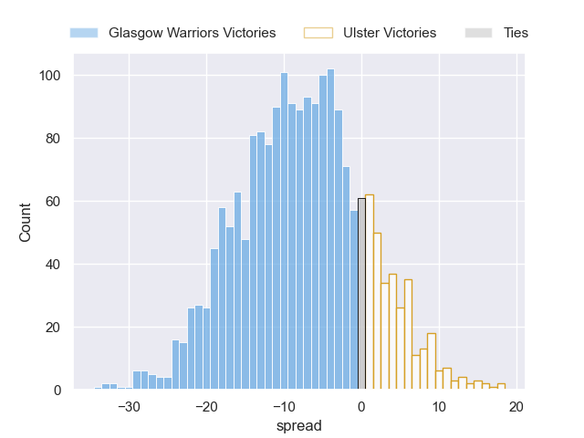

---  
layout: page  
title: Glasgow Warriors at Ulster  
date: 2024-09-21 18:00:00 -0500  
categories: "United Rugby Championship 2024" match projection  
---
# Glasgow Warriors at Ulster

# Club Level Predictions

The first set of predictions treats a club as the smallest object, as the club develops its members, organizes a gameplan, and deploys its players as needed for each match. This club model has a prediction of 0.394, which translates to predicting Glasgow Warriors to win by 0.5.

Our Over/Under is 56.5 - and combined with the spread above, we have a predicted scoreline of 28 to 28

Each club has a rating and a rating deviation (similar to a Glicko rating), and expected performances can be generated. This allows for simulated matches and spreads like the ones below.
## Projected Performances - Club Model

## Projected Spreads - Club Model

## Projected Results - Club Model

# Player Level Predictions

Treating teams instead as an entity made up of the currently active players, I have ratings for each player in an altogether different system. These can be combined to form team ratings once teamsheets are announced, weighting starters a bit higher than the reserves. After the match is played, players can be weighted by their minutes on the field, allowing for an accurate measure of the team's composition. With these compiled team ratings, we can make predictions, measure inaccuracy, and update the individual player ratings.
## Prediction without Player Minutes: Glasgow Warriors by 7.8

Glasgow Warriors by 14.5 on a neutral pitch

## Projected Performances - Player Model

## Projected Spreads - Player Model

## Projected Results - Player Model

| Away Player           |   Away Percentile |   Number |   Home Percentile | Home Player        |
|:----------------------|------------------:|---------:|------------------:|:-------------------|
| Jamie Bhatti          |             98.32 |        1 |             89.04 | Eric O'Sullivan    |
| Johnny Matthews       |             45.87 |        2 |             25.87 | John Andrew        |
| Sam Talakai           |             55.44 |        3 |            nan    | Corrie Barrett     |
| Max Williamson        |             71.59 |        4 |             92.23 | Iain Henderson     |
| Richie Gray           |             92.12 |        5 |             77.91 | Kieran Treadwell   |
| Matt Fagerson         |             98.36 |        6 |            nan    | James Mcnabney     |
| Rory Darge            |             94.68 |        7 |             87.38 | David McCann       |
| Henco Venter          |             95.79 |        8 |             92.06 | Nick Timoney       |
| Jamie Dobie           |             87.24 |        9 |             30.55 | Nathan Doak        |
| Tom Jordan            |             73.38 |       10 |             76.74 | Aidan Morgan       |
| Kyle Steyn            |             99.53 |       11 |             67.96 | Jacob Stockdale    |
| Sione Tuipulotu       |             90.91 |       12 |             70.98 | Jude Postlethwaite |
| Stafford McDowall     |             92.77 |       13 |             93.69 | Stewart Moore      |
| Sebastian Cancelliere |             99.49 |       14 |             70.82 | Mike Lowry         |
| Josh McKay            |             79.21 |       15 |             79.44 | Ethan McIlroy      |
| Gregor Hiddleston     |             68.62 |       16 |            nan    | James Mccormick    |
| Nathan McBeth         |             74.98 |       17 |             12.38 | Andrew Warwick     |
| Zander Fagerson       |             99.82 |       18 |             73.74 | Tom O'Toole        |
| Alex Samuel           |             70.37 |       19 |             89.79 | Harry Sheridan     |
| Gregor Brown          |             84.79 |       20 |             78.58 | Cormac Izuchukwu   |
| Euan Ferrie           |             50.5  |       21 |            nan    | Dave Shanahan      |
| Ben Afshar            |             35.48 |       22 |            nan    | James Humphreys    |
| Adam Hastings         |             98.08 |       23 |             80.41 | Werner Kok         |

