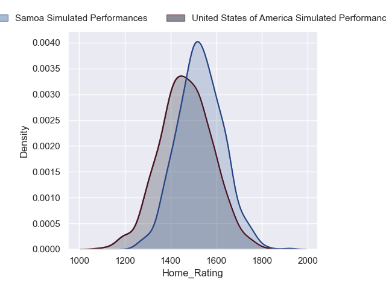
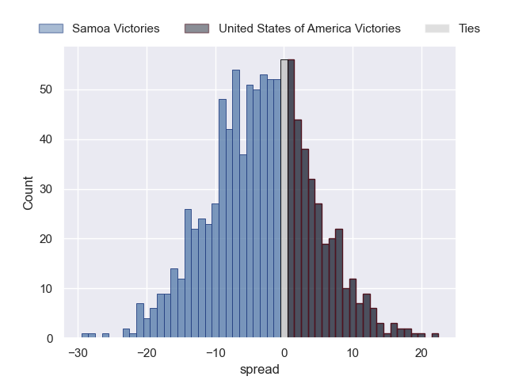
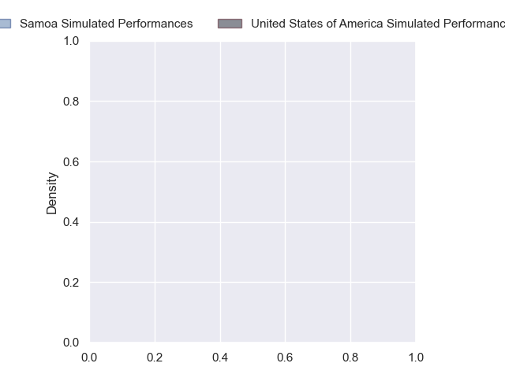
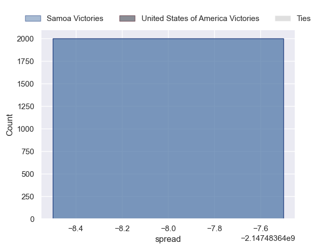

---  
layout: page  
title: Samoa at United States of America  
date: 2024-09-21 18:00:00 -0500  
categories: "Pacific Nations Cup 2024" match projection  
---
# Samoa at United States of America

# Club Level Predictions

The first set of predictions treats a club as the smallest object, as the club develops its members, organizes a gameplan, and deploys its players as needed for each match. This club model has a prediction of 0.329, which translates to predicting Samoa to win by 3.1.

Our Over/Under is 38.5 - and combined with the spread above, we have a predicted scoreline of 21 to 18

Each club has a rating and a rating deviation (similar to a Glicko rating), and expected performances can be generated. This allows for simulated matches and spreads like the ones below.
## Projected Performances - Club Model

## Projected Spreads - Club Model

## Projected Results - Club Model

# Player Level Predictions

Treating teams instead as an entity made up of the currently active players, I have ratings for each player in an altogether different system. These can be combined to form team ratings once teamsheets are announced, weighting starters a bit higher than the reserves. After the match is played, players can be weighted by their minutes on the field, allowing for an accurate measure of the team's composition. With these compiled team ratings, we can make predictions, measure inaccuracy, and update the individual player ratings.
## Prediction without Player Minutes: United States of America by 2.4

Samoa by 0.4 on a neutral pitch

## Projected Performances - Player Model

## Projected Spreads - Player Model

## Projected Results - Player Model

| Away Player        |   Away Percentile |   Number |   Home Percentile | Home Player              |
|:-------------------|------------------:|---------:|------------------:|:-------------------------|
| Aki Seiuli         |            nan    |        1 |             10.96 | Jake Turnbull            |
| Sama Malolo        |            nan    |        2 |             13.03 | Kapeli Pifeleti          |
| Marco Fepulea'i    |            nan    |        3 |             36.25 | Alex Maughan             |
| Ben Nee Nee        |            nan    |        4 |             44.51 | Jason Damm               |
| Michael Curry      |            nan    |        5 |             10.54 | Greg Peterson            |
| Theo McFarland     |            nan    |        6 |            nan    | Paddy Ryan               |
| Izaiha Moore-Aiono |            nan    |        7 |             53.05 | Cory Gilliland-Daniel    |
| Iakopo Petelo Mapu |            nan    |        8 |             67.29 | Jamason Fa'anana-Schultz |
| Melani Matavao     |            nan    |        9 |            nan    | Juan Philip Smith        |
| Rodney Iona        |            nan    |       10 |             65.95 | Luke Carty               |
| Elisapeta Alofipo  |            nan    |       11 |            nan    | Mitch Wilson             |
| Alapati Leiua      |            nan    |       12 |              0.82 | Tommaso Boni             |
| Lalomilo Lalomilo  |            nan    |       13 |            nan    | Dominic Besag            |
| Tuna Tuitama       |            nan    |       14 |            nan    | Conner Mooneyham         |
| Tomasi Alosio      |            nan    |       15 |            nan    | Toby Fricker             |
| Luteru Tolai       |             65.5  |       16 |             42.2  | Sean Mcnulty             |
| Andrew Tuala       |            nan    |       17 |             75.29 | Payton Telea-Ilalio      |
| Brook Toomalatai   |            nan    |       18 |             16.62 | Pono Davis               |
| Sam Slade          |            nan    |       19 |            nan    | Thomas Tu'avao           |
| Jonah Mau'U        |             29.13 |       20 |             72.43 | Moni Tonga'Uiha          |
| Danny Tusitala     |            nan    |       21 |            nan    | Vili Helu                |
| Afa Moleli         |            nan    |       22 |             52.94 | Ethan Mcveigh            |
| Melani Nanai       |            nan    |       23 |            nan    | Rand Santos              |

