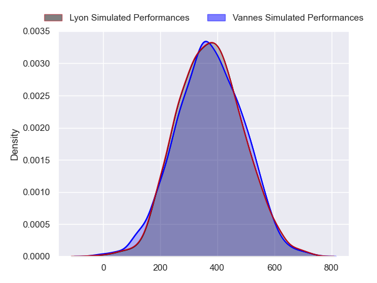
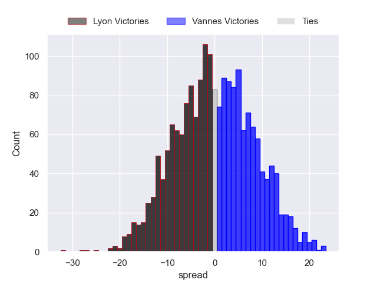

---  
layout: page  
title: Lyon at Vannes  
date: 2024-09-21 18:00:00 -0500  
categories: "Top 14 2024" match projection  
---
# Lyon at Vannes

# Club Level Predictions

The first set of predictions treats a club as the smallest object, as the club develops its members, organizes a gameplan, and deploys its players as needed for each match. This club model has a prediction of 0.303, which translates to predicting Lyon to win by 3.8.

Our Over/Under is 76.5 - and combined with the spread above, we have a predicted scoreline of 40 to 37

Each club has a rating and a rating deviation (similar to a Glicko rating), and expected performances can be generated. This allows for simulated matches and spreads like the ones below.
## Projected Performances - Club Model

## Projected Spreads - Club Model

## Projected Results - Club Model

# Player Level Predictions

Treating teams instead as an entity made up of the currently active players, I have ratings for each player in an altogether different system. These can be combined to form team ratings once teamsheets are announced, weighting starters a bit higher than the reserves. After the match is played, players can be weighted by their minutes on the field, allowing for an accurate measure of the team's composition. With these compiled team ratings, we can make predictions, measure inaccuracy, and update the individual player ratings.
## Prediction without Player Minutes: Vannes by 0.0

Lyon by 4.0 on a neutral pitch

## Projected Performances - Player Model

## Projected Spreads - Player Model

## Projected Results - Player Model

| Away Player          |   Away Percentile |   Number |   Home Percentile | Home Player              |
|:---------------------|------------------:|---------:|------------------:|:-------------------------|
| Sebastien Taofifenua |             19.1  |        1 |             99.73 | Mako Vunipola            |
| Guillaume Marchand   |             19.82 |        2 |            nan    | Cyril Blanchard          |
| Jermaine Ainsley     |             83.47 |        3 |              6.37 | Santiago Medrano         |
| Killian Géraci       |            nan    |        4 |            nan    | Anton Bresler            |
| Mickael Guillard     |             80.47 |        5 |             84.35 | Fabrice Metz             |
| Dylan Cretin         |             80.95 |        6 |            nan    | Joe Edwards              |
| Beka Shvangiradze    |            nan    |        7 |            nan    | Francisco Gorrissen      |
| Arno Botha           |             86.68 |        8 |            nan    | Karl Chateau             |
| Baptiste Couilloud   |             96.2  |        9 |            nan    | Michael Ruru             |
| Leo Berdeu           |             82.25 |       10 |            nan    | Maxime Lafage            |
| Davit Niniashvili    |             71.26 |       11 |             86.84 | Filipo Nakosi            |
| Josiah Maraku        |             10.72 |       12 |            nan    | Alex Arraté              |
| Semi Radradra        |             99.39 |       13 |            nan    | Théo Costossèque         |
| Ethan Dumortier      |             59.49 |       14 |             86.33 | Salesi Rayasi            |
| Alexandre Tchaptchet |             67.99 |       15 |            nan    | Paul Surano              |
| Sam Matavesi         |             91.38 |       16 |            nan    | Théo Béziat              |
| Jerome Rey           |             26.97 |       17 |            nan    | Thomas Moukoro           |
| Felix Lambey         |             85.68 |       18 |            nan    | Christiaan Van Der Merwe |
| Steeve Blanc-Mappaz  |            nan    |       19 |             86.92 | Kitione Kamikamica       |
| Martin Page-Relo     |             88.05 |       20 |            nan    | Jules Le Bail            |
| Martin Meliande      |              7.19 |       21 |             60.51 | Thibault Debaes          |
| Vincent Rattez       |             94.39 |       22 |             49.88 | Tani Vili                |
| Irakli Aptsiauri     |             67.55 |       23 |            nan    | Paga Tafili              |

