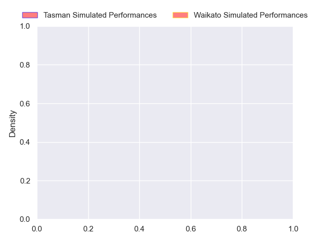
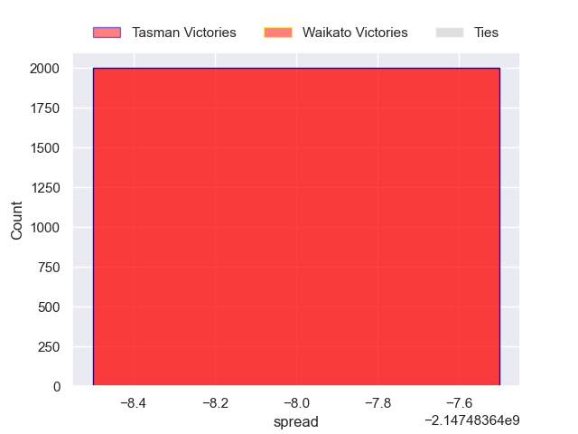

---  
layout: page  
title: Tasman at Waikato  
date: 2024-09-21 18:00:00 -0500  
categories: "NPC 2024" match projection  
---
# Tasman at Waikato

# Club Level Predictions

The first set of predictions treats a club as the smallest object, as the club develops its members, organizes a gameplan, and deploys its players as needed for each match. This club model has a prediction of 0.436, which translates to predicting Tasman to win by 2.8.

Each club has a rating and a rating deviation (similar to a Glicko rating), and expected performances can be generated. This allows for simulated matches and spreads like the ones below.
## Projected Performances - Club Model

## Projected Spreads - Club Model

## Projected Results - Club Model

# Player Level Predictions

Treating teams instead as an entity made up of the currently active players, I have ratings for each player in an altogether different system. These can be combined to form team ratings once teamsheets are announced, weighting starters a bit higher than the reserves. After the match is played, players can be weighted by their minutes on the field, allowing for an accurate measure of the team's composition. With these compiled team ratings, we can make predictions, measure inaccuracy, and update the individual player ratings.
## Prediction without Player Minutes: Waikato by 10.7

Waikato by 7.5 on a neutral pitch

## Projected Performances - Player Model

## Projected Spreads - Player Model

## Projected Results - Player Model

| Away Player             |   Away Percentile |   Number |   Home Percentile | Home Player            |
|:------------------------|------------------:|---------:|------------------:|:-----------------------|
| Ryan Coxon              |            nan    |        1 |            nan    | Ollie Norris           |
| Samiuela Moli           |            nan    |        2 |            nan    | Manaaki Boyle-Tiatia   |
| Isaac Salmon            |             49.78 |        3 |            nan    | George Dyer            |
| Te Ahiwaru Cirikidaveta |            nan    |        4 |            nan    | Joshua Balme           |
| Antonio Shalfoon        |            nan    |        5 |            nan    | Laghlan McWhannell     |
| Tim Sail                |            nan    |        6 |            nan    | Xavier Saifoloi        |
| Johnny Lee              |             38.08 |        7 |             25.93 | Patrick McCurran       |
| Sione Havili Talitui    |            nan    |        8 |            nan    | Malachi Wrampling-Alec |
| Louie Chapman           |            nan    |        9 |            nan    | Xavier Roe             |
| Campbell Parata         |            nan    |       10 |            nan    | D'Angelo Leuila        |
| Macca Springer          |            nan    |       11 |            nan    | Aki Tuivailala         |
| William Butler          |            nan    |       12 |            nan    | Gideon Wrampling       |
| Levi Aumua              |            nan    |       13 |            nan    | Bailyn Sullivan        |
| Kyren Taumoefolau       |            nan    |       14 |            nan    | Quinn Tupaea           |
| William Havili          |            nan    |       15 |            nan    | Tepaea Cook-Savage     |
| Eli Oudenryn            |            nan    |       16 |            nan    | Sean Ralph             |
| Monu Moli               |            nan    |       17 |            nan    | Ayden Johnstone        |
| Sam Matenga             |            nan    |       18 |            nan    | Gabe Robinson          |
| Hunter Leppien          |            nan    |       19 |             70.48 | Tai Cribb              |
| Braden Stewart          |            nan    |       20 |            nan    | Senita Lauaki          |
| Mason Lund              |            nan    |       21 |            nan    | Quintony Ngatai        |
| Nic Sauira              |            nan    |       22 |             93.53 | Aaron Cruden           |
| Timoci Tavatavanawai    |            nan    |       23 |            nan    | Jole Naufahu           |

